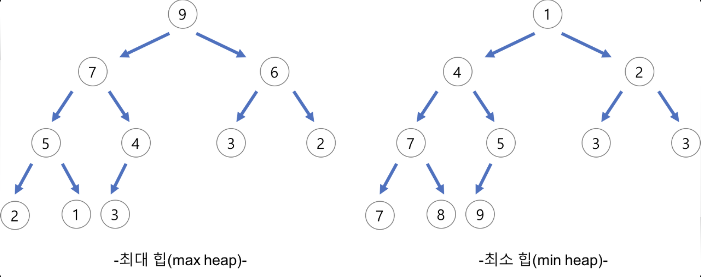
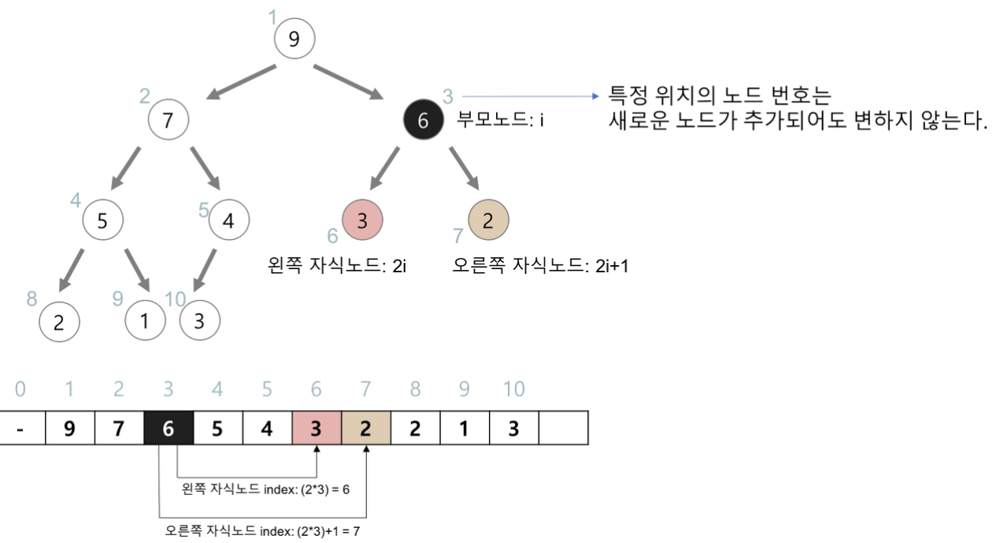

# 이진 힙(Binary Heap)

## 이진 힙(Binary Heap)이란?

이진 힙은 `우선순위 큐`를 이용해서 만들어진 **완전이진트리의 한 종류**이다. 즉, 여러개의 값들 중에서 **최댓값**이나 **최솟값**을 빠르게 찾아내도록 만들어진 자료구조이다. 이진 힙은 힙 중에서도 가장 널리 쓰이며 힙의 특징(최대 힙의 경우 부모노드 또는 자식노드보다 값이 커야한다.)을 만족한다. 참고로 이진탐색트리에서는 중복된 값을 허용하지 않지만, 힙 트리에서는 **중복된 값을 허용**한다.

## 이진 힙(Binary Heap)의 종류

- 최대 힙(Max Heap): 부모 노드의 키 값이 자식 노드의 키 값보다 **크거나 같은** 완전이진트리
- 최소 힙(Min Heap): 부모 노드의 키 값이 자식 노드의 키 값보다 **작거나 같은** 완전이진트리

## 이진 힙(Binary Heap)의 구현

- 일반적으로 `배열`을 이용해서 구현한다.
- 구현을 쉽게하기 위해서 배열의 **첫 번째 인덱스인 0은 사용되지 않는다.**
- 특정 위치의 노드번호는 새로운 노드가 추가되어도 변하지 않는다.
- 힙에서 부모 노드와 자식 노드의 관계는 다음과 같다.
	- 왼쪽 자식의 인덱스 = 부모의 인덱스 x 2
	- 오른쪽 자식의 인덱스 = 부모의 인덱스 x 2 + 1
	- 부모의 인덱스 = 자식의 인덱스 / 2

- 삽입 O(logn)
	- 새로운 요소가 들어오면 일단 새로운 노드를 힙의 **마지막 노드에 이어서 삽입**한다.
	- 새로운 노드를 부모 노드들과 교환해서 힙의 성질을 만족시킨다.
- 삭제
	- 최대 힙에서 최댓값은 루트 노드이므로 **루트 노드가 삭제된다.**
	- 삭제된 루트 노드에는 힙의 마지막 노드를 가져온다.
	- 힙을 재구성한다.

## 힙 정렬(Heap Sort)

힙에서 자료를 꺼낼 때 **가장 큰/작은 값부터 나오는 성질을 이용한 정렬**이다. 힙에 자료를 하나 넣을 때 평균 O(logn)의 복잡도를 가지며 이를 n번 반복하기 때문에 전체 복잡도는 O(nlogn)이 된다. 퀵 정렬과 평균 시간복잡도는 동일하지만 퀵 정렬이 최악의 경우 O(n^2)가 나오는 것에 비해서 언제나 O(nlogn)을 넘지 않기 떄문에 장점이 된다.

