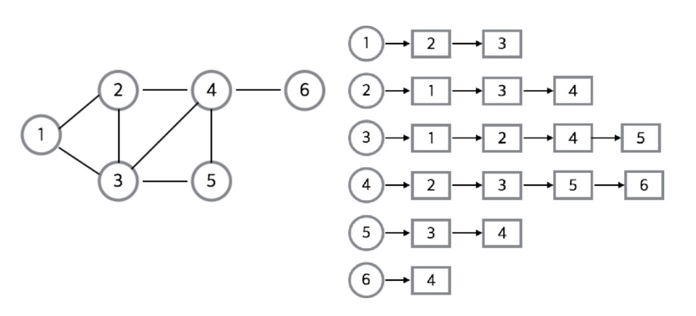
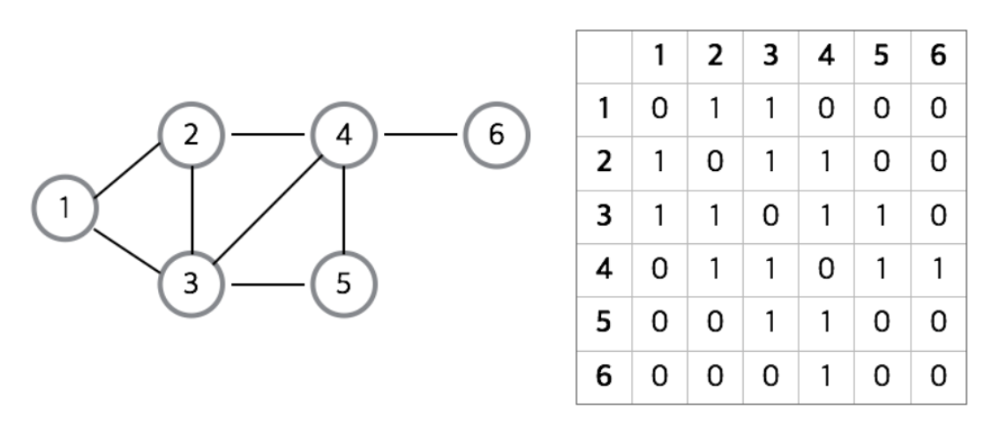

# 그래프(Graph)

## 그래프(Graph)의 개념

단순히 `노드(N, node)`와 그 노드를 연결하는 `간선(E, edge)`을 하나로 모아놓은 자료구조이다.

- 즉, **연결되어 있는 객체들의 관계를 표현**할 수 있는 자료구조이다.
	- Ex) 지도, 지하철 노선도의 최단경로, 전기회로의 소자들, 도로(교차점과 일방통행 길), 선수과목 등
- 그래프는 여러 개의 고립된 부분 그래프(Isolated Subgraphs)로 구성될 수 있다.

**그래프와 트리의 차이**

## 그래프(Graph)와 관련된 용어

- 정점(vertex) : **위치**라는 개념. (node 라고도 부른다)
- 간선(edge) : 위치간의 관계이다. 즉, **노드를 연결하는 선**을 의미한다.
- 인접 정점(adjacent vertex) : 간선에 의해 **직접 연결**된 정점
- 정점의 차수(degree) : 무방향 그래프에서 하나의 정점에 인접한 정점의 수
	- 무방향 그래프에 존재하는 정점의 모든 차수의 합 = 그래프의 간선수의 2배
- 전입 차수(in-degree) : 방향 그래프에서 외부에서 오는 간선의 수(내차수 라고도 부른다)
- 전출 차수(out-degree) : 방향 그래프에서 외부로 향하는 간선의 수(외차수 라고도 부른다)
	- 방향 그래프에 있는 정점의 전입 차수 또는 진출 차수의 합 = 방향 그래프의 간선의 수(내차수 + 외차수)
- 경로 길이(path length) : 경로를 구성하는 데 사용된 간선의 수
- 단순 경로(simple path) : 경로 중에서 **반복되는 정점이 없는 경우**의 경로
- 사이클(cycle) : 단순 경로의 **시작 정점과 종료 정점이 동일**한 경우

## 그래프(Graph)의 특징

- `네트워크 모델`
- 2개 이상의 경로가 가능하다.
	- 즉, 노드들 사이에 무방향/방향에서 양방향 경로를 가질 수 있다.
- self-loop 뿐만 아니라 loop/circuit 모두 가능하다.
- 루트 노드라는 개념이 없다.
- 부모-자식 관계라는 개념이 없다.
- 순회는 DFS나 BFS로 이루어진다.
- 그래프는 `순환(Cyclic) `혹은 `비순환(Acyclic)`이다.
- 그래프는 크게 방향 그래프와 무방향 그래프가 있다.
- 간선의 유무는 그래프에 따라 다르다.

## 그래프(Graph)의 종류

### 무방향 그래프 VS 방향 그래프

- 무방향 그래프(Undirected Graph)
	- 무방향 그래프의 간선은 간선을 통해서 **양방향**으로 갈 수 있다.
	- 정점 A와 정점 B를 연결하는 간선은 (A, B)와 같이 정점의 쌍으로 표현한다. (A, B)와 (B, A)는 동일하다.
- 방향 그래프(Directed Graph)
	- 간선에 **방향성이 존재**하는 그래프
	- A -> B로만 갈 수 있는 간선은 <A, B>로 표시한다. <A, B>와 <B, A>는 다르다.

### 가중치 그래프

- 가중치 그래프(Weighted Graph)
	- 간선에 비용이나 가중치가 할당된 그래프
	- `네트워크(Network)` 라고도 한다.

### 연결 그래프 VS 비연결 그래프

- 연결 그래프(Connected Graph)
	- 무방향 그래프에 있는 모든 정점쌍에 대해서 **항상 경로가 존재**하는 경우
	- 예를들어 트리(Tree)는 사이클을 가지지 않는 연결 그래프라고 할 수 있다.
- 비연결 그래프(Unconnected Graph)
	- 무방향 그래프에서 **특정 정점쌍 사이에 경로가 존재하지 않는** 경우

### 사이클(순환) VS 비순환 그래프

- 사이클(Cycle)
	- 단순 경로의 시작 정점과 종료 정점이 동일한 경우
- 비순환 그래프(Acyclic Graph)
	- 사이클이 없는 그래프

### 완전 그래프

- 완전 그래프(Complete Graph)
	- 그래프에 속해있는 모든 정점이 서로 연결되어 있는 그래프
	- 무방향 완전 그래프 -> 정점 수가 n이면 간선의 수는 n * (n-1) / 2개 이다.

## 그래프(Graph)의 2가지 구현방식

### 1. 인접 리스트(Adjacency List)

인접 리스트(Adjacency List)로 그래프를 표현하는 것이 **가장 일반적인 방법**이다.

인접 리스트란 그래프이 노드들을 `리스트`로 표현한 것이다. 주로 정점의 리스트 배열을 만들어서 관계를 설정해줌으로써 구현한다.

**인접 리스트의 장점**

1. 정점들의 연결 정보를 탐색할 때 `O(n)`의 시간이면 가능하다. (n: 간선의 개수)
2. 필요한 만큼의 공간만 사용하기 때문에 공간의 낭비가 적다.

**인접 리스트의 단점**

1. 특정 두 점이 연결되었는지 확인하려면 인접행렬 방식에 비해서 시간이 오래걸린다는 단점이 존재한다.(리스트가 배열에 비해서 조회성능이 느리기 때문이다.)
2. 구현이 비교적 어렵다.

### 2. 인접 행렬(Adjacency Matrix)

인접 행렬은 그래프의 노드를 `2차원 배열`로 만든 것이다. 완성된 배열의 모양은 1, 2, 3, 4, 5, 6의 정점을 연결하는 노드에 다른 노드들이 인접 정점이라면 1, 아니면 0을 넣어준다.

**인접 배열의 장점**

1. 2차원 배열안에 모든 정점들의 간선정보를 담기 때문에 배열의 위치만 확인하면 두 점에 대한 연결정보를 조회할 때 `O(1)`의 시간복잡도로 조회가 가능하다.
2. 구현이 비교적 간편하다.

**인접 배열의 단점**

1. 모든 정점에 대해서 간선정보를 대입해야 하므로 `O(n^2)`의 시간복잡도가 소요된다.
2. 무조건 2차원 배열이 필요하기 때문에 필요 이상의 공간이 낭비된다.