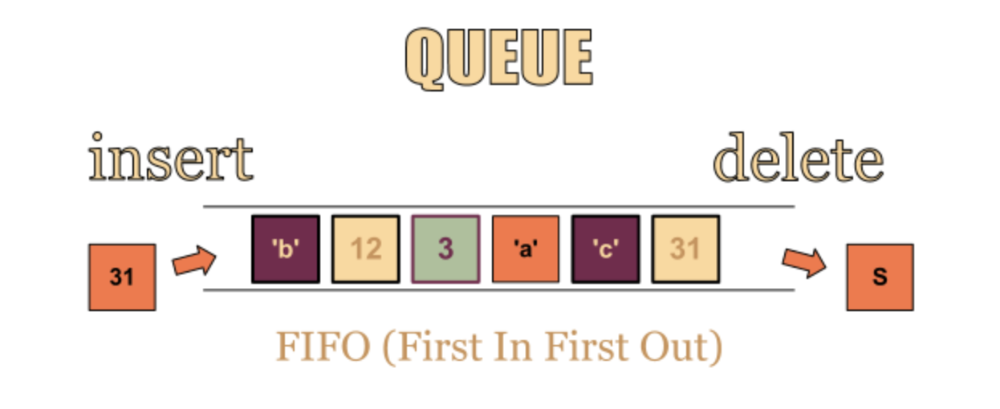

# 큐(Queue)

## 큐(Queue)의 개념

컴퓨터의 기본적인 자료구조의 한 가지로, 먼저 집어넣은 데이터가 먼저 나오는 FIFO(First In First Out) 구조로 저장되는 자료구조이다.



## 큐(Queue)의 연산

큐(Queue)는 FIFO(First In First Out)를 따른다.

- add(Object) : Object를 리스트의 끝 부분에 추가한다.
- remove() : 리스트의 첫 번째 항목을 삭제한다.
- peek() : 큐에서 가장 첫 번째 원소를 반환한다.
- isEmpty() : 큐가 비어있는지 아닌지를 판단한다. 큐가 비어있으면 true를 반환한다.

## 큐(Queue)의 구현

큐(Queue)는 연결리스트로 구현할 수 있다. 연결리스트의 반대방향에서 항목을 추가하거나 제거하도록 구현한다.

```java
public class MyQueue {
  private static class QueueNode {
    private T data;
    private QueueNode next;

    public QueueNode(T data) {
      this.data = data;
    }
  }

  private QueueNode first;
  private QueueNode last;

  public void add(T item) {
    QueueNode t = new QueueNode(item);

    if (last != null) last.next = t;
    last = t;
    if (first == null) first = last;
  }

  public T remove() {
    if (first == null) throw new NoSuchElementException();
    T data = first.data;
    first = first.next;

    if (first == null) last = null;
    return data;
  }

  public T peek() {
    if (first == null) throw new NoSuchElementException();
    return first.data;
  }

  public boolean isEmpty() {
    return first == null;
  }
}
```

## 큐(Queue)의 사용 사례

데이터가 입력된 시간 순서대로 처리해야할 필요가 있는 상황에 이용한다.

- 너비우선탐색(BFS, Breadth-First Search) 구현
- 캐시(Cache) 구현
- 우선순위가 같은 작업 예약(인쇄 대기열)
- 선입선출이 필요한 대기열(티켓 카운터)
- 콜센터 고객 대기시간
- 프린터의 출력 처리
- 윈도우 시스템의 메시지 처리기
- 프로세스 관리

## Java 라이브러리의 큐(Queue) 관련 메서드

### 두 가지 형태의 메서드

1. 수행이 실패했을 때 exception을 발생시키는 메서드
	- add(e), element(), remove()
2. 수행이 실패했을 때 null 또는 false를 반환하는 메서드
	- offer(e), peek(), poll()

#### 1. 수행이 실패했을 때 exception을 발생시키는 메서드

- boolean add(E item)
	- 해당 item을 Queue에 삽입한다.
	- 삽입에 성공하면 true를 반환하고, 큐에 더이상 자료를 넣을 공간이 없는 경우에 예외(IllegalStateException)을 발생시킨다.
- E element()
	- Queue에 Head에 있는 item을 삭제하지 않고 해당 item을 반환한다.
	- 만약 Queue가 비어있다면 예외(NoSuchElementException)을 발생시킨다.
- E remove()
	- Queue의 Head에 있는 item을 삭제하고 해당 item을 반환한다. 즉, Queue의 Head에 있는 요소를 꺼내는 연산이다.
	- 만약 Queue가 비어있다면 예외(NoSuchElementException)을 발생시킨다.

#### 2. 수행이 실패했을 때 null 또는 false를 반환하는 메서드

- boolean offer(E item)
	- add(E item)과 동일한 기능을 수행한다.
	- 다른점은 삽입에 성공하면 true를 반환하고, 실패하면 예외를 발생시키지 않고 false를 반환한다는 점이다.
- E peek()
	- element()와 동일한 기능을 수행한다.
	- 다른점은 Queue가 비어있다면 예외를 발생시키지 않고 null을 반환한다는 점이다.
- E poll()
	- remove()와 동일한 기능을 수행한다.
	- 다른점은 Queue가 비어있으면 예외를 발생시키지 않고 null을 반환한다는 점이다.

## Java 라이브러리 큐(Queue) 사용법

1. 일반적인 큐(Queue) 사용

일반적인 큐(Queue)를 사용할 때는 Queue 자체가 인터페이스이기 때문에 다형성을 이용하여 연결리스트로 큐를 구현한다.

```java
Queue<E> queue = new LinkedList<>();
```

2. 우선순위 큐(Priority Queue) 사용

우선순위 큐(Queue)를 사용할 때는 PriorityQueue 클래스를 이용해서 큐를 구현한다.

```java
Queue<E> pq = new PriorityQueue<>();
```