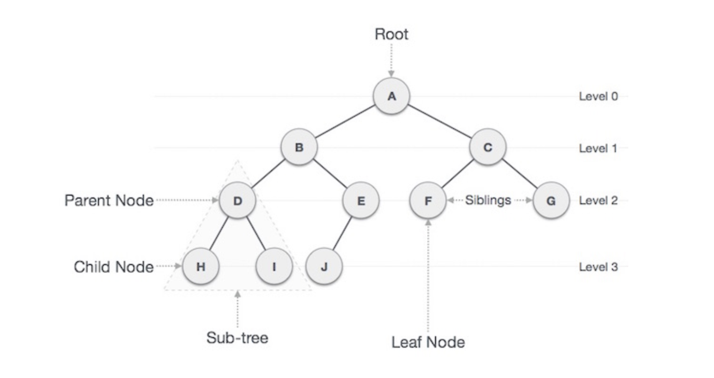

# 트리(Tree)

## 트리(Tree)의 정의

트리(Tree)란 노드들이 나뭇가지처럼 연결된 비선형 계층적인 자료구조이다.

트리는 다음과 같이 나뭇가지 형태를 띄며, 나무를 꺼꾸로 뒤집어 놓은 모양과 유사하다.

트리는 또한 트리 내에 다른 하위 트리가 있고, 그 하위 트리 안에는 또 다른 하위 트리가 있는 재귀적인 자료구조이다.

컴퓨터의 디렉토리 구조가 트리 구조의 대표적인 예가 될 수 있다.

## 트리(Tree) 용어

### 노드(Node)

- 트리를 구성하고 있는 기본 요소
- 노드는 키 값과 하위노드에 대한 포인터를 가지고 있다.
- A, B, C, D, E, F, G, H, I, J

### 간선(Edge)

- 노드와 노드간의 연결 선
- 즉, 노드간을 이어주는 선을 의미한다.

### 루트 노드(Root Node)

- 트리 구조에서 부모가 없는 최상위 노드
- 위 그림에서는 A 노드를 의미한다.

### 부모 노드(Parent Node)

- 자식 노드를 가진 노드
- 노드 H, I 의 부모노드는 노드 D이다.

### 자식 노드(Child Node)

- 부모 노드의 하위 노드
- 노드 D의 자식 노드는 H, I 이다.

### 형제 노드(Sibling Node)

- 같은 부모를 가지는 노드
- 노드 H와 노드 I는 같은 부모를 가지는 형제 노드이다.

### 외부 노드(External Node), 단말 노드(Terminal Node), 리프 노드(Leaf Node)

- 자식 노드가 없는 노드
- 위 그림에서는 H, I, J, F, G 가 속한다.

### 내부 노드(Internal Node), 비 단말 노드(non-terminal node), 가지 노드(Branch Node)

- 자식 노드를 하나 이상 가진 노드
- 위 그림에서는 A, B, C, D, E 가 속한다.

### 깊이(Depth)

- 루트에서 어떤 노드까지의 간선(Edge) 수
- 루드 노드의 깊이 = 0
- 노드 D의 깊이 = 2

### 높이(Height)

- 어떤 노드에서 리프 노드까지 가장 긴 경로의 간선(Edge) 수
- 리프 노드의 높이 = 0
- 노드 A의 높이 = 3

### Level

- 루트에서 어떤 노드까지의 간선의 수

### Degree

- 노드의 자식 수
- 리프 노드의 Degree = 0, 노드 A의 Degree = 2

### Path

- 한 노드에서 다른 한 노드에 이르는 길 사이에 놓여있는 노드들의 순서
- A -> H 의 경로 : A - B - D - H

### Path Length

- 해당 경로에 있는 총 노드의 수
- A -> H 의 경로 길이 : 4

### Distance

- 두 노드 사이의 최단경로에 있는 간선의 수
- D와 J의 Distance : 3

## 트리(Tree)의 특징

- 하나의 루트 노드와 0개 이상의 하위 트리로 구성되어있다.
- 데이터를 순차적으로 저장하지 않는 비선형 자료구조이다.
- 트리 내에 또 다른 트리가 있는 재귀적인 자료구조이다.
- 단순 순환(loop)을 갖지 않고, 연결된 무방향 그래프 구조이다.
- 노드간의 부모 자식 관계를 갖고있는 계층형 자료구조이며 모든 자식노드는 하나의 부모노드만 갖는다.
- 노드가 n개인 트리는 항상 n-1개의 간선은 가진다.

## 트리(Tree)의 종류

### 편향 트리(Skew Tree)

- 모든 노드들이 자식을 하나만 가진 트리
- 왼쪽 방향으로 자식을 하나만 가질때는 left skew tree, 오른쪽 방향으로 자식을 하나만 가질때는 right skew tree라고 한다.

### 이진 트리(Binary Tree)

- 각 노드의 차수가 2 이하인 트리

### 이진 탐색 트리(Binary Search Tree)

- 순서화된 이진 트리
- 노드의 왼쪽 자식은 부모의 값보다 작은 값을 가져야 하며, 노드의 오른쪽 자식은 부모의 값보다 큰 값을 가져야 한다.

### m 원 탐색 트리(m-way Search Tree)

- 최대 m개의 서브트리를 갖는 탐색 트리
- 이진 탐색 트리의 확장된 형태로 높이를 줄이기 위해서 사용한다.

### 균형 트리(Balanced Tree)

- m 원 탐색 트리에서 높이 균형을 유지하는 트리
- height-balanced m-way tree라고도 한다.

## 사용 사례

- 계층적인 데이터 저장: 파일 및 폴더 등
- 효율적인 검색 속도: 효율적인 삽입 및 삭제를 위해서 사용
- 힙(Heap)
- 데이터베이스 인덱싱: B-Tree, B+Tree
- Trie: 사전을 저장하는데 사용되는 특별한 종류의 트리