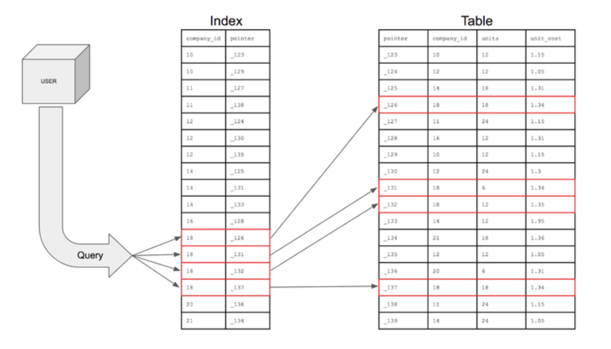
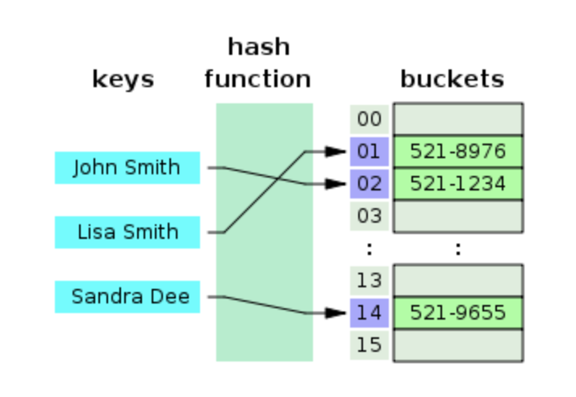
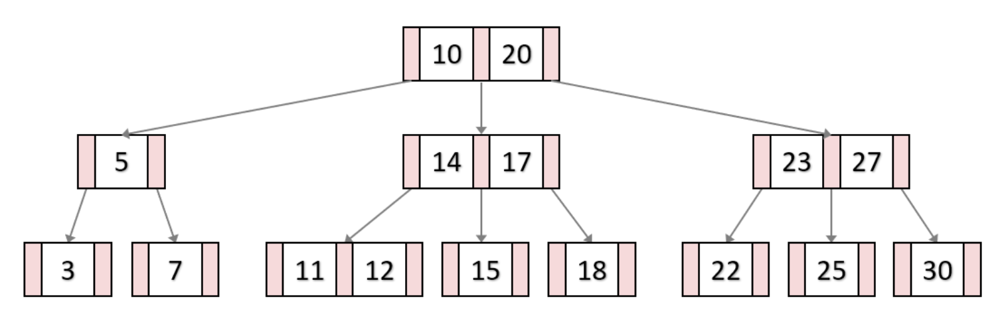
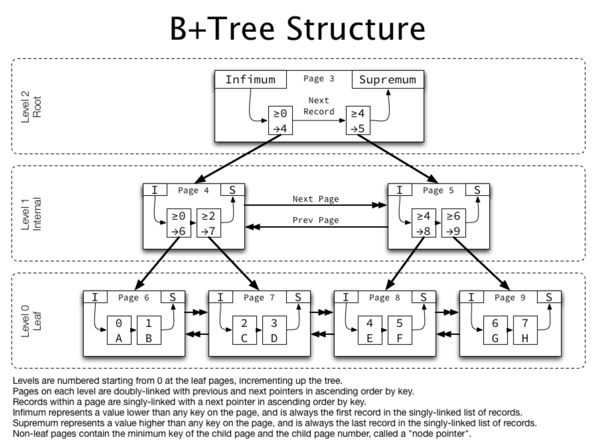

# 인덱스(INDEX)

### 인덱스(INDEX)란?

`인덱스`란 추가적인 쓰기작업과 저장공간을 활용하여 데이터베이스 **테이블의 검색 속도를 향상**시키기 위한 자료구조이다.

만약 우리가 책에서 원하는 내용을 찾는다고 하면, 책의 모든 페이지를 찾아보는 것은 오랜시간이 걸린다. 그래서 책의 저자들은 책의 맨 앞 또는 맨 뒤에 색인을 추가하는데, 데이터베이스의 `index`는 **책의 색인**과 같다고 할 수 있다.

책과 동일하게 데이터베이스에서도 테이블의 모든 데이터를 검색하면 시간이 오래걸리기 때문에 **데이터**와 **데이터의 위치**를 포함한 자료구조를 생성하여 빠르게 조회할 수 있도록 돕고 있다. 	



인덱스를 활용하면, 데이터를 조회하는 SELECT 이외에도 UPDATE, DELETE의 성능이 함께 향상된다. 그 이유는 해당 연산을 수행하려면 해당 대상을 조회해야 작업을 할 수 있기 때문이다.

```mysql
UPDATE USER SET NAME = 'GILDONG' WHERE NAME = 'GIL';
```
위의 UPDATE 쿼리를 실행하려면 자동으로 NAME이 'GIL'인 이름을 찾으려 SELECT 쿼리가 실행될 것이다.

```msql
SELECT NAME FROM USER WHERE NAME = 'GIL';
```
만약 index를 사용하지 않는 컬럼을 조회해야 하는 상황이라면 전체를 탐색하는 Full Scan을 수행해야 한다. Full Scan은 전체를 비교하며 탐색하기 때문에 처리 속도가 느려진다.

### 인덱스(INDEX)의 관리

DBMS는 index를 항상 최신의 정렬된 상태를 유지해야 원하는 값을 빠르게 탐색할 수 있다. 그렇기 때문에 인덱스가 적용된 컬럼에 INSERT, UPDATE, DELETE가 수행된다면 각각 다음과 같은 연산을 추가적으로 해줘야 하며 그에따른 오버헤드가 발생한다.

- INSERT: 새로운 데이터에 대한 인덱스를 추가한다.
- DELETE: 삭제하는 데이터의 인덱스를 사용하지 않는다고 변경한다.
- UPDATE: 기존의 데이터에 사용하지 않는다고 변경하고, 갱신된 데이터에 대한 인덱스를 추가한다.

### 인덱스(INDEX)의 장점과 단점

- 장점
	- 테이블을 조회하는 속도와 그에 따른 성능을 향상시킬 수 있다.
	- 전반적인 시스템의 부하를 줄일 수 있다.
- 단점
	- 인덱스를 관리하기 위해서 DB의 약 10%의 해당하는 저장공간이 필요하다.
	- 인덱스를 관리하기 위해서 추가 작업이 필요하다.
	- 인덱스를 잘못 사용할 경우 **오히려 성능이 저하**되는 역효과가 발생할 수 있다.

만약 CREATE, UPDATE, DELETE가 빈번한 속성에 인덱스를 걸게 된다면 인덱스의 크기가 매우 커져서 오히려 성능이 저하되는 경우가 발생할 수 있다. 그러한 이유 중 하나는 UPDATE, DELETE 연산 때문이다. 앞서 설명했듯이 UPDATE, DELETE는 인덱스를 지우지 않고, 사용하지 않음으로 바꾼다고 말했다. 만약에 어떤 테이블에서 UPDATE, DELETE 연산이 빈번하게 발생한다면 실제 데이터는 10만건인데 인덱스는 100만건이 넘어가게 되어서, SQL문 처리 시 비대해진 인덱스 때문에 오히려 성능이 떨어지게 될 것이다.

### 인덱스(INDEX)를 사용하면 좋은 경우

- 규모가 작지 않은 테이블
- INSERT, UPDATE, DELETE가 자주 발생하지 않는 컬럼
- JOIN, WHERE, ORDER BY가 자주 사용되는 컬럼
- 데이터의 중복도가 낮은 컬럼
- 등등 상황에 따라서 사용한다.

### 인덱스(INDEX)의 자료구조

인덱스를 구현하기 위해서 다양한 자료구조를 사용할 수 있는데, 가장 대표적인 자료구조로 해시 테이블과 B+Tree에 대해서 알아보자.

##### 1. 해시 테이블(Hash Table)

해시 테이블은 다들 알겠지만 (Key, Value)로 데이터를 저장하는 구조로 빠른 데이터 검색이 필요할 때 유용하다. 해시 테이블은 Key값을 고유한 index로 생성하여 그 index에 저장된 값을 꺼내오는 구조이다.



해시 테이블 기반의 DB 인덱스는 (Key=컬럼의 값, Value=데이터의 위치)와 같이 사용하여 컬럼의 값으로 생성된 해시를 통해서 인덱스를 구현한다. 해시 테이블의 시간 복잡도는 O(1)이며 매우 빠른 검색을 지원한다.

하지만 DB인덱스에서 해시 테이블이 사용되는 경우는 제한적이다. 그 이유는 해시가 등호(=) 연산에만 특화되어있기 때문이다. 해시 함수는 값이 1이라도 달라지면 완전히 다른 해시 값을 생성하는데, 이러한 특성에 의해서 특정문자로 시작하는 값 검색, 부등호(>, <) 연산이 자주 사용되는 데이터베이스 검색에 있어서는 해시 테이블이 적합하지 않다.

> 예를들어 'Lee'로 시작하는 모든 이름들을 검색하기 위한 쿼리문은 인덱스의 혜택을 전혀 받지 못하게된다. 이러한 이유로 데이터베이스의 인덱스의 자료구조로 B+Tree 자료구조가 일반적으로 많이 사용된다.

##### 2. B+Tree

B+Tree는 DB의 인덱스를 위해서 자식 노드가 2개 이상인 B-Tree를 개선시킨 자료구조이다. 

###### 2-1. B-Tree

B-Tree는 이진트리와 다르게 하나의 노드에 여러개의 정보를 가질 수 있다. 즉, 하나의 노드는 3개이상의 자식을 가질 수 있다.

차수가 3인 B-Tree의 구조의 예시는 다음과 같다. 흰색 부분은 각 노드의 Key값을 나타내고, 빨간색 부분은 자식 노드를 가리키는 포인터이다.



B-Tree는 탐색을 하려면 모든 노드를 찾아서 이동해야 한다는 단점이 존재한다.

###### 2-2. B+Tree

B+Tree는 모든 노드에 데이터(Value)를 저장했던 B-Tree와는 다른 특성을 가지고있다.

- 리프노드(데이터노드)만 인덱스와 함께 데이터(Value)를 가지고 있고, 나머지 노드(인덱스노드)들은 데이터를 위한 인덱스(Key)만을 갖는다.
- 리프노드들은 LinkedList로 연결되어 있다.
- 데이터노드 크기는 인덱스노드 크기와 달라도 된다.

데이터베이스의 인덱스 컬럼은 부등호를 이용한 순차검색 연산이 자주 사용될 수 있다. 이러한 이유로 B-Tree의 리프노드들을 LinkedList로 연결하여 순차검색을 용이하게 하는 등 B-Tree를 인덱스에 맞게 최적화하였다. 물론 리프노드까지 가지않아도 되는 데이터의 경우 B-Tree가 B+Tree보다 더 빠르다는 단점도 존재한다.

비록 B+Tree는 O(log2n)의 시간복잡도를 갖지만 위의 이유로 해시테이블보다 인덱싱에 더 적합한 자료구조가 되었다.

아래 그림은 InnoDB에 사용된 B+Tree의 자료구조이다.



