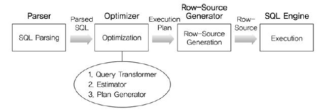
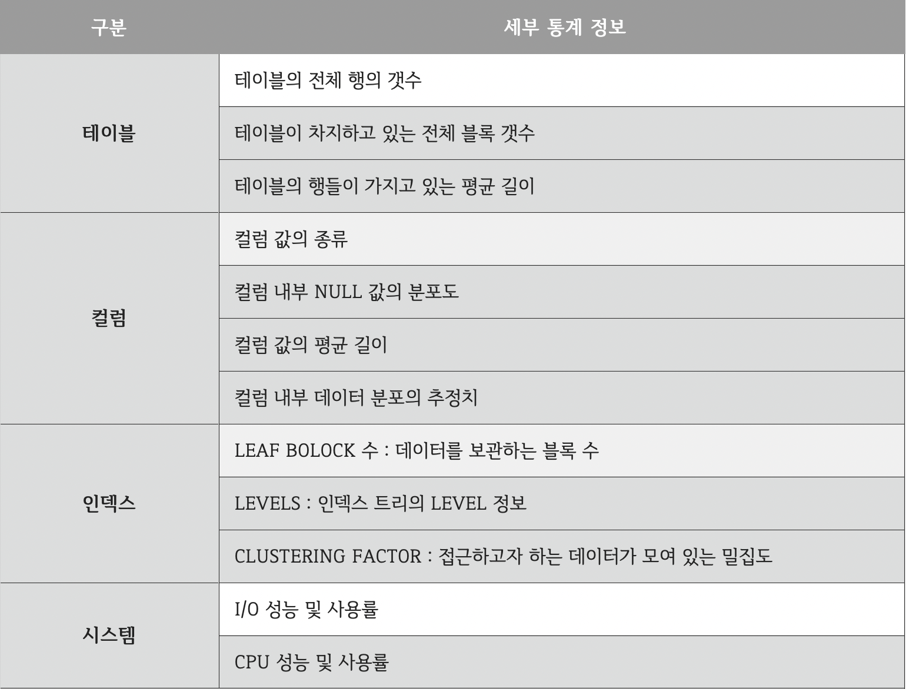

# Database Optimizer

가장 효율적인 방법으로 SQL을 수행할 최적의 처리 경로를 생성해주는 DBMS의 핵심 엔진

## SQL 수행과정

### 1. SQL 파싱(Parsing)
- MySQL 서버의 `SQL Parser 모듈`로 처리된다.
- 과정
  1. 사용자로부터 요청된 SQL 문장을 잘게 쪼개서 MySQL 서버가 이해할 수 있는 수준으로 분리한다. (만약 SQL 문장이 문법적으로 잘못됐다면 이 단계에서 걸러진다.)
  2. 이 단계에서 "SQL 파스 트리"가 만들어진다. (MySQL 서버는 SQL 문장 그 자체가 아니라 SQL 파스 트리를 이용해 쿼리를 실행한다.)

### 2. 최적화 및 실행 계획 수립
- MySQL 서버의 `옵티마이저`에서 처리된다.
- 첫 번째 단계에서 만들어진 SQL 파스 트리를 참조하며 다음 내용들을 처리한다.
  - 불필요한 조건의 제거 및 복잡한 연산의 단순화
  - 여러 테이블의 조인이 있는 경우 어떤 순서로 테이블을 읽을지 결정
  - 각 테이블에 사용된 조건과 인덱스 통계 정보를 이용해 사용할 인덱스 결정
  - 가져온 레코드들을 임시 테이블에 넣고 다시 한번 가공해야 하는지 결정

### 3. 수행
- 수립된 실행 계획대로 스토리지 엔진에 레코드를 읽어오도록 요청
- MySQL 엔진에서는 스토리지 엔진으로부터 받은 레코드를 조인하거나 정렬하는 작업을 수행

## 옵티마이저의 종류
실행 계획을 세우는 방식에 따라 규칙 기반 옵티마이저와 비용 기반 옵티마이저로 구분

| |규칙 기반 옵티마이저|비용 기반 옵티마이저|
|---|---|---|
|개념|사전에 정의된 규칙 기반|최소비용 계산 실행계획 수립|
|기준|실행우선 순위(Ranking)|액세스 비용(Cost)|
|인덱스|인덱스 존재 시 가장 우선시 사용| Cost에 의한 결정|
|성능|사용자 SQL 작성 숙련도|옵티마이저 예측 성능|
|장점|판단이 매우 규칙적이므로 실행 예상 가능|통계 정보를 통한 현실 요소를 적용|
|단점|예측 통계정보 요소 무시|최소 성능 보장 계획의 예측 제어 어려움|
|사례|AND 중심 양쪽 ‘=’ 시 Index Merge 사용|AND 중심 양쪽 ‘=’ 시 분포도별 Index 선택|

### 규칙 기반 옵티마이저 (RBO)
- 오라클8 이하의 버전에서 기본으로 설정된 옵티마이저
- 옵티마이저의 비용을 예측하는 능력이 그다지 좋지 않던 과거에 주로 사용한 방식
- 실행 속도가 빠른 순으로 `규칙`을 먼저 세워두고 우선순위가 앞서는 방법을 채택
- 규칙의 우선순위
  - (1) ROWID를 사용한 단일 행인 경우
  - (2) 클러스터 조인에 의한 단일 행인 경우
  - (3) 유일하거나 기본키(Primary Key)를 가진 해시 클러스터 키에 의한 단일 행인 경우
  - (4) 유일하거나 기본키(Primary Key)에 의한 단일 행인 경우
  - (5) 클러스터 조인인 경우
  - (6) 해시 클러스터 조인인 경우
  - (7) 인덱스 클러스터 키인 경우
  - (8) 복합 칼럼 인덱스인 경우
  - (9) 단일 칼럼 인덱스인 경우
  - (10) 인덱스가 구성된 칼럼에서 제한된 범위를 검색하는 경우
  - (11) 인덱스가 구성된 칼럼에서 무제한 범위를 검색하는 경우
  - (12) 정렬-병합(Sort-Merge) 조인인 경우
  - (13) 인덱스가 구성된 칼럼에서 MAX 혹은 MIN(최대/최소)을 구하는 경우
  - (14) 인덱스가 구성된 칼럼에서 ORDER BY를 실행하는 경우
  - (15) 전체 테이블을 스캔(FULL TABLE SCAN)하는 경우
- 장점 : 규칙에 순위가 매겨져 있기 때문에 옵티마이저의 실행계획을 미리 예측할 수 있음
- 단점 : 테이블에 데이터가 몇 개 없을 때 전체 조회를 하는 경우,
  - FULL TABLE SCAN이 더 빠를 수 있음에도
  - INDEX를 확인하고 타버린다던지 하는 비효율적인 실행 계획이 도출될 가능성이 있음

### 비용 기반 옵티마이저 (CBO)
- 최근에 많이 사용하고 있는 옵티마이저 방식
- 오라클 10 이후 버전부터는 공식적으로 비용 기반 옵티마이저만 사용됨
- 옵티마이저에서 실행 계획을 세운 뒤(최대 2천개까지) 비용이 최소한으로 나온 실행 계획을 수행
- 비용을 예측하기 위해 규칙 기반 옵티마이저는 사용하지 않는 테이블, 인덱스, 칼럼 등의 다양한 객체 통계정보와 시스템 통계정보를 이용
- 통계정보가 없는 경우 비효율적인 실행계획을 생성할 수 있으므로, 정확한 통계정보를 유지하는 것이 중요
- 모드에 따라 최적의 비용을 구하는 방식이 조금씩 달라짐
  - `CHOOSE`
    - 현재 잘 사용되지 않음
    - SQL 실행 환경에서 통계 정보를 가져올 수 있으면 비용 기반 옵티마이저로,
    - 그렇지 않다면 규칙 기반 옵티마이저로 작동시키는 모드 
  - `FIRST_ROWS`
    - 옵티마이저가 처리 결과 중 첫 건을 출력하는데 걸리는 시간을 최소화할 수 있는 실행 계획을 세우는 모드
  - `FIRST_ROWS_n`
    - SQL의 실행 결과를 출력하는데까지 걸리는 응답속도를 최적화하는 모드
  - `ALL_ROWS`
    - SQL 실행 결과 전체를 빠르게 처리하는데 최적화 된 실행계획을 세우는 모드
    - 마지막으로 출력될 행까지 최소한의 자원을 사용하여 최대한 빨리 가져오게 하며,
    - 오라클 10g 이후로는 이 모드가 기본값으로 설정되어 있음

## 옵티마이저의 작동

- `Parser` : SQL을 분석하여 문법 검사와 구성요소를 파악하고, 이를 파싱하여 `파싱 트리`를 만듦 
- `Query Transformer` : 파싱된 SQL을 보고 같은 결과를 도출하되, `좀 더 나은 실행 계획을 갖는 SQL로 변환이 가능한지 판단하여 변환` 작업을 수행 
- `Estimator` : 시스템 통계정보를 딕셔너리로부터 수집하여 `SQL을 실행할 때 소요되는 총비용을 계산`
- `Plan Generator` : Estimator를 통해 계산된 값들을 토대로 `후보군이 되는 실행계획을 도출`합니다. 
- `Row-Source Generator` : 옵티마이저가 생성한 실행계획을 `SQL 엔진이 실제 실행할 수 있는 코드나 프로시저 형태로 포맷팅`
- `SQL Engine` : SQL 실행

## 옵티마이저를 잘 활용하기 위해 알아야 할 내용
### 통계정보
- 비용 기반 옵티마이저에서는 실행 계획 도출 시 DBMS에서 제공하는 통계 정보를 사용
- 통계정보는 꾸준히 갱신되고 있는 것이 좋음
- 통계 정보의 생성 주기 및 수행 시간을 스케줄러에 일괄적으로 등록하여 일정 주기마다 통계 정보를 수집하고 종료하도록 자동 통계 정보를 생성할 수도 있고,
- 사용자가 직접 수동으로 통계 정보를 생성할 수도 있음
- 통계정보

 
 

출처 : [[DB] 데이터베이스 옵티마이저(Optimizer)에 대하여](https://coding-factory.tistory.com/743)