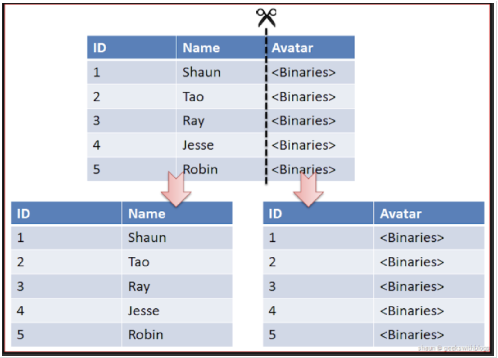

# 파티셔닝(Partitioning)

## 파티셔닝(Partitioning)이란?

### 등장 배경

- 서비스의 크기가 커지고 DB에 저장하는 데이터의 규모도 커짐에 따라서, 기존의 사용하던 DBMS의 `용량(Storage)`의 한계와 `성능(Performance)`의 저하를 가져오게 되었다.
- 즉, 하나의 DBMS에 너무 큰 테이블이 들어가게 되면서 용량과 성능 측면에서 많은 이슈가 발생하게 되고, 이러한 이슈를 해결하기 위한 방법으로 테이블을 `파티션(Partition)`이라는 작은 단위로 나누어 관리하는 `파티셔닝(Partitioning)`기법이 나타나게 되었다.
- 파티셔닝(Partitioning)기법의 등장으로 소프트웨어적으로 **데이터를 분산처리**하여 **성능이 저하되는 것을 방지**하고, 데이터의 관리를 보다 수월하게 할 수 있게 되었다.

### 개념

- 논리적인 데이터 요소(element)들을 다수의 엔티티(entity)로 쪼개는 행위를 뜻하는 일반적인 용어이다.
- 즉, 큰 테이블이나 인덱스를 관리하기 쉬운 `파티션(Partition)`이라는 작은 단위로 물리적으로 분할하는 것을 의미한다.
	- 물리적인 분할이 있더라도 DB에 접근하는 애플리케이션은 이를 인지하지 못한다.

### 목적

1. 성능(Performance)의 향상
	- 특정 DML과 Query의 성능을 향상시킨다.
	- 주로 **대용량 데이터 쓰기(Data Write)** 환경에서 효율적이다.
	- Full scan에서 데이터 Access 범위를 줄여서 성능 향상을 가져온다.
	- 많은 INSERT가 있는 OLTP(온라인 트랜잭션 처리 시스템)에서 INSERT 작업을 작은 단위인 partition으로 분산시켜 경합을 줄인다.
2. 가용성(Availability)의 향상
	- 물리적인 파티셔닝으로 인하여 **전체 데이터의 훼손 가능성이 줄고**, 데이터의 가용성이 향상된다.
	- 각 분할영역(Partition)을 독립적으로 백업하고 복구할 수 있다.
	- 테이블의 파티션 단위로 Disk I/O를 분산하여 경합을 줄이기 때문에 UPDATE 성능을 향상시킨다.
3. 관리 용이성(Manageability)
	- **큰 테이블을 제거**하여 관리를 쉽게 해준다.

## 파티셔닝(Partitioning)의 장단점

### 장점

- 관리적 측면: 파티션 단위 백업, 추가, 삭제, 변경
	- 전체 데이터를 손실할 가능성이 줄어들어 데이터의 가용성이 향상된다.
	- 파티션별로 데이터의 백업, 복구가 가능하다.
	- 파티션 단위로 I/O분산이 가능해서 UPDATE 성능을 향상시킨다.
- 성능적 측면: 파티션 단위 조회 및 DML 수행
	- 데이터 전체 검색 시 **필요한 부분만 탐색**해 성능이 증가한다.
		- 즉, Full scan에서 데이터 Access의 범위를 줄여 성능 향상을 가져온다.
		- 필요한 데이터만 빠르게 조회할 수 있기 때문에 쿼리 자체가 가볍다.

### 단점

- 테이블간 `JOIN`을 할 때, 비용이 증가한다.
- 테이블과 인덱스를 별도로 파티셔닝할 수 없다.
	- 테이블과 인덱스를 같이 파티셔닝해야 한다.

## 파티셔닝(Partitioning)의 종류

### 수평(horizontal) 파티셔닝

#### 장점

- **데이터의 개수**를 기준으로 나누어 파티셔닝한다.
- 데이터의 개수가 작아지고 따라서 index의 개수도 작아지게 된다. 자연스럽게 성능은 향상된다.

#### 단점

- 서버간의 연결과정이 많아진다.
- 데이터를 찾는 과정이 기존보다 복잡하기 때문에 지연시간(latency)이 증가하게 된다.
- 하나의 서버가 고장나게 되면 데이터의 무결성이 깨질 수 있다.

### 수직(Vertical) 파티셔닝

- **테이블의 컬럼**을 기준으로 나누어 파티셔닝(Partitioning)한다.
- 정규화하는 과정도 이와 비슷하다고 볼 수 있지만 수직 파티셔닝(Vertical Partitioning)은 이미 정규화된 Data를 분리하는 과정이다.
- 자주 사용하는 컬럼등을 분리시켜 성능을 향상시킬 수 있다.

## 파티셔닝(Partitioning)의 분할 기준

### 1. 범위 분할(Range Partitioning)

- 분할 키 값이 `범위`내에 있는지 여부로 구분한다.
- 즉, **연속적인 숫자나 날짜 기준**으로 파티셔닝한다.
- 예를 들어 우편번호, 일별, 월별, 분기별 등의 데이터에 적합하다.

### 2. 목록 분할(List Partitioning)

- 값 목록에 파티션을 할당 분할 키값을 그 목록에 비추어 파티션을 선택한다.
- 즉, 특정 파티션에 저장될 Data에 대한 명시적 제어가 가능하다.
- 분포도가 비슷하며, 많은 SQL에서 해당 Column에 대한 조건이 많이 들어오는 경우 유용하다.
- Multi-Column Partition Key를 제공하기 힘들다.
- ex) [한국, 중국, 일본 -> 아시아] [노르웨어, 스웨덴, 핀란드 -> 북유럽]

### 3. 해시 분할(Hash Partitioning)

- 파티션 키의 `해시(Hash)` 값에 의한 파티셔닝 (균등한 데이터의 분할이 가능하다)
- Select 시 조건과 무관하게 병렬 Degree 제공 (질의 성능 향상)
- 특정 데이터가 어떤 Hash Partition에 있는지는 판단이 불가능하다.
-  Hash Partition은 파티션을 위한 범위가 없는 데이터에 적합하다.

### 4. 컴포지트 분할(Composite Partitioning)

- 파티션(Partition)의 서브 파티셔닝(Sub-Partitioning)을 말한다.
- 즉, 상기 기술을 `결합`하는 것을 의미하며, 범위분할하고 해시분할을 하는 경우를 생각할 수 있다.
- 범위분할을 할 수 있는 컬럼이 존재하지만, 파티셔닝 결과 생성된 파티션이 너무 커서 효과적으로 관리할 수 없을 떄 유용하다.
- Range-List, Range-Hash

