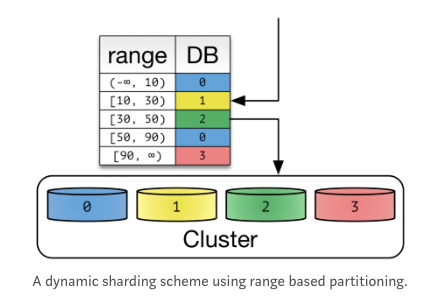
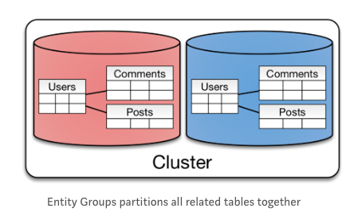

# 샤딩(Sharding)

## 샤딩(Sharding)의 개념

- `샤딩`은 **수평 분할(Horizontal Partitioning)**과 동일한 개념이며, 인덱스의 크기를 줄이고 작업 동시성을 늘리기 위한 것이라고 할 수 있다.
- `수평 분할(Horizontal Partitioning)`은  하나의 테이블에서 **스키마(Schema)가 같은** 데이터를 두 개 이상의 테이블에 나누어 저장하는 것을 말한다.
- 예를들면, 같은 주민 데이터를 처리하기 위해 스키마가 같은 `서현동주민 테이블`과 `정자동주민 테이블`로 나누어 사용하는 것을 말한다.
- 데이터베이스를 `샤딩`하게 되면 하나로 구성될 스키마를 다수의 복제본으로 구성하고 각각의 샤드에 어떤 데이터가 저장될지를 `샤드키`를 기준으로 분리한다.

## 샤딩(Sharding)의 단점

- 프로그래밍적, 운영적인 **복잡도가 높아진다.**
- 샤딩을 적용하기 전에 샤딩을 피하거나 지연시킬 수 있는 방법을 모색해야 한다.
	- `Scale-Up` 하는 방향을 고려해본다. 즉, 좀 더 고스펙의 컴퓨터를 사용한다.
	-  Read(SELECT) 명령이 많다면 캐시(Cache)나 `Database Replication`을 적용한다.
	-  테이블의 일부 컴럼만 사용한다면 **수직 분할(Vertical Partitioning)**을 사용한다.
	-  **Cold**, **Hot** Data를 분리하여 사용한다.

> **Database Replication**

2개 이상의 DBMS를 **Master**와 **Slave**로 나누어 동일한 데이터를 저장하는 기법을 말한다. **Master DB**는 INSERT, UPDATE, DELETE의 기능을 수행하고, **Slave DB**에 실제 데이터를 복사한다. 즉, Slave DB의 시간이 오래걸리는 SELECT문의 기능을 수행하여 전체적인 SELECT문 성능을 향상시킨다.

> **Cold / Hot Data란? | Naver D2 :: Cold Storage 소개**

- Cold Data : 드물게 사용되거나 아예 사용하지 않는 데이터
- Hot Data : 자주 사용되는 데이터
- Cold Storage : 에너지 절감을 위해서 연산 능력에 손해를 보더라도 낮은 가격과 저전력으로 **자주 사용되지 않는 데이터를 처리**하는 데이터 저장장치 및 시스템

## 샤딩(Sharding)의 주요 관점, 필요한 원리

- 분산된 DB에서 어떻게 데이터를 읽어올지?
- 분산된 DB에 어떻게 데이터를 잘 분산시켜서 저장할 것인가?
	- 분산이 잘 되지 않고, 한쪽으로만 데이터가 쏠리면 자연스럽게 HotSpot이 되어 성능이 느려진다.
	- 그렇기 때문에 **균일하게 분산하여 데이터를 저장하는 것이 중요**하다.

## 샤딩(Sharding) 방법

### 1. Hash Sharding

- Database id를 단순하게 나누어 샤딩하는 방식이다.
- 즉, 샤드키는 Database id를 Hashing 하여 결정한다.[Sharding Key = hash(key) % NUM_DB]

**장점**

- 같은 값을 가지는 Key-Value 데이터베이스에 적합하다.

**단점**

- Cluster 를 포함하는 Node의 개수가 변하게 되면 `재샤딩(Resharding)`을 해야한다.
- Hash Key로 분산되기 때문에 **공간에 대한 효율이 부족**하다. 즉, 데이터가 크던 작던 공간에 대한 효율을 고려하지 않는다. -> 내부 단편화 같은 느낌

> **Cluster**

보통 데이터베이스 구축을 할 경우 1개의 서버로 하나의 데이터베이스를 구축해서 사용하는 편이다. 그런데 하나의 서버로 데이터베이스를 사용할 경우 서버가 죽으면 서비스가 불가한다는 현상이 발생한다. 이 때, 하나의 데이터베이스를 여러개의 서버로 나누어 구축하게 되는데, 이 것을 클러스터라고 한다.

### 2. Dynamic Sharding

- 이름 그대로 다이나믹(Dynamic)하게 바꿀 수 있는 기법이다.
- 즉, `서비스 중개자(Locator Service)`를 통해서 Shared Key를 추가하고 얻으면 된다.
- Cluster 내의 Node의 개수를 늘려도 `서비스 중개자(Locator Service)`에 데이터를 추가 해주기만 하면 된다. 
- Ex) HDFS: Name Node, MongoDB: ConfigServer

**장점**

- Cluster의 Node가 증가해도 샤드키만 서비스 중개자(Locator Service)에 추가하면 되어서 재샤딩이 필요없다.
- 즉, 확장에 유연한 구조이다.

**단점**

- 데이터 재배치(Data Relocation)을 하게 된다면 서비스 중개자(Locator Service)의 샤드키 테이블도 재배치를 해야한다. -> 추가작업이 필요하다.
- 성능향상을 위해서 캐시를 한 다음 재배치(Relocation)을 하면 데이터를 찾지 못하고 에러가 발생한다.
- 결과적으로 서비스 중개자(Locator Service)에 의존할 수 밖에 없는 구조이다.

### 3. Entity Group

위의 Hash Sharding과 Dynamic Sharding은 Key-Value 형태를 지원하기 위해서 나온 방법인데, Key-Value 형태가 아니라면 어떻게 샤딩을 해야할까? 바로 `Entity Group` 방식을 이용하면 된다.

- RDBMS의 JOIN, INDEX, TRANSACTION을 이용하여 복잡도를 줄이는 방식과 유사하다.
- 동일한 파티션에 관련 엔티티를 저장하여 **단일 파티션 안에서 추가기능을 제공**하는 방식이다.

**장점**

- 하나의 물리적인 Shared에 쿼리를 진행하면 효율적이다. -> **강한 응집도**를 가질 수 있다.
- 데이터는 자연스럽게 사용자별로 분리되어 저장된다.
- 사용자가 늘어남에 따라 확장성이 좋은 Partitioning 이다.

**단점**

- Cross-Partition 쿼리(다수의 Partition으로 확장되는 쿼리)는 Single-Partition 쿼리보다 Consistency의 보장과 성능을 잃는다.
- 따라서 이런 쿼리들이 자주 실행되지 않도록 만들어야 한다.
- 예를들면, 두 사용자간의 채팅 메시지는 두번 저장될 것이다. 이 때, 보내는 사람과 받는 사람에 의해서 파티션되었기에 사용자들에 의해 보내지거나 받아진 모든 메시지는 단일 파티션에 저장된다. -> 이럴경우 데이터를 효율적으로 읽는 것을 지원하기 위해서 다수의 파티션으로 저장할 필요가 있다.