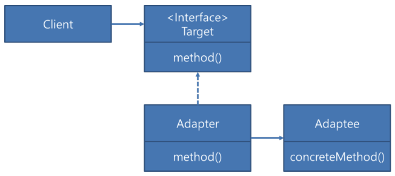

# 어댑터 패턴(Adapter Pattern)

`어댑터 패턴(Adapter Pattern)`은 클래스의 인터페이스를 사용자가 기대하는 다른 인터페이스로 변환하는 패턴으로, 호환성이 없는 인터페이스 때문에 동작할 수 없는 클래스들이 함께 작동하도록 해준다.

여기서 어댑터라는 개념은 **노트북 어댑터(Adapter)**를 생각하면 된다. 콘센터 전원에서 나오는 전기는 보통 교류 200V 이지만 노트북은 직류 120V이다. 그렇지만 우리는 노트북을 사용할 때 아무런 불편없이 노트북 선을 전원에 그대로 꽂아 사용할 수 있다. 그 이유는 중간에 교류 200V를 직류 120V로 바꿔주는 어댑터가 존재하기 때문이다.

이와 비슷한 맥락에서 어댑터 패턴은 노트북 어댑터의 역할처럼 기존 클래스를 재사용할 수 있도록 중간에서 맞춰주는 역할을 한다. 다시 말하면, 호환성이 없는 기존 클래스의 인터페이스를 변환해 재사용할 수 있도록 해준다.

어댑터 패턴은 아래와 같이 2가지 형태로 사용한다.

1. 클래스 어댑터 패턴: 상속을 이용한 어댑터 패턴이다.
2. 인스턴스 어댑터 패턴: 위임을 이용한 어댑터 패턴이다.

아래의 그림을 보면 Client는 Target 인터페이스를 사용하여 메서드를 호출한다. Adapter에서는 Adaptee 인터페이스를 사용하여 concretMethod 호출로 변경한다. 이 때, Client는 중간에 Adapter가 존재한다는 것을 인식하지 못한다.



## 어댑터 패턴 예시

다음 예시는 Duck 객체가 모자라서 Turkey객체를 대신 사용해야 하는 상황으로 가정한 것이다.

- Target Interface: Adapter가 implements하는 인터페이스이다. 클라이언트는 Target Interface를 통해서 Adaptee인 써드파티 라이브러리를 사용하게 된다.

```java
public interface Duck{
	void quack();
	void fly();
}
```

```java
public class MallardDuck implements Duck{
	
	@Override
	public void quack() {
		System.out.println("꽥! 꽥!");
	}
	
	@Override
	public void fly() {
		System.out.println("날라갈 수 있습니다!");
	}
}
```

- Adaptee: 써드파티 라이브러리나 외부 시스템을 의미한다.

```java
public interface Turkey{
	void gobble();
	void fly();
}
```

```java
public class WildTurkey implements Turkey{

	@Override
	public void gobble() {
		System.out.println("고르륵! 고르륵!");
	}
	
	@Override
	public void fly(){
		System.out.println("짧은거리만 날라갈 수 있습니다!");
	}
}
```

- Adapter: Client와 Adaptee 중간에서 호환성이 없는 둘을 연결시켜주는 역할을 담당한다. Target Interface를 implements하며, 클라이언트는 Target Interface를 통해서 어댑터에 요청을 보낸다. 어댑터는 클라이언트의 요청을 Adaptee가 이해할 수 있는 방법으로 전달하고, 처리는 Adaptee에서 이루어진다.

```java
public class TurkeyAdapter implements Duck{
	
	private Turkey turkey;
	
	public TurkeyAdapter(Turkey turkey){
		this.turkey = turkey;
	}
	
	public void quack(){
		turkey.gobble();
	}
	
	public void fly(){
		turkey.fly();
	}
}
```

- Client: 써드파티 라이브러리나 외부시스템을 이용하려는 곳이다.

```java
public class App{
	
	public static void main(String[] args){
		System.out.println("==칠면조가 웁니다==");
		WildTurkey turkey = new WildTurkey();
		turkey.gobble();
		turkey.fly();
		
		System.out.println("==칠면조 어댑터가 웁니다==");
		Duck turkeyAdapter = new TurkeyAdapter(turkey);
		turkeyAdapter.quack();
		turkeyAdapter.fly();
		
		System.out.println("==오리가 웁니다==");
		MallardDuck duck = new MallardDuck();
		duck.quack();
		duck.fly();
	}
}
```