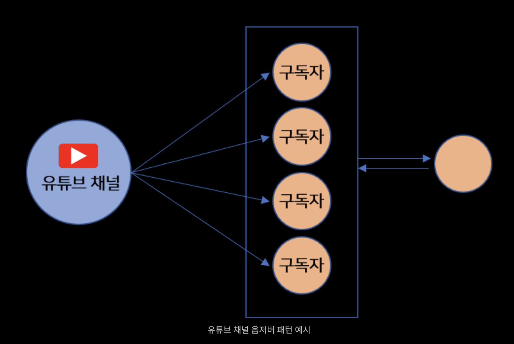
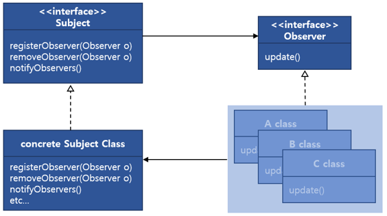

# 옵저버(Observer) 패턴

### 옵저버 패턴이란?

`옵저버 패턴(Observer Pattern)`은 객체의 상태변화를 관찰하는 관찰자들, 즉 옵저버의 목록을 객체에 등록하여 상태변화가 있을 때마다 메서드 등을 통해서 객체가 직접 목록의 각 옵저버에게 통지하도록 하는 디자인 패턴이다. 주로 분산 이벤트 핸들링 시스템을 구현하는데 사용된다. **발행/구독 모델**로 알려져 있기도 하다.

간단히 얘기하면 **어떤 객체의 상태가 변할 때 그와 관련된 객체들에게 알림을 보내는 디자인 패턴**이다. 

예를들면 **유튜브 구독 알람**을 예시로 들 수 있는데, 철수(Observer)가 코딩 공부를 위해서 유튜브에서 프로그래밍 관련 영상을 찾고있다. 그런데 노마드 코더(Subject)라는 사람의 채널에 좋은 영상들이 있는 것을 알게 되었다. 그래서 영상들을 보기 시작했고, 어느새 모든 영상을 보게 되었다. 이제 철수는 새로운 영상이 업로드되는 것을 기다리고 있는데, 영상이 언제 올라올 줄 알고 기다릴까? 이때, 채널 구독(Register)을 하여 업데이트 알림(Notify)을 받게 하는 방법이 있다. 유튜브 채널 관리자가 업데이트를 하면, 구독하고 있는 모든 사용자들에게 알림을 전달하는 것이다.



### 정의 및 구조

> 한 객체의 상태가 바뀌면 그 객체에 의존하는 다른 객체들에게 정보가 자동으로 갱신되는 방식으로, 일대다(one-to-many) 의존성을 정의한다.

옵저버 패턴에서 주제자(Subject)는 옵저버에 대한 정보가 없다. 오직 옵저버가 특정 인터페이스를 구현한다는 것만 알고있다. 즉, 옵저버가 무슨 동작을 하는지 모른다는 것이다. 게다가 옵저버는 언제든지 새로 추가되거나 제거될 수 있으며, 새로운 형식의 옵저버를 추가할 때도 주제에 전혀 영향을 주지 않는다. 이러한 관계를 느슨한 결합(Loosing coupling)이라고 한다.

아래의 UML을 확인해보자. Subject interface는 등록, 해제, 갱신을 위한 API를 제공한다. 그리고 이를 상속받는 concrete Subject Class는 등록, 해제, 갱신을 구현하고 기타 함수도 구현할 수 있다. Observer interface는 Subject에서 갱신할 때 호출되는 update API만 제공된다. 마지막으로 Observer interface를 상속받는 A, B, C Class에 Update를 구현한다. 이것이 옵저버 패턴의 가장 기본적인 구조이다.



### 코드 예제

해당 예시는 Concrete Subject class 에서 값을 변경하면 등록된 모든 Observer들에게 갱신하는 간단한 구조이다.

밑의 코드는 Subject interface의 구조인데, Observer를 등록, 갱신, 해제하기 위한 구조이다.

```java
public interface Subject
{
    void registerObserver(Observer o);
    void removeObserver(Observer o);
    void notifyObservers();
}
```

Observer interface는 다음과 같은 구조인데, update 함수에 인자로 값이 넘어온다.

```java
public interface Observer
{
    void update(int value);
}
```

Concrete Subject는 Subject 인터페이스를 상속받는다. 이 클래스는 ArrayList를 활용하여 Observer 정보를 가지고 있다.

```java
public class ConcreteSubject implements Subject
{
	private List<Observer> observers = new ArrayList();
	private int value;
	public ConcreteSubject()
	{
		value = 0;
	}
	@Override
	public void notifyObservers()
	{
		for(Observer o : observers){
			o.update(value);
		}
	}
 
 	@Override
	public void registerObserver(Observer o)
	{
		observers.add(o);
	}
	
 	@Override
	public void removeObserver(Observer o)
	{
		observers.remove(o);
	}
	public void setValue(int value)
	{
		value = value;
		notifyObservers();
	}
}
```

아래는 Observer 인터페이스를 상속받는 A, B, C class 이다. 각 클래스에서 ConcreteSubject를 인자로 받고, registerObserver를 호출하여 자신을 옵저버로써 등록한다.

```java
public class A implements Observer
{
	private ConcreteSubject subject;
	
	public B(ConcreteSubject subject)
	{
		this.subject = subject;
		subject.registerObserver(this);
	}
	
	@Override
	public void update(int value)
	{
		logger.info("A Class update, value: " + value);
	}
}
 
public class B implements Observer
{
	private ConcreteSubject subject;
	
	public B(ConcreteSubject subject)
	{
		this.subject = subject;
		subject.registerObserver(this);
	}
	
	@Override
	public void update(int value)
	{
		logger.info("B Class update, value: " + value);
	}
}
 
public class C implements Observer
{
	private ConcreteSubject subject;
	
	public B(ConcreteSubject subject)
	{
		this.subject = subject;
		subject.registerObserver(this);
	}
	
	@Override
	public void update(int value)
	{
		logger.info("C Class update, value: " + value);
	}
}
```

마지막으로 메인 스레드이다. ConcreteSubject 및 A, B, C의 인스턴스를 생성하는데 A, B, C 각 인스턴스가 옵저버로서 ConcreteSubject 인스턴스에 등록된다. 마지막 줄인 setValue(10)을 호출하면 모든 옵저버의 update가 호출된다.

```java
public class Program
{
	public static void Main(string[] args)
	{
		ConcreteSubject concreteSubject = new ConcreteSubject();
 
		A observerA = new A(concreteSubject);
		B observerB = new B(concreteSubject);
		C observerC = new C(concreteSubject);
 
		concreteSubject.setValue(10);
	}
}
```

이렇게 가장 기본적인 옵저버 패턴을 구현할 수 있다. ConcreteSubject에서 값을 설정해야 모든 옵저버가 갱신하는 방식이다. 이를 응용하면 각 옵저버에서도 값을 설정하여 모든 옵저버에 갱신하는 방법도 구현할 수 있다. 옵저버 패턴은 가장 많이 사용되고 MVC 패턴을 사용하기 위한 기초 개념이 된다.