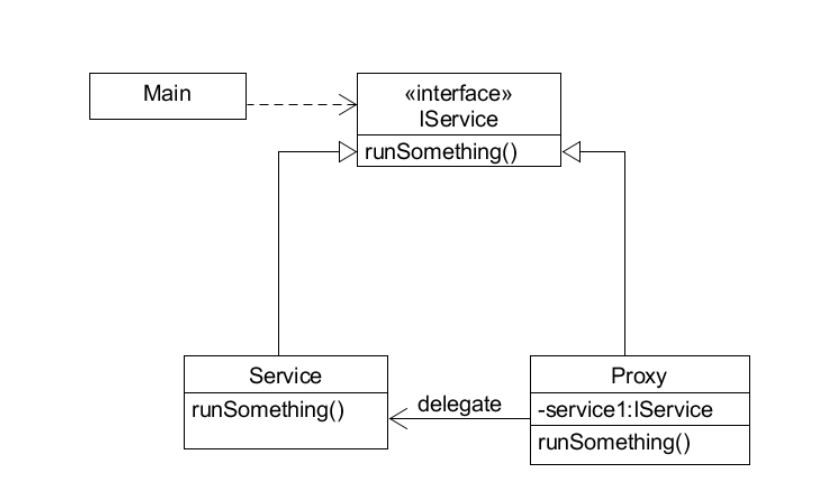
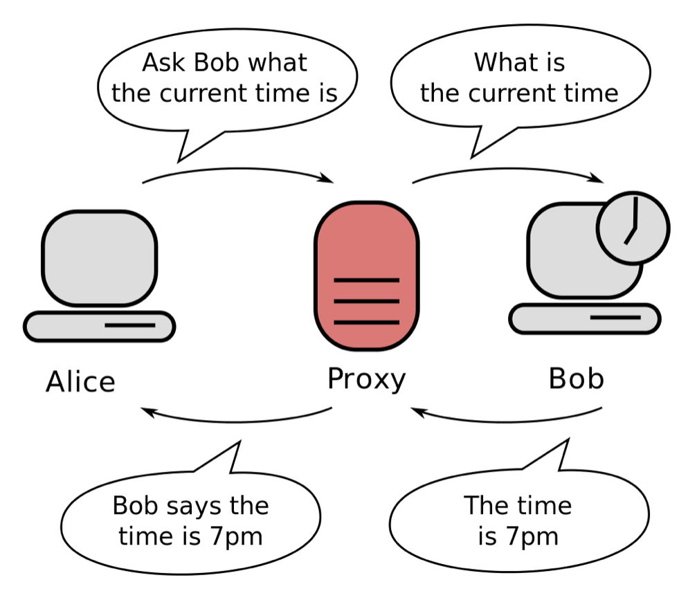
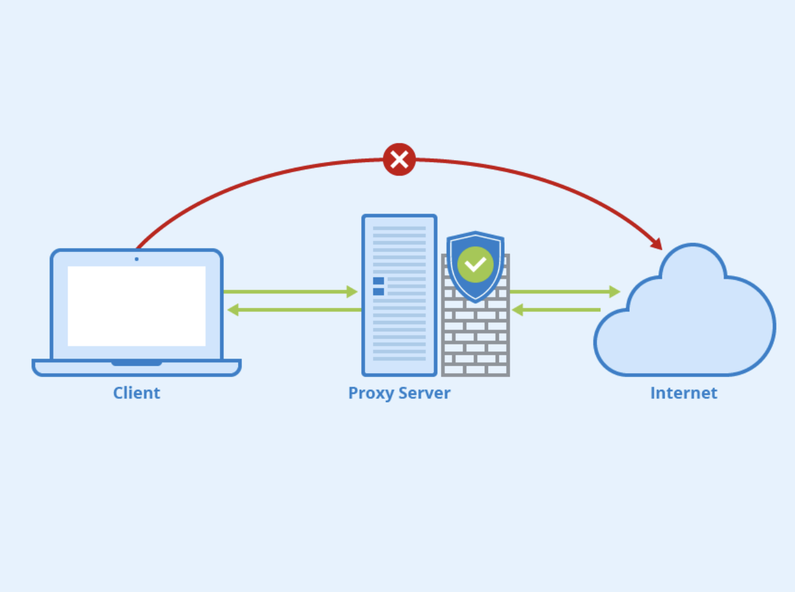

# 프록시 패턴(Proxy Pattern)

프록시 패턴은 대상 객체(subject)에 접근하기 전에 그 접근에 대한 흐름을 가로채 대상 객체 앞단의 인터페이스 역할을 하는 디자인 패턴이다.

### 프록시란?

대리자, 대변인으로 다른 누군가를 대신해서 그 역할을 수행하는 존재이다.

> 인터페이스를 사용, 실행시킬 클래스에 대한 객체가 들어갈 자리에 **대리자 객체를 대신 투입**한다. **흐름제어**만 할 뿐 결과값을 조작하거나 변경시키면 안된다.

### 프록시 패턴의 특징

프록시 서버는 클라이언트가 자신을 통해서 다른 네트워크 서비스에 간접적으로 접속할 수 있게 해주는 컴퓨터 시스템이나 응용 프로그램을 가리킨다.

서버와 클라이언트 사이에 중계자로서 대리로 통신을 수행하는 것을 가리켜 '프록시', 그 **중계 기능을 하는 것을 프록시 서버**라고 부른다.

프록시 서버 중 일부는 프록시 서버에 요청된 내용들을 캐시를 이용하여 저장해둔다.



### 프록시 패턴의 예시

**Interface**

runnable 메서드를 가진 인터페이스

```java
public interface IService{
	String runnable();
}
```

**Service**

```java
public class Service implements IService{
	
	@Override
	public String runnable(){
		return "서비스 좋아요!";
	}
}
```

**Proxy**

새로운 서비스 객체를 생성해서 service.runnable()을 반환한다.

```java
public class Proxy implements IService{
	
	private IService service;		// 실제 객체의 참조를 보관
	
	@Override
	public String runnable(){
		//메서드를 호출할 때 비로소 초기화
		if(service == null){
			service = new Service();
		}
		return service.runnable();
	}
}
```

**Main**

```java
public class Main{
	public static void main(String[] args){
		IService proxy = new Proxy();
		System.out.println(proxy.runnable());
	}
}
```

# 프록시 서버(Proxy Server)

프록시 서버란 클라이언트가 자신을 거쳐 다른 네트워크에 접속할 수 있도록 중간에서 대리해주는 서버를 말한다. 서버와 클라이언트 사이에서 대리로 통신을 수행해주는 것을 프록시라고 하고 그 기능을 하는 서버를 프록시 서버라고 부르게 되는 것이다.



즉, 프록시 서버는 서버와 클라이언트 사이에서 요청과 응답을 처리해주게 되는 것이다.

1. 클라이언트에서 프록시 서버로 데이터 전송
2. 프록시 서버에서 다시 웹 서버로 웹 요청
3. 웹 서버에서 프록시 서버로 웹 응답
4. 프록시 서버에서 클라이언트로 데이터 전송

### 프록시 서버의 사용 목적(이유)

프록시 서버를 사용하는 목적과 이유에는 여러가지가 있을 수 있는데, 대표적으로 아래와 같은 것들이 존재한다.

첫번째는 캐시 데이터를 사용하기 위함이다. 프록시 서버 중 일부는 프록시 서버에 요청된 내용을 캐시를 사용해 저장해둔다. 그러면 캐시에 저장되어있는 내용에 대한 재요청은 서버에 따로 접속할 필요가 없이 저장된 내용을 그대로 돌려주면 되기 때문에 전송 시간을 절약할 수 있고 외부 트래픽을 줄임으로써 네트워크 병목 현상도 방지할 수 있다.

두번째는 보안 목적이다. 프록시 서버가 중간에 경유하게 되면 IP를 숨기는 것이 가능하기 때문이다. 또한 프록시 서버를 방화벽으로 사용하기도 한다.(프록시 방화벽)



세번째는 접속 우회이다. 간혹 한국에서는 접속이 제한되는 사이트가 있다. IP를 검사해서 한국에서 접속한지를 검사하기 때문인데 이런 경우 프록시 서버를 사용하면 접속을 다른나라로 우회할 수 있다. 우회에 사용할 서버 주소와 포트를 구한 후 '인터넷 옵션>연결>LAN설정>프록시서버'에서 서버 주소와 포트를 설정해주면 설정해준 서버에서 접속한 것처럼 속일 수 있기 때문에 접속 제한을 우회할 수 있다.

