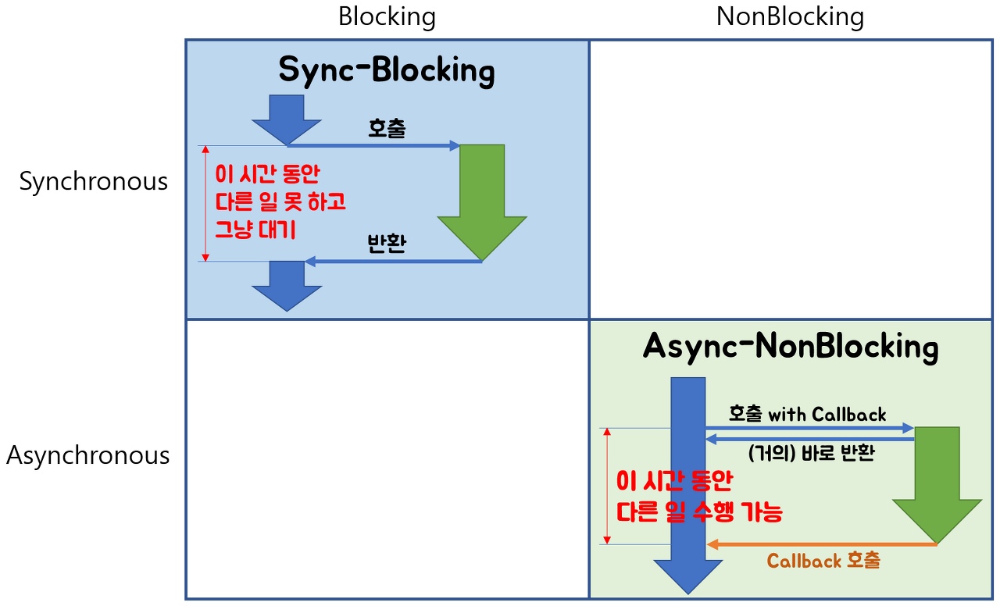
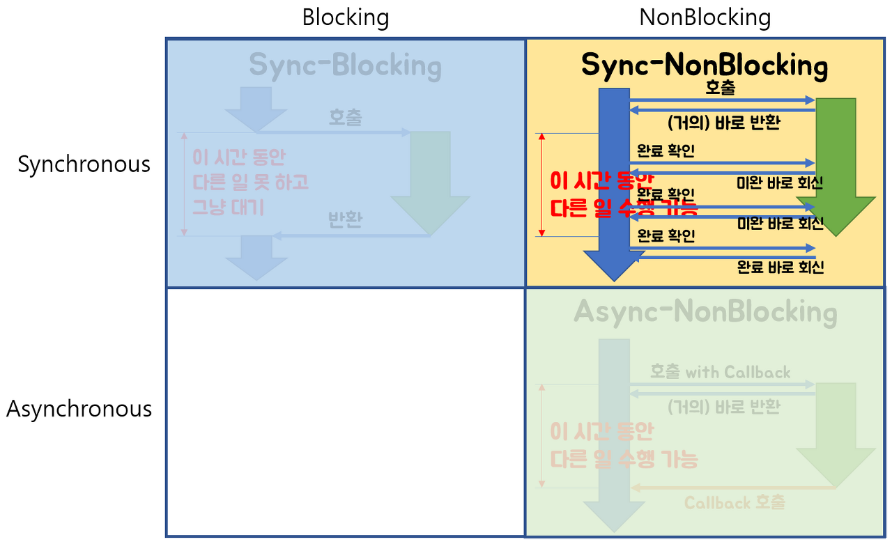
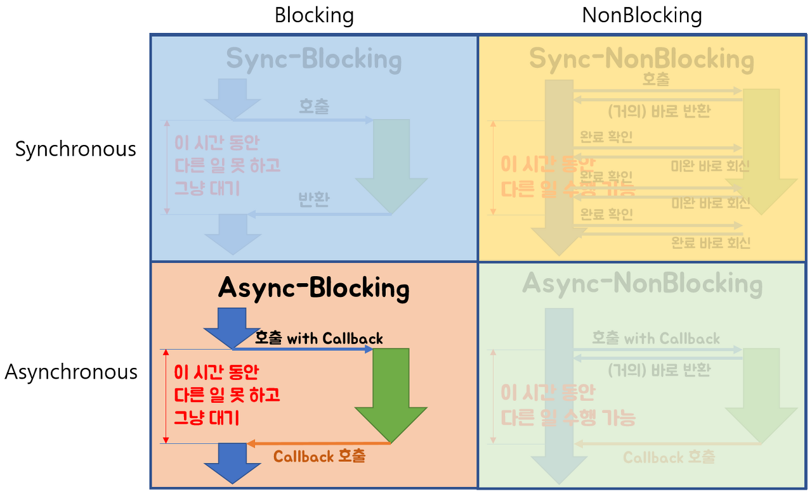

# Blocking & Non-blocking

### 블로킹(Blocking)

- A함수가 B함수를 호출할 때, B함수가 **자신의 작업이 종료되기 전까지 A함수에게 제어권을 돌려주지 않는 것**

### 논블로킹(Non-blocking)

- A함수가 B함수를 호출할 때, **B함수가 제어권을 바로 A함수에게 넘겨주면서**, A함수가 다른 일을 할 수 있도록 하는 것

### 동기(Synchronous)

- A함수가 B함수를 호출할 때, **B함수의 결과를 A함수가 처리**하는 것

### 비동기(Asynchronous)

- A함수가 B함수를 호출할 때, **B함수의 결과를 B함수가 처리**하는 것. (callback)

4가지 개념을 바탕으로 그림으로 이해해보자.

Sync-Blocking 모델과 Async-Nonblocking 모델에 대해서는 흔하게 접하고 있기 때문에 그림만으로도 충분히 이해할 것이라고 생각된다.

- Sync-Blocking 모델의 경우에는 Blocking 이기 때문에 A함수가 B함수를 호출할 때, B함수의 작업이 종료되기 전까지 제어권을 주지 않는것을 볼 수 있고, 또한 B함수의 결과를 A함수가 반환받아서 처리하는 것을 볼 수 있다.
- Async-NonBlocking 모델의 경우에는 NonBlocking 이기 때문에 A함수가 B함수를 호출할 때, B함수가 바로 제어권을 A함수에게 넘겨주어 A함수가 다른일을 할 수 있게 되고, 또한 B함수는 결과를 자신이 처리하는 것을 볼 수 있다.

이 방식은 그림에서도 나와있듯이 NonBlocking 이기 때문에 B함수가 바로 제어권을 A함수에게 돌려주기에 A함수는 다른 작업을 수행할 수 있지만, 언제 종료되는지 알 수 없는 B함수의 종료를 A함수가 처리해야 한다.

즉, Sync 방식으로써 A함수가 B함수의 결과를 직접 처리해야하는 상황이기에 B함수의 종료를 반복적으로 물어봐야 하는 경우이다.

이 방식은 그림으로만 봐도 알 수 있듯 굉장히 비효율적으로 보이는 모델이다.

Blocking이고 Async라서 A함수는 B함수를 호출하면, B함수가 자신의 로직을 수행하고 결과값을 처리할 때까지 A함수는 아무것도 못하고 기다려야만 한다.