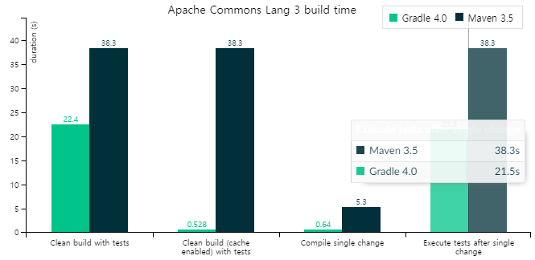
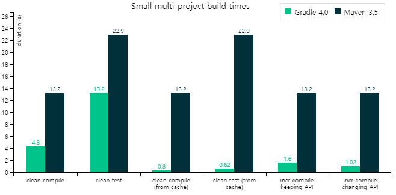
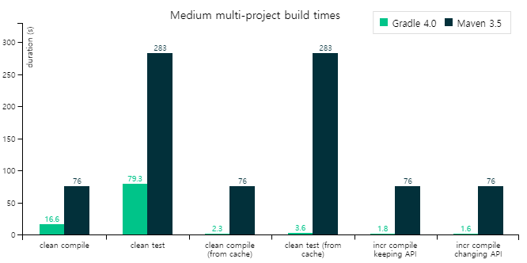
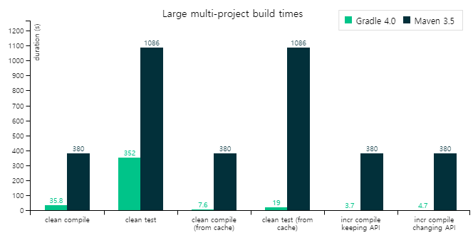

# 메이븐(Maven)과 그래들(Gradle)

### 1. 메이븐(Maven)

#### Maven이란?

- 아파치 메이븐은 자바용 프로젝트 관리 도구이다.
- 아파치 Ant의 대안으로 만들어졌다.
- 아파치 라이센스로 배포되는 오픈 소스 소프트웨어이다.

프로젝트를 진행하면서 사용하는 수 많은 라이브러리들을 관리해주는 도구이다.

여기서 메이븐의 특징적인 점은 그 라이브러리들과 연관된 라이브러리들까지 거미줄처럼 모두 연동이 되서 관리가 된다는 점이다.

즉, 메이븐은 네트워크를 통해서 연관된 라이브러리까지 같이 업데이트를 해주기 때문에 사용이 편리하다.

#### POM - Project Object Model

Maven의 기능을 이용하기 위해 POM이 사용된다.

POM은 약자 이름 그대로 Project Object Model의 정보를 담고있는 파일이다.

pom.xml에서 주용하게 다루는 기능들은 아래와 같다.

- **프로젝트 정보**: 프로젝트의 이름, 라이센스 등
- **빌드 설정**: 소스, 리소스, 라이프사이클별 실행한 플로그인 등 빌드와 관련된 설정
- **빌드 환경**: 사용자 환경별로 달라질 수 있는 프로파일 정보
- **pom 연관 정보**: 의존 프로젝트(모듈), 상위 프로젝트, 포함하고 있는 하위 모듈 등

### 2. 그래들(Gradle)

#### Gradle이란?

- 빌드, 프로젝트 구성/관리, 테스트, 배포 도구
- 안드로이드 앱의 공식 빌드 시스템
- 빌드 속도가 Maven에 비해서 10~100배 가량 빠르다.
- Java, C/C++, Python 등을 지원한다.
- 빌드툴인 Ant Builder와 Groovy 스크립트 기반으로 만들어져 기존 Ant의 역할과 배포 스크립트의 기능을 모두 사용이 가능하다.

> Groovy: Java 가상 머신에서 실행되는 **스크립트 언어**이다. Java 가상머신에서 동작하지만, Java와는 달리 소스코드를 **컴파일할 필요는 없다.** Groovy는 스크립트 언어이고, 소스코드를 그대로 실행한다. 또한 **Java와 호환**되고, Java 클래스 파일을 그대로 Groovy 클래스로 사용할 수 있다.

### 3. 메이븐(Maven) VS 그래들(Gradle)

1. 스크립트의 길이와 가독성 면에서 Gradle이 우세하다.(Gradle이 더 간결하게 작성할 수 있다.)
2. 빌드와 테스트 실행 결과 Gradle이 더 빠르다. (Gradle은 캐시를 사용하기 때문에 테스트 반복시 차이가 더 커진다.)
3. 의존성이 늘어날수록 성능과 스크립트 품질의 차이가 심해질 것이다.

maven은 프로젝트가 커질수록 빌드 스크립트의 내용이 길어지고 가독성이 떨어진다. 반면에 Gradle은 훨씬 적은양의 스크립트로 짧고 간결하게 작성할 수 있다.

maven이 정적인 형태의 XML 기반으로 작성되어 **동적인 빌드를 적용할 경우 어려움이 많다**면, Gradle은 Groovy를 사용하기 때문에 **동적인 빌드는 Groovy 스크립트로 플러그인을 호출하거나 직접 코드를 짜면 된다.**

maven의 경우 멀티 프로젝트에서 **특정 설정**을 다른 모듈에서 사용하려면 상속을 받아야 하지만, Gradle은 설정 주입 방식을 사용하기 때문에 멀티 프로젝트에 매우 적합하다.

다음은 Gradle과 Maven의 속도 비교표이다.

