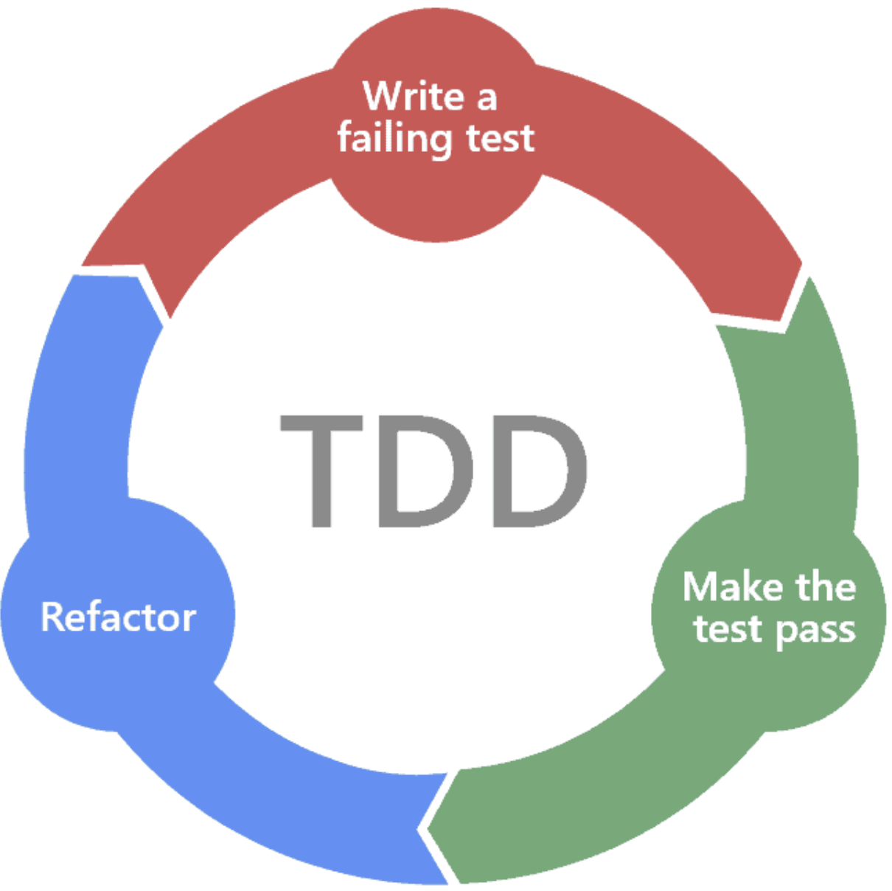
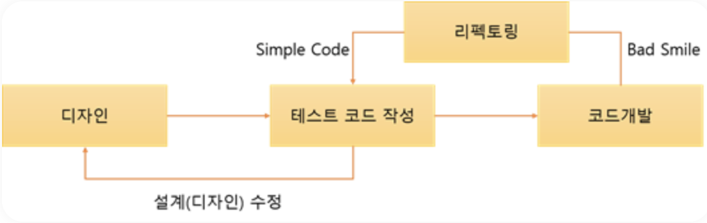

# TDD(Test Driven Development)

TDD란 Test Driven Development의 약자로 테스트 주도 개발이라고 한다.

**반복 테스트**를 이용한 소프트웨어 방법론으로 **작은 단위의 테스트 케이스를 작성하고 이를 통과하는 코드를 추가하는 단계를 반복**하여 구현한다.

짧은 개발 주기의 반복에 의존하는 개발 프로세스이며, 애자일 방법론 중 하나인 `eXtream Programming(XP)`의 **Test-First** 개념에 기반을 둔 단순한 설계를 중요시한다.

> eXtream Programming(XP): 미래에 대한 예측을 최대한 하지 않고  지속적으로 프로토타입을 완성하는 애자일 방법론 중 하나이다.
> 이 방법론은 추가 요구사항이 생기더라도 실시간으로 반영할 수 있다.

### TDD 개발주기

- [**RED**] 단계에서는 **실패하는 테스트 코드를 먼저 작성**한다.
- [**GREEN**] 단계에서는 테스트 코드를 **성공시키기 위한 실제 코드를 작성**한다.
- [**BLUE**] 단계에서는 중복 코드 제거, 일반화 등의 **실제 리팩토링을 수행**한다.

중요한 것은 실제 테스트 코드를 작성할 때까지 실제 코드를 작성하지 않는 것과, 실패하는 테스트 코드를 통과할 정도의 최소 실제 코드를 작성해야 하는 것이다. 이를 통해서 실제 코드에 대해 기대되는 바를 보다 명확하게 정의함으로써 불필요한 설계를 피할 수 있고, 정확한 요구사항에 집중할 수 있다.

즉, 일반 개발방식과의 가장 큰 차이점은 **테스트 코드를 작성한 뒤에 실제 코드를 작성**한다는 것이다.

디자인(설계) 단계에서 프로그래밍 목적을 반드시 미리 정의해야만 하고, 무엇보다 테스트해야 할지 미리 정의(테스트 케이스 작성)해야만 한다.

이후 테스트가 통과된 코드만을 코드 개발단계에서 실제 코드로 작성한다.

> 이러한 반복적인 단계가 진행되면서 자연스럽게 코드의 **버그가 줄어들고 소스코드는 간결해진다.**

또한 테스트 케이스 작성으로 인해서 자연스럽게 설계가 개선됨으로 재설계 시간이 절감된다.

TDD의 대표적인 툴로는 JUnit, xUnit 등 이 존재한다.

### TDD 개발방식의 장점

#### 보다 튼튼한 객체지향적인 코드 생산

TDD는 코드의 **재사용 보장을 명시**하므로 TDD를 통한 소프트웨어 개발 시 **기능별 철저한 모듈화가 이루어진다.**

이는 종속성과 의존성이 낮은 모듈로 조합된 소프트웨어 개발을 가능하게 하며 필요에 따라서 모듈을 추가하거나 제거해도 소프트웨어 전체 구조에 영향을 미치지 않게된다.

#### 재설계 시간의 단축

테스트 코드를 먼저 작성하기 때문에 개발자가 지금 무엇을 해야하는지 분명히 정의하고 개발을 시작하게 된다. 또한 테스트 시나리오를 작성하면서 다양한 예외사항에 대해서 생각해볼 수 있다. 이는 개발 진행 중 소프트웨어의 전반적인 설계가 변경되는 것을 방지할 수 있다.

#### 디버깅 시간의 단축 

이는 유닛 테스팅을 하는 이점이기도 하다. 예를들면 사용자의 데이터가 잘못 나온다면 DB의 문제인지, 비즈니스 레이어의 문제인지 UI의 문제인지 실제 모든 레이어들을 전부 디버깅 해야하지만, TDD의 경우 자동화된 유닛 테스팅을 전제하므로 특정 버그를 손 쉽게 찾아낼 수 있다.

#### 테스트 문서의 대체 가능

주로 SI 프로젝트 진행 과정에서 어떤 요소들이 테스트 되었는지 테스트 정의서를 만든다. 이것은 단순 통합 테스트 문서에 지나지 않는다. 하지만 TDD를 하게될 경우 테스팅을 자동화 시킴과 동시에 보다 **정확한 테스트 근거를 산출할 수 있다.**

#### 추가 구현의 용이함

개발이 완료된 소프트웨어의 어떤 기능을 추가할 때, 가장 우려되는 점은 해당 기능이 기존 코드에 어떤 영향을 미칠지 알지 못한다는 것이다. 하지만 TDD의 경우 자동화된 유닛 테스팅을 전제하므로 테스트 기간을 획기적으로 단축할 수 있다.

> 이러한 TDD의 장점에도 불구하고 모두가 이 개발 프로세스를 사용하는 것은 아니다. 그 이유는 무엇일까?

### TDD 개발방식의 단점

#### 가장 큰 단점은 바로 생산성 저하이다.

개발 속도가 느려진다고 생각하는 사람이 많기 때문에 TDD에 대해서 반신반의 한다.

왜냐하면 처음부터 2개의 코드를 작성해야하고, 중간중간 테스트 하면서 고쳐나가야 하기 때문이다.

TDD 방식의 개발 시간은 일반적인 개발 방식에 비해서 대략 10%~30% 정도로 늘어난다.

SI 프로젝트의 경우에는 소프트웨어의 품질보다는 납기일 준수가 훨씬 중요하기 때문에 TDD 방식을 잘 사용하지 않는다.

### TDD를 하기 어려운 이유?

#### 이제까지 자신이 개발하던 방식을 많이 바꿔야한다.

몸에 체득한 것이 많을수록 바꾸기 어렵다.

오히려 개발을 별로 해보지 않은 사람들에게 적용하기 쉽다.

#### TDD는 이렇게 해야한다는 이미지(틀)이 있다.

- 반드시 툴(단위 테스트 프레임워크)을 써서 개발해야 된다. 라고 생각한다.
- 이러한 규칙에 얽매이는 것은 애자일 방식이 아니다.
- 결국엔 규칙에 얽매여 똑같은 테스트를 copy&paste를 한다.
- 도구/규칙에 집착하다 보니 TDD가 어려워지는 것이다.

### TDD를 잘하는 방법?

#### 계속해서 본인이 일하는 방식을 업그레이드 해야한다.

예를들어서 게임 개발을 하면서 stage3를 테스트 할 때, 

항상 stage1, stage2를 클리어한 뒤 테스트를 해야한다.

-> 테스트 비용이 증가한다.

> 어떻게 하면 비용을 낮출 수 있을까 고민한다.

-> 바로 stage3로 갈 수 있도록 만든다.

이렇게 하면 피드백을 좀 더 자주 받을 수 있다.

> 즉, **중복적으로 하는 노력들을 자동화하도록 업그레이드하면 발전할 수 있다.**