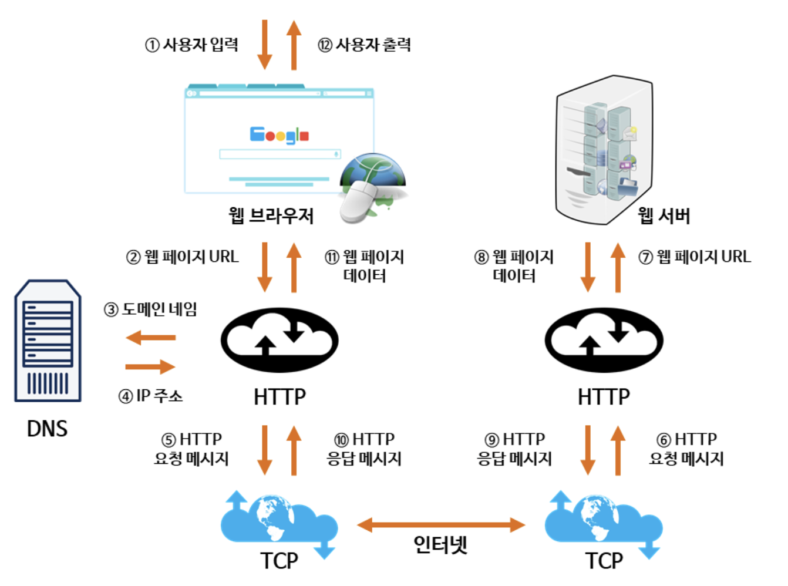

# 웹의 동작원리

다음은 우리가 웹 브라우저를 통해 웹 사이트에 접속하여 원하는 웹 페이지를 가져오는 과정을 도식화한 그림이다.

1. 사용자가 웹 브라우저를 컴퓨터를 통해서 켠다.
2. 사용자는 웹 브라우저를 통해서 원하는 웹 페이지의 URL 주소를 입력한다.
3. 사용자가 입력한 URL 주소 중에서 도메인 네임(Domain name) 부분을 DNS 서버에서 검색한다.
4. DNS 서버에서 해당 도메인 네임에 해당하는 IP 주소를 찾아서 사용자가 입력한 URL 정보와 함께 전달한다.
5. 웹 페이지의 URL 정보와 전달받은 IP주소는 HTTP 프로토콜을 사용하여 HTTP 요청 메시지를 생성한다.
6. 이렇게 생성된 HTTP 요청 메시지는 TCP 프로토콜을 사용하여 인터넷을 거쳐서 해당 IP 주소의 컴퓨터로 전송된다.
7. 이렇게 도착한 HTTP 요청 메시지는 HTTP 프로토콜을 사용하여 웹 페이지 URL 정보로 변환된다.
8. 웹 서버는 도착한 웹 페이지 URL 정보에 해당하는 데이터를 검색한다.
9. 검색된 웹 페이지 데이터는 또 다시 HTTP 프로토콜을 사용하여 HTTP 응답 메시지를 생성한다.
10. 이렇게 생성된 HTTP 응답 메시지는 TCP 프로토콜을 사용하여 인터넷을 거쳐 원래 컴퓨터로 전송된다.
11. 도착한 HTTP 응답 메시지는 HTTP 프로토콜을 사용하여 웹 페이지 데이터로 변환된다.
12. 변환된 웹 페이지 데이터는 웹 브라우저에 의해서 출력되어 사용자가 볼 수 있게 된다.