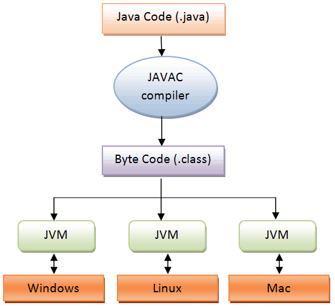
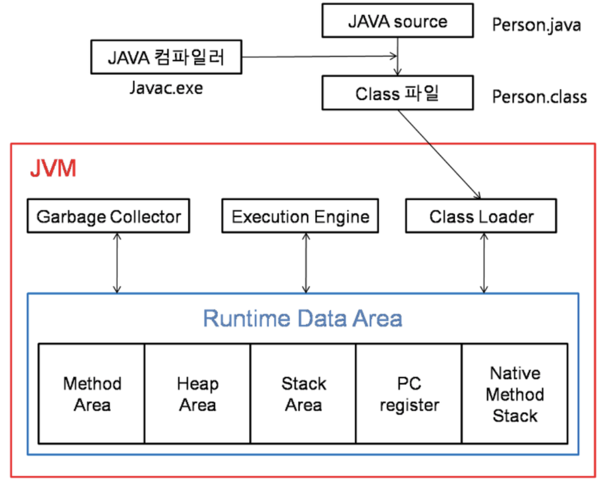

# JVM(Java Virtual Machine)

## JVM이란?

JVM은 Java Virtual Machine의 약자로, 자바 가상머신이라고 부른다. 그리고 자바와 운영체제 사이에서 중개자 역할을 수행하며, 자바가 운영체제에 구애받지않고 프로그램을 실행할 수 있도록 도와준다. 또한 Gabage Collector를 사용한 메모리 관리도 자동으로 수행하며 다른 하드웨어와 다르게 레지스터 기반이 아닌 스택 기반으로 동작한다.

Java 프로그램을 실행하는 동작 원리는 다음과 같다.

### Java 파일의 작동원리

> src/TPC01.java 파일을 구동한다고 가정해보자

1.TPC01.java 는 소스파일이어서 실행이 불가능하다. 따라서 TPC01.java를 실행하면 컴파일 과정을 거친다.

2.컴파일이 성공적으로 완료된 소스파일(TPC01.java)는 실행 가능한 파일(TPC01.class)를 생성하게 된다. 단, **.class** 파일은 실행파일(**.exe**)이 아니고 바이트코드(**byte code**)이기 때문에 바로 실행이 불가능하다.

그렇다면 **.java** 파일은 어떻게 실행되는 것일까?

> 결과부터 말하면 **JVM(Java Virtual Machine)** 에 의해서 실행된다.

3.**JVM**은 **.class** 파일을 메모리에 로드하고, 자신의 운영체제에 맞게 다시 컴파일을 하여 **.exe**를 만들어서 실행한다.

>**Java** 프로그램을 구동할 때의 핵심은 **JVM** 이라는 가상머신이 구동하기 때문에 **OS**에 독립적으로 실행할 수 있다는 장점이 있다는 것이다.

즉, 만약에 자바 소스파일을 리눅스 환경에서 만들고나서 이 소스파일을 윈도우에서 실행하고 싶다면 윈도우용 JVM을 설치하여 실행하면 된다.

## JVM 구조

JVM 내부에서는 크게 `Class Loader`, `Garbage Collector`, `Execution Engine` 의 세 가지로 나뉜다.

### Class Loader

자바 컴파일러가 **.java** 파일을 컴파일하면 **.class** 파일(바이트 코드)가 생성된다. 이렇게 생성된 클래스 파일을 엮어서 `Runtime Data Area` 형태로 메모리에 적재하는 역할을 한다.

1. 어떤 메서드를 호출하는 문장을 만났는데, 그 메서드를 가진 클래스 바이트코드가 아직 로딩된적이 없다면 곧바로 JVM은 JRE 라이브러리 폴더에서 **클래스를 찾는다.**
2. 없으면 **ClassPath 환경변수에 지정된 폴더에서 클래스를 찾는다.**
3. 찾았으면 그 클래스 파일이 **올바른지 바이트코드를 검증**한다.
4. 올바른 바이트코드라면 **메서드 영역으로 파일을 로딩**한다.
5. 클래스 **변수**를 만들라는 명령어가 있으면 **메서드 영역에 그 변수를 준비한다.**
6. 클래스 블록이 있으면 **순서대로 그 블록을 실행**한다.
7. 이렇게 한번 클래스의 바이트코드가 로딩되면 **JVM이 종료될 때까지 유지된다.**

### Execution Engine

메모리에 적재된 클래스들을 **기계어로 변경해서 명령어 단위로 실행**하는 역할을 한다.

방식에는 두 가지가 있는데, 명령어를 하나씩 실행하는 `인터프리터` 방식과 실행 시점에 자주 쓸만한 코드들을 기계어로 변환시켜놓고 저장해서 사용하는 `JIT(Just In Time)` 방식이 있다.

### Garbage Collector

Heap 메모리 영역에 생성된 객체들중에 **Reachability** 를 잃은 객체를 탐색 후 제거하는 역할을 한다.

> 자세한 내용은 구글에 검색하면 많이 나온다.

### Runtime Data Area 

#### Method Area 

클래스 멤버변수, 메서드 정보, Type(Class, Interface) 정보, Constant Pool, static, final 변수 등이 생성된다. 상수 풀은 모든 Sybolic Reference를 포함하고 있다.

#### Heap Area

**동적으로 생성된 오브젝트와 배열**이 저장되는 곳으로 **Garbage Collection의 대상**이 되는 영역이다.

#### Stack Area

지역 변수, 파라미터 등이 생성되는 영역이다. 동적으로 객체를 생성하면 실제 객체는 Heap 영역에 할당되고 해당 참조만 Stack에 저장된다. Stack은 스레드별로 독자적으로 가진다.

> Heap에 있는 오브젝트가 **Stack에서 참조할 수 없는 경우에는 GC의 대상**이 된다.

#### PC Register

현재 쓰레드가 **실행되는 부분의 주소와 명령을 저장**하고 있다. (CPU의 PC Register와 다르다.)

#### Native Method Stack

**자바외 언어**로 작성된 네이티브 코드를 위한 메모리 영역