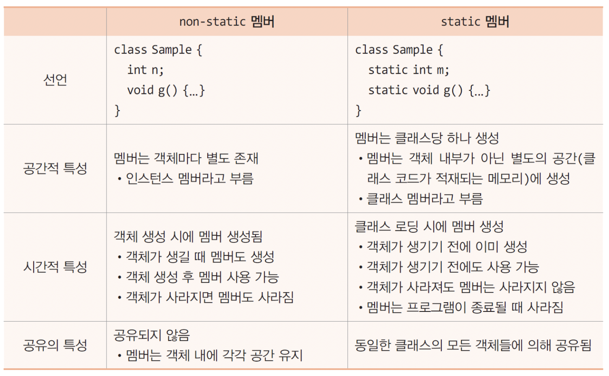

# non-static VS static

## non-static 멤버

### 특성

- 공간적 특성 : 멤버들은 객체마다 독립적으로 별로로 존재한다.
	- 인스턴스 멤버라고도 부른다.
- 시간적 특성 : 필드와 메서드는 객체 생성 후 비로소 사용이 가능하다.
- 비공유 특성 : 멤버들은 다른 객체에 의해 공유되지 않고 배타적이다.

## static 멤버

### 특성

- 공간적 특성 : 클래스 당 하나만 생성된다.
	- 클래스 멤버라고도 부른다.
- 시간적 특성 : 클래스가 로딩될 때 공간이 할당된다.
- 공유의 특성 : 동일한 클래스의 모든 객체에 의해 공유된다.
	- 객체를 생성하지 않고 사용 가능하다.

## non-static 멤버와 static 멤버의 차이점

### Q. java의 main 메서드가 static인 이유

C언어와 마찬가지로 자바 언어에서도 `main`메서드가 먼저 실행된다. 그런데 실행되기 위해서는 메모리에 미리 올라가야 한다. 그렇기 때문에 `static`으로 선언하여 메모리 할당(new)를 하지 않아도 사용할 수 있게 만든다. 특히나 `main`메서드는 자바 가상머신(JVM)에 의해 호출되기 때문에 반드시 `static`으로 선언되어 미리 로드되어 있어야 한다.