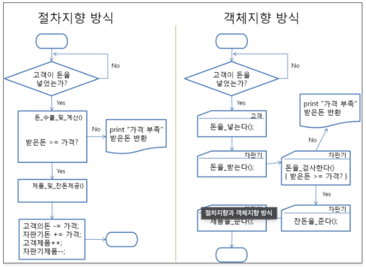

# 객체지향 이란?

### 절차 지향

절차 지향 모델링은 프로그램을 `기능중심`으로 바라보는 방식으로 **"무엇을 어떤 절차로 할 것인가?"**가 핵심이 된다. 즉, 어떤 기능을 어떤 순서로 처리하는가에 초점을 맞춘다.

### 객체 지향

객체 지향 모델링은 기능이 아닌 `객체가 중심`이 되며 **"누가 어떤 일을 할 것인가?"**가 핵심이 된다. 즉, 객체를 도출하고 역할을 정의해 나가는 것에 초점을 맞춘다.

### 절차 지향 VS 객체 지향

- 대형 프로그래밍의 경우 **많은 기능**을 수반하기 때문에 절차 지향보다는 객체 지향이 적합하다.
	- 각 객체가 하는 역할이 많아도, 많은 역할을 객체로 묶을 수 있기 때문이다.
- 소형 프로그래밍의 경우 **작은 기능**을 수반하기 때문에 객체 지향보다는 절차 지향이 적합하다.
	- 작은 기능을 객체별로 나눌 경우, 오히려 복잡해질 수 있기 때문이다.

