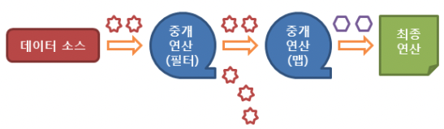

# Stream

### Stream 이란?

자바(Java)에서는 파일이나 콘솔의 입출력을 직접 다루지 않고, 스트림(Stream)이라는 흐름을 통해 다룬다. 스트림(Stream)이란 실제의 입력이나 출력이 표현된 **데이터의 이상화된 흐름**을 의미한다. 즉, 스트림은 운영체제에 의해 생성되는 가상의 연결고리를 의미하며, `중간 매개자`의 역할을 한다.

하지만 이 스트림은 자바 8부터 추가되는 `Stream API`라는 개념과는 별개의 개념을 뜻한다.

### Java Stream API 란? 

자바 8부터 도입된 스트림 API는 데이터를 추상화하여 다루므로, 다양한 방식으로 저장된 데이터를 읽고 쓰기위한 공통된 방법을 제공한다.

자바에서는 많은 양의 데이터를 저장하기 위해서 배열이나 컬렉션을 이용한다. 이렇게 저장된 데이터에 접근하기 위해서는 반복문이나 반복자(Iterator)를 사용하여 매번 새로운 코드를 작성해야 한다. 하지만 이렇게 작성된 코드는 길이가 너무 길고 가독성도 떨어지며, 코드의 재사용이 거의 불가능하다. 즉, 데이터베이스의 쿼리와 같이 정형화된 처리 패턴을 가지지 못했기 때문에 데이터마다 다른 방법으로 접근해야만 했다.

이러한 문제점을 극복하기 위해서 자바 8부터 Stream API를 도입한 것이다. 실제로 Stream API를 사용하면 람다식과 메서드 참조 그리고 중간연산과 최종연산을 거치면서 데이터에 맞는 방식(Map, List 등등)으로 길게 써야했던 코드를 짧게 이용할 수 있음을 경험했다.

### Stream API의 특징

- 스트림은 외부 반복을 통해서 작업하는 컬렉션과는 달리 **내부 반복(Internal iteration)**을 통해서 작업을 수행한다.
- 스트림은 재사용이 가능한 컬렉션과는 달리 **단 한번만 사용할 수 있다.**
- 스트림은 **원본 데이터를 변경하지 않는다.**
- 스트림의 연산은 `필터-맵(filter-map)`기반의 API를 사용하여 **지연(Lazy) 연산을 통해 성능을 최적화**한다.
- 스트림은 `parallelStream()` 메서드를 통해서 **손쉬운 병렬 처리를 지원**한다.

### Stream API의 동작 흐름

1. 스트림의 생성
2. 스트림의 중개(중간) 연산(스트림의 변환)
3. 스트림의. 최종 연산(스트림의 사용)



###  Java Stream API 사용법

#### Stream의 생성

Stream API는 다음과 같이 다양한 데이터 소스에서 생성할 수 있다.

- 컬렉션

```java
List<Integer> list = new ArrayList<>();
Stream<Integer> stream = list.stream();
```

- 배열

```java
String[] arr = new String[]{"one", "two", "three", "four"};
Stream<String> stream1 = Arrays.stream(arr);
Sream<String> stream2 = Arrays.stream(arr, 1, 3);
```

- 가변 매개변수

```java
Stream<Double> stream = Stream.of(4.2, 2.5, 3.1, 1.9);
```

- 저장된 범위의 연속된 정수에서 스트림 생성

```java
IntStream stream1 = IntStream.range(1, 4);
IntStream stream2 = IntStream.rangeClosed(1, 4);
```

- 특정 타입의 난수로 이루어진 스트림 생성

```java
IntStream stream = new Random().ints(4);
```

- 람다 표현식

```java
IntStream stream = Stream.iterate(2, n -> n + 2);	// 2, 4, 6, 8, 10, ...
```

- 파일

```java
Stream<String> stream = Files.lines(Path path);	// 라인 단위로 접근한다.
```

- 빈 스트림 생성

```java
Stream<Object> stream = Stream.empty();
```

#### 중개(중간) 연산

중개 연산은 Stream을 전달받아 Stream으로 반환하므로 중개 연산을 연속으로 사용할 수 있다. 또한, Stream의 중개 연산은 `필터-맵(filter-map)`기반의 API를 사용함으로 **지연(Lazy) 연산**을 통해서 **성능을 최적화**할 수 있다.

대표적인 중개 연산과 그에 따른 메서드는 다음과 같다.

- **Stream 필터링: filter(), distinct()**
	- `distinct()`: stream에서 **중복된 요소를 제거**하는 메서드이다.
	- `filter()`: stream에서 **특정 조건을 통해서 필터링**하는 메서드이다.

```java
IntStream stream = IntStream.of(1, 2, 3, 2, 3, 4, 5);
stream.distinct();	// 1, 2, 3, 4, 5
```

```java
IntStream stream = IntStream.of(1, 2, 3, 2, 3, 4, 5);
stream.filter(n -> n % 2 != 0);	// 1, 3, 3, 5
```

- **Stream 변환: map(), flatMap()**
	- `map()`: 해당 스트림의 요소들을 주어진 함수에 인수로 전달하여, 그 반환값들로 이루어진 새로운 스트림을 반환한다.
	- `flatMap()`: 여러 문자열이 저장된 배열을 각 문자열에 포함된 단어로 이루어진 스트림으로 변환한다.

```java
Stream<String> stream = Stream.of("HTML", "CSS", "JAVA", "JAVASCRIPT");
stream.map(s -> s.toLowerCase());	// html, css, java, javascipt
```

```java
String[] arr = {"I study hard", "You study JAVA", "I am hungry");
Stream<String> stream = Arrays.stream(arr);
stream.flatMap(s -> Stream.of(s.split(" ")));	// I, study, hard, You, study, JAVA, I, am, hungry
```

- **Stream 제한: limit(), skip()**
	- `skip()`: 특정 인덱스까지의 요소를 **제외한 나머지 요소만 반환**
	- `limit()`: **특정 인덱스까지의** 요소 까지만 반환

```java
IntStream stream = IntStream.range(0, 10);
stream.skip(4);	// 4, 5, 6, 7, 8, 9
```

```java
IntStream stream = IntStream.range(0, 10);
stream.limit(5);	// 0, 1, 2, 3, 4
```

- **Stream 정렬: sorted()**
	- `sorted()`: 해당 스트림을 주어진 **비교자(comparator)**를 이용하여 정렬한다.

```java
Stream<String> stream = Stream.of("JAVA", "HTML", JAVASCRIPT", "CSS");
stream.sorted();	// CSS, HTML, JAVA, JAVASCRIPT
```

#### 최종 연산

최종 연산은 앞서 중개 연산을 통해서 만들어진 stream에 있는 요소들에 대해서 마지막으로 각 요소를 소모하며 최종 결과를 표시한다. 즉, 지연(lazy)되었던 모든 중개 연산들이 최종 연산 시에 모두 수행되는 것이다. 이렇게 최종 연산 시에 모든 요소를 소모한 해당 stream은 더이상 사용할 수 없다.

대표적인 최종 연산과 그에 따른 메서드는 다음과 같다.

- **요소의 출력: forEach()**
	- `forEach()`: 스트림의 각 요소에 대해서 해당 요소를 소모하여 명시된 동작을 수행한다.

```java
Stream<String> stream = Stream.of("one", "two", "three", "four");
stream.forEach(System.out::println);	// one, two, three, four
```

- **요소의 소모: reduce()**
	- `reduce()`: **처음 두 요소**를 가지고 연산을 수행한 뒤, 그 결과와 다음 요소를 가지고 또다시 연산을 수행한다. 이런식으로 해당 스트림의 모든 요소를 소모하여 연산을 수행하고, 그 결과를 반환한다.

```java
Stream<String> stream1 = Stream.of("one", "two", "three", "four");
Stream<String> stream2 = Stream.of("one", "two", "three", "four");
Optional<String> result1 = stream1.reduce((s1, s2) -> s1 + "+" + s2); // one+two+three+four
String result2 = stream2.reduce("zero", (s1, s2) -> s1 + "+" + s2); // zero+one+two+three+four
```

- **요소의 검색: findFirst(), findAny()**
	- `findFirst()`: 해당 스트림에서 **첫 번째 요소를 참조**하는 Optional 객체를 반환한다.
	- `findAny()`: findFirst()와 동일하며, 병렬 스트림일때 사용한다.

```java
IntStream stream = IntStream.of(4, 2, 3, 1);
OptionalInt result1 = stream.sorted().findFirst();	// 1
OptionalInt result2 = stream.sorted().findAny();	// 1
```

- **요소의 검사: anyMatch(), allMatch(), noneMatch()**
	- `anyMatch()`: 해당 스트림의 **일부** 요소가 특정 조건을 만족할 경우에 true를 반환한다.
	- `allMatch()`: 해당 스트림의 **모든** 요소가 특정 조건을 만족할 경우에 true를 반환한다.
	- `noneMatch()`: 해당 스트림의 모든 요소가 특정 조건을 **만족하지 않을 경우**에 true를 반환한다.

```java
IntStream stream = IntStream.of(4, 2, 3, 1);
boolean result1 = stream.anyMatch(n -> n > 2);// true
boolean result2 = stream.allMatch(n -> n > 2);// false
boolean result3 = stream.noneMatch(n -> n > 5);// true
```

- **요소의 통계: count(), min(), max()**
	- `count()`: 해당 스트림의 **요소의 개수**를 반환한다.
	- `max()`: 해당 스트림의 요소 중에서 **가장 큰 값**을 가지는 요소를 참조하는 Optional 객체를 반환한다.
	- `min()`: 해당 스트림의 요소 중에서 **가장 작은 값**을 가지는 요소를 참조하는 Optional 객체를 반환한다.

```java
IntStream stream = IntStream.of(4, 2, 3, 1);
long count = stream.count();    // 4
OptionalInt max = stream.max(); // 4
OptionalInt min = stream.min(); // 1
```

- **요소의 연산: sum(), average()**
	- `sum()`: 해당 스트림의 모든 요소에 대해서 **합**을 구하여 반환한다.
	- `average()`: 해당 스트림의 모든 요소에 대해서 **평균값**을 구하여 반환한다.

```java
IntStream stream = IntStream.of(4, 2, 3, 1);
int sum = stream.sum(); // 10
OptionalDouble average = stream.average();  // 2.5
```

- **요소의 수집: collect()**
	- collect(): 인수로 전달되는 Collectors 객체에 구현된 방법대로 스트림의 요소를 수집한다.

```java
Stream<String> stream = Stream.of("HTML", "CSS", "JAVA", "PHP");
Map<Boolean, List<String>> partition = stream.collect(Collectors.partitioningBy(s -> (s.length() % 2) == 0));
List<String> oddLengthList = partition.get(false);  // 문자열의 길이가 홀수: CSS, PHP
List<String> evenLengthList = partition.get(true);  // 문자열의 길이가 짝수: HTML, JAVA
```
