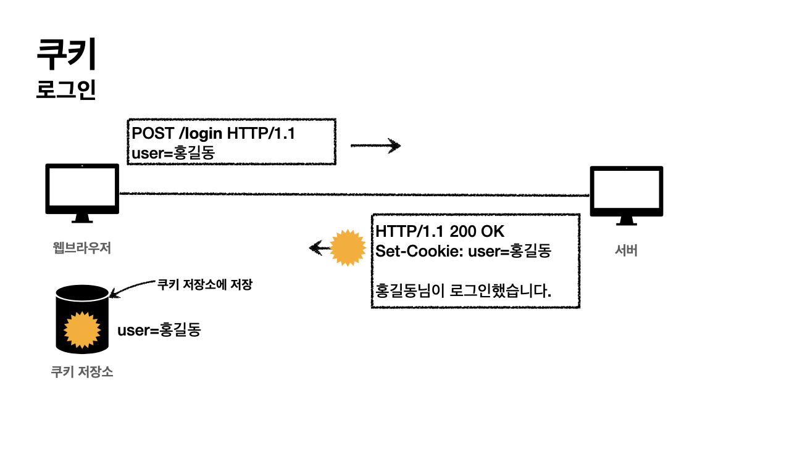

# 쿠키와 세션

**쿠키**와 **세션**을 이해하기 위해서는 HTTP 프로토콜에 대한 이해가 필요하다.
> * HTTP프로토콜은 비연결성(Connectionless)하고 무상태(Stateless)한 프로토콜이다.
> * 클라이언트와 서버가 요청과 응답을 주고 받으면 **연결이 끊어진다.**
> * 클라이언트가 다시 요청하면 서버는 이전 요청을 **기억하지 못한다.**
> * 클라이언트와 서버는 **서로 상태를 유지하지 못한다.**

이와 같은 HTTP 프로토콜을 사용하면서 서버가 클라이언트를 식별할 방법이 필요했고 `쿠키`와 `세션`이 사용되게 됐다.

## 쿠키(Cookie)

### 쿠키란?
* 쿠키는 `클라이언트`에 저장되는 만료기한이 있는 Key-Value 데이터파일이다.
* 쿠키에는 이름, 값, 만료날짜, 경로정보가 들어있다.
* Response Header에 `Set-Cookie` 속성을 사용하면 클라이언트에 쿠키를 만들 수 있다.
* 쿠키는 사용자가 따로 요청하지 않더라도 브라우저가 Request시에 `Request Header`를 넣어서 자동으로 서버에 전송한다.

### 쿠키의 동작 방식

1. 클라이언트가 페이지를 요청
2. 서버에서 쿠키를 생성
3. HTTP 헤더에 쿠키를 포함시켜 응답
4. 브라우저가 종료돼도 쿠키가 만료되지 않았다면 클라이언트에서 보관
5. 같은 요청을 할 경우 HTTP 헤더에 쿠키를 함께 보냄
6. 서버에서 쿠키를 읽어 이전 상태 정보를 변경할 필요가 있다면, 쿠키를 업데이트하고 변경된 쿠키를 HTTP 헤더에 포함시켜 응답

#### 쿠키가 없는 경우

쿠키가 없는 경우 서버는 클라이언트의 상태를 유지하지 못한다.

#### 쿠키를 사용하는 경우

* 처음 서버에 로그인 정보를 보냈을때, 서버가 로그인 정보 유지를 위한 쿠키값을 클라이언트에 저장한다.
* 이후 다시 서버에 요청을 보낼때 쿠키값을 함께 전송하며 서버는 해당 쿠키값을 확인하여 로그인 여부를 확인한다.

### 쿠키의 구성요소
* 쿠키는 여러 구성요소들을 통해 쿠키 값을 설정한다.
* 예) set-cookie:**sessionId**=abcde1234;
**expires**=Sat, 26-Dec-2020 00:00:00 GMT;
**path**=/;
**domain=**.google.com;
**Secure**

#### **생명주기(Set-Cookie : expires, max-age)**
* Set-Cookie: **expires**=Sat, 26-Dec-2020 00:00:00 GMT;
  * 만료일이 되면 쿠키 삭제
* Set-Cookie: **max-age**=3600 (3600초)
  * 해당 시간을 초과하면 쿠키 만료
  * 0이나 음수를 지정하면 쿠키 삭제
* 세션 쿠키 : 만료 날짜를 생략하면 브라우저 종료시까지만 유지
* 영속 쿠키 : 만료 날짜를 입력하면 해당 날짜까지 유지

#### **도메인(Set-Cookie : domain)**
* 예) domain=example.org
* 명시: 명시한 문서 기준 도메인 + 서브 도메인 포함
  * domain=example.org를 지정해서 쿠키 생성한다면
    * example.org은 물론이고
    * dev.example.org도 쿠키 접근

* 생략: 현재 문서 기준 도메인만 적용
  * example.org 에서 쿠키를 생성하고 domain 지정을 생략한다면
    * example.org에서만 쿠키 접근
    * dev.example.org는 쿠키 미접근

#### **경로(Set-Cookie : path)**
* path=/home
* **이 경로를 포함한 하위 경로 페이지만 접근**
* 일반적으로는 path=/루트로 지정
* 예)
  * **path=/home** 지정
  * /home -> 가능
  * /home/level1 -> 가능
  * /home/level1/level2 -> 가능
  * /outside -> 불가능

#### **보안(Set-Cookie : Secure, HttpOnly, SameSite)**
* Secure
  * 쿠키는 http와 https를 구분하지 않고 전송
  * Secure 설정을 하면 https 인 경우에만 전송
* HttpOnly
  * XSS 공격방지
  * JS에서 접근 불가
  * HTTP 전송에만 사용
> XSS 공격이란?(Cross-Site Scripting)
> * 웹 상에서 가장 기초적인 취약점 공격 방법의 일종으로, 악의적인 사용자가 공격하려는 사이트에 스크립트를 넣는 기법을 말한다. 
> * 공격에 성공하면 사이트에 접속한 사용자는 삽입된 코드를 실행하게 되며, 보통 의도치 않은 행동을 수행시키거나 쿠키나 세션 토큰 등의 민감한 정보를 탈취한다.

* SameSite
  * XSRF 공격방지
> * XSRF 공격이란?(Crose-Site Request Forgery)
> * 사용자가 자신의 의지와 무관하게 공격자가 의도한 행위(수정, 삭제, 등록 등)를 특정 웹사이트에 요청하게 하는 공격이다.

------

## 세션(Session)

### 세션이란?
* 브라우저에 저장하는 쿠키와는 다르게 **서버**측에 사용자 정보 파일을 저장하는 기법.
* 서버에서는 클라이언트를 구분하기 위해 `세션ID`를 부여하며 브라우저가 서버에 접속해서 브라우저를 종료할 때까지 인증상태를 유지한다.
* 사용자에 대한 정보를 서버에 두기 때문에 쿠키보다 보안에 좋지만, 사용자가 많아질수록 서버 메모리를 만힝 차지한다.
* 클라이언트가 Request를 보내면, 해당 서버의 엔진이 클라이언트에게 유일한 ID를 부여하는데 이것이 세션ID다.

### 세션의 동작 방식
1. 클라이언트가 서버에 접속 시 `세션ID`를 발급 받음
2. 클라이언트는 세션ID에 대해 `쿠키`를 사용해서 저장하고 갖고 있음
3. 클라이언트는 서버에 요청할 대, 이 쿠키의 세션ID를 같이 서버에 전달해서 요청
4. 서버는 세션ID를 전달 받아서 별다른 작업없이 세션ID로 세션에 있는 클라이언트 정보를 가져와서 사용
5. 클라이언트 정보를 가지고 서버 요청을 처리하며 클라이언트에게 응답

## 쿠키와 세션의 차이
* 쿠키와 세션은 비슷한 역할을 하며, 동작원리도 비슷. 결국 세션도 쿠키를 사용하기 때문(세션ID)
* 가장 큰 차이점은 사용자의 **정보가 저장되는 위치**이다. 쿠키는 클라이언트에 저장하며 세션은 서버에 저장된다.
* 보안 면에서는 세션이 더 우수하고, 쿠키는 중간에 변조될 위험이 있다.
* 요청 속도는 쿠키가 더 빠르다. 세션은 서버의 로직이 필요하다.
* 쿠키는 만료시간을 정할 수 있다. 세션도 만료시간을 정할 수 있지만 브라우저가 종료되면 상관없이 세션이 삭제된다.

참고 : 인프런 김영한 - 모든 개발자를 위한 HTTP 웹 기본 지식

