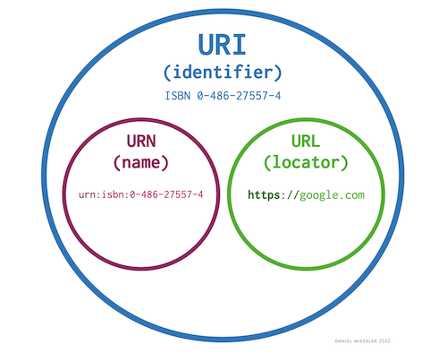

# CORS

> 교차 출처 자원 공유, Cross Origin Resource Sharing(**CORS**)

## 들어가며
출처에 대해 알아보기 전, URI와 URL에 대해 간단히 구분해보자.



### URI와 URL
#### URI와 URL의 차이점
- URI : 인터넷에서 이름이나 리소스를 고유하게 식별하는 문자열로, 자원의 이름 그 자체일 수도 있고 프로토콜을 포함하는 전체일 수도 있음
- URL : 프로토콜과 자원의 이름이 함께 있어야 함

#### 예시


<br>

### HTTP URL 구조

- `http` : 프로토콜
- `host` 
- `port` : 입력되지 않은 경우 default 80 포트 적용
- `path`
- `query string`

### URI Comparison : Exceptions
1. 비어 있거나 지정되지 않은 포트는 기본값과 동일
2. 호스트 이름의 비교는 대소문자를 구분하지 않음
3. 빈 abs_path는 "/"의 abs_path와 동일

<br>

## Origin

> 프로토콜 + 호스트 + 포트번호

### Cross Origin, Same Origin
#### Q. 다음 중 `https://heather-dev.tistory.com`와 동일 출처(Same Origin)인 것은?
1. `https://heather-dev.tistory.com:8080`
2. `http://heather-dev.tistory.com`
3. `https://heather-dev.tistory.com/category/Database/MySQL`

#### A. `3`
1. 포트번호가 다르므로 **Cross Origin**
2. 프로토콜이 다르므로 **Cross Origin**
3. 출처는 `프로토콜, 호스트, 포트번호`까지만 비교하므로 **Same Origin**

## CORS 개요
- 정의 : 한 출처에서 실행 중인 웹 애플리케이션이 `다른 출처의 자원에 접근`할 수 있도록 `브라우저`에 알려주는 체제
- 방식 : 자신과 다른 출처의 리소스를 불러오려면 그 출처에서 올바른 CORS 헤더를 포함한 응답을 반환해줘야 한다.
- 요청 : 웹 애플리케이션은 `리소스가 자신의 출처(도메인, 프로토콜, 포트)와 다를 때` `교차 출처 HTTP 요청`을 실행
- 목적 : 브라우저와 서버 간의 안전한 교차 출처 요청 및 데이터 전송을 지원함으로써 교차 출처 HTTP 요청의 위험을 완화

## CORS 동작 방식
### 1. Simple requests
#### 조건
- `GET`, `HEAD`, `POST` 중 하나의 **메서드**일 것
- `Accept`, `Accept-Language`, `Content-Language`, `Content-Type` **헤더**일 것
  - Content-Type 헤더에 허용되는 값
    - application/x-www-form-urlencoded
    - multipart/form-data
    - text/plain

<br>

#### 클라이언트 - 서버 간 통신


#### 브라우저가 서버에 전송하는 내용
```shell
GET /resources/public-data/ HTTP/1.1
Host: bar.other
User-Agent: Mozilla/5.0 (Macintosh; Intel Mac OS X 10.14; rv:71.0) Gecko/20100101 Firefox/71.0
Accept: text/html,application/xhtml+xml,application/xml;q=0.9,*/*;q=0.8
Accept-Language: en-us,en;q=0.5
Accept-Encoding: gzip,deflate
Connection: keep-alive
Origin: https://foo.example
```
- `Origin` : 어떤 출처에서 온 요청인지 표기되어 있다.
- `Origin: https://foo.example` : 클라이언트 출처는 `https://foo.example` 이다.

<br>

#### 서버에서 브라우저에 전송하는 내용
```shell
HTTP/1.1 200 OK
Date: Mon, 01 Dec 2008 00:23:53 GMT
Server: Apache/2
Access-Control-Allow-Origin: *
Keep-Alive: timeout=2, max=100
Connection: Keep-Alive
Transfer-Encoding: chunked
Content-Type: application/xml

[…XML Data…]
```
- `Access-Control-Allow-Origin` : 서버에서 허용하고 있는 출처가 표기되어 있다.
- `Access-Control-Allow-Origin: *` : 서버에서는 모든 도메인에서의 접근을 허용한다.
- 만약 서버에서 오직 `https://foo.example`의 요청만을 허용하고 싶다면 다음과 같은 값을 보낸다.
  - `Access-Control-Allow-Origin: https://foo.example`

#### Simple requests 정리
다른 출처의 리소스에 대한 접근을 허용하려면,
`Access-Control-Allow-Origin 헤더`에
요청의 Origin 헤더에서 전송된 값이 포함되어야 한다.


### 2. Preflighted requests
- 먼저 OPTIONS 메서드를 통해 다른 도메인의 리소스로 HTTP 요청을 보내 실제 요청이 전송하기에 안전한지 확인
- cross-origin 요청이 유저 데이터에 영향을 줄 수 있기 때문에 이와같이 미리 전송(preflighted)함

<br>

#### 클라이언트 - 서버 간 통신


#### 1. Preflighted request
- Simple `GET` Request인 경우 Preflighted 되지 않는다.

````shell
OPTIONS /doc HTTP/1.1
Host: bar.other
User-Agent: Mozilla/5.0 (Macintosh; Intel Mac OS X 10.14; rv:71.0) Gecko/20100101 Firefox/71.0
Accept: text/html,application/xhtml+xml,application/xml;q=0.9,*/*;q=0.8
Accept-Language: en-us,en;q=0.5
Accept-Encoding: gzip,deflate
Connection: keep-alive
Origin: https://foo.example
Access-Control-Request-Method: POST
Access-Control-Request-Headers: X-PINGOTHER, Content-Type
````
- `OPTIONS` : HTTP method로, preflight 요청 시 사용된다.
- `Origin: https://foo.example` : 클라이언트의 출처를 밝힌다.
- `Access-Control-Request-Method: POST` : 실제 요청을 전송할 때 POST 메서드로 전송될 것임을 알린다.
- `Access-Control-Request-Headers: X-PINGOTHER, Content-Type` : 실제 요청을 전송 할 때 X-PINGOTHER 와 Content-Type 사용자 정의 헤더와 함께 전송될 것임을 알린다.
- Access-Control-Request-* 헤더는 Preflight 요청 시에만 사용된다.
  - 실제 요청에 대한 정보를 담기 때문에 서버가 이러한 상황에서 어떻게 반응할지 결정하도록 할 수 있다.

#### 2. Preflighted response
````shell
HTTP/1.1 204 No Content
Date: Mon, 01 Dec 2008 01:15:39 GMT
Server: Apache/2
Access-Control-Allow-Origin: https://foo.example
Access-Control-Allow-Methods: POST, GET, OPTIONS
Access-Control-Allow-Headers: X-PINGOTHER, Content-Type
Access-Control-Max-Age: 86400
Vary: Accept-Encoding, Origin
Keep-Alive: timeout=2, max=100
Connection: Keep-Alive
````
- `Access-Control-Allow-Origin: https://foo.examplen` : 서버에서는 https://foo.example의 요청만을 허가한다.
- `Access-Control-Allow-Methods: POST, GET, OPTIONS` : 이 리소스를 얻는 데에 사용될 수 있는 메서드를 알려준다.
- `Access-Control-Allow-Headers: X-PINGOTHER, Content-Type` : 실제 요청에 허용되는 헤더를 쉼표로 구분해 알려준다.
- `Access-Control-Max-Age: 86400` : 다른 preflight request를 보내지 않고, preflight request에 대한 응답을 캐시할 수 있는 시간을 알려준다.

#### 3. Real request
````shell
POST /doc HTTP/1.1
Host: bar.other
User-Agent: Mozilla/5.0 (Macintosh; Intel Mac OS X 10.14; rv:71.0) Gecko/20100101 Firefox/71.0
Accept: text/html,application/xhtml+xml,application/xml;q=0.9,*/*;q=0.8
Accept-Language: en-us,en;q=0.5
Accept-Encoding: gzip,deflate
Connection: keep-alive
X-PINGOTHER: pingpong
Content-Type: text/xml; charset=UTF-8
Referer: https://foo.example/examples/preflightInvocation.html
Content-Length: 55
Origin: https://foo.example
Pragma: no-cache
Cache-Control: no-cache

<person><name>Arun</name></person>
````
- 서버가 허용하는 방식으로 요청을 보냄
  - POST
  - Origin
  - X-PINGOTHER, Content-Type

#### 4. Real response
````shell
HTTP/1.1 200 OK
Date: Mon, 01 Dec 2008 01:15:40 GMT
Server: Apache/2
Access-Control-Allow-Origin: https://foo.example
Vary: Accept-Encoding, Origin
Content-Encoding: gzip
Content-Length: 235
Keep-Alive: timeout=2, max=99
Connection: Keep-Alive
Content-Type: text/plain

[Some XML payload]
````
- `https://foo.example`은 허용된 출처이므로 응답을 보내 줌

<br>

### 3. Requests with credentials


- HTTP cookies 와 HTTP Authentication 정보를 인식
- 브라우저가 제공하는 비동기 리소스 요청 API인 `XMLHttpRequest` 객체나 `fetch` API : 별도의 옵션 없이는 쿠키 정보나 인증과 관련된 헤더를 요청에 담지 않음 
- `credentials` : 요청에 인증과 관련된 정보를 담을 수 있게 해주는 옵션으로, 다음과 같은 3개의 값을 갖는다.
  - `same-origin` : 기본값으로, **같은 출처 간 요청에만** 인증 정보를 담을 수 있다는 의미
  - `include` : 모든 요청에 인증 정보를 담을 수 있다는 의미
  - `omit` : 모든 요청에 인증 정보를 담지 않는다는 의미
> **주의**
> 
> credentials가 same-origin 또는 include인 경우, 서버의 `Access-Control-Allow-Origin` 헤더에 `*`를 사용하면 안된다.

- 요청에 인증 정보가 담겨있는 상태에서 다른 출처의 리소스를 요청하는 경우, 브라우저는 CORS 정책 위반 여부를 검사하는 룰에 다음 두 가지를 추가함
  - `Access-Control-Allow-Origin`에는 `*`를 사용할 수 없으며, 명시적인 URL이어야 함
  - 응답 헤더에는 반드시 `Access-Control-Allow-Credentials: true`가 존재해야 함

#### Request
````shell
GET /resources/credentialed-content/ HTTP/1.1
Host: bar.other
User-Agent: Mozilla/5.0 (Macintosh; Intel Mac OS X 10.14; rv:71.0) Gecko/20100101 Firefox/71.0
Accept: text/html,application/xhtml+xml,application/xml;q=0.9,*/*;q=0.8
Accept-Language: en-us,en;q=0.5
Accept-Encoding: gzip,deflate
Connection: keep-alive
Referer: https://foo.example/examples/credential.html
Origin: https://foo.example
Cookie: pageAccess=2
````
- GET
- Cookie

#### Response
````shell
HTTP/1.1 200 OK
Date: Mon, 01 Dec 2008 01:34:52 GMT
Server: Apache/2
Access-Control-Allow-Origin: https://foo.example
Access-Control-Allow-Credentials: true
Cache-Control: no-cache
Pragma: no-cache
Set-Cookie: pageAccess=3; expires=Wed, 31-Dec-2008 01:34:53 GMT
Vary: Accept-Encoding, Origin
Content-Encoding: gzip
Content-Length: 106
Keep-Alive: timeout=2, max=100
Connection: Keep-Alive
Content-Type: text/plain

[text/plain payload]
````
- `Access-Control-Allow-Origin: https://foo.example` : 명시적 URL
- `Access-Control-Allow-Credentials: true`

<br>

## CORS 정책 위반 해결 방법
### 1. 매 응답 시 Access-Control-Allow-Origin 헤더에 값 설정

### 2. 서버 CORS 설정
- 서버에서 미들웨어를 통해 설정할 수 있다.

#### spring boot 예시
```java
@Configuration
public class CorsConfiguration implements WebMvcConfigurer {

    @Override
    public void addCorsMappings(CorsRegistry registry){
        registry.addMapping("/**")
         .allowedOrigins("https://your_host:your_port_no");
    }
}
```

### 3. 프록시 서버 이용
- nginx, apache 같은 서버를 WAS 앞에 두고 요청을 분기하는 방식

<br><br><br><br>

----

출처
- https://developer.mozilla.org/en-US/docs/Web/HTTP/CORS
- https://evan-moon.github.io/2020/05/21/about-cors/