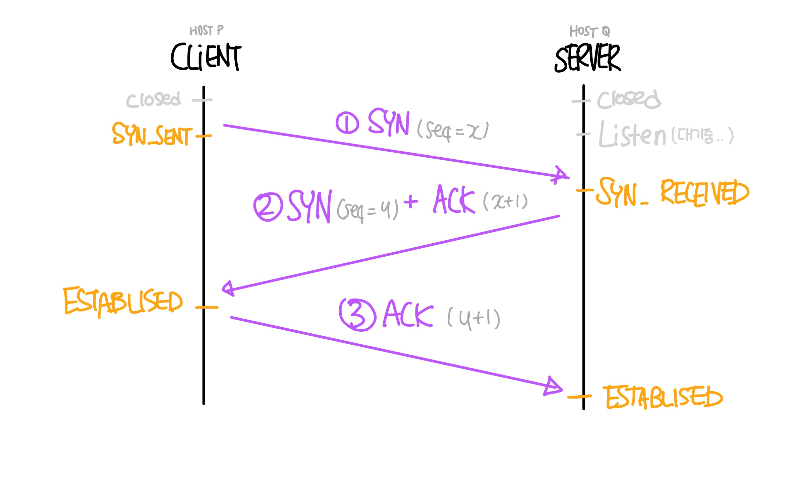
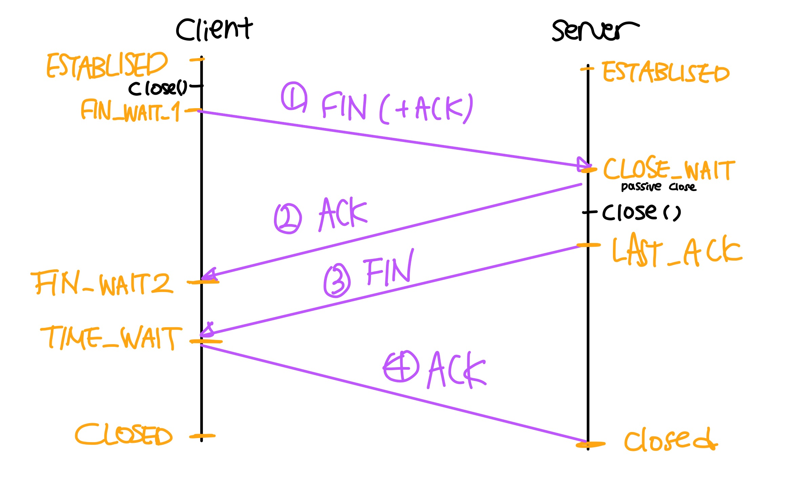

# 3-Way Handshake / 4-Way Handshake
3-Way Handshake는 TCP 연결 과정이고, 4-Way Handshake는 TCP 해제 과정이다.

## TCP의 3-Way Handshake
* **TCP 통신을 이용하여 데이터를 전송하기 위해 Client와 Server 간 맺는 연결을 설정하는 과정**
* 양쪽 모두 데이터를 전송할 준비가 되었단 것을 보장하며, 실제로 데이터 전달이 시작하기 전에 한쪽이 다른 한쪽이 데이터를 받을 준비가 됐단 것을 알 수 있음.
* 즉, TCP/IP 프로토콜을 이용해서 통신을 하는 응용 프로그램이 데이터를 전송하기 전에 정확한 전송을 보장하기 위해 상대방 컴퓨터와 사전에 연결을 수립하는 과정

## 3-Way Handshake의 작동 방식
* 일반적으로 Client가 Server와 연결하기 위해 3-Way 연결요청을 시도한다.
> Client와 Server 모두 `연결 요청`을 수행할 수 있기 때문에, 연결 요청을 먼저 시도한 요청자를 `Client`, 연결 요청을 받은 수신자를 `Server`라고 칭한다.  

* **SYN(Synchronization)** : `연결 요청`, 세션을 설정하는데 사용되며 초기에 **시퀀스 번호**를 **랜덤**으로 전달한다.
* ACK(Acknowledgement) : `요청에 대한 답변`, 받은 시퀀스 번호에 **+1을 더한 값**을  ACK로 돌려준다.

* **1단계** (SYN ->)
**클라이언트는 서버와 연결하기 위해 SYN을 보낸다 (seq : x)**
	* 클라이언트가 최초로 데이터를 전송할 때, 시퀀스 번호를 랜덤으로 설정한 후 해당  `세그먼트`를 전송한다.
	* **PORT 상태**
	Client : `CLOSED` ->  `SYN_SENT`
	Server : `LISTEN`

* **2단계** (SYN + ACK <-)
**서버가 SYN(x)을 받고, 클라이언트로부터 받았다는 신호인 ACK와 본인도 클라이언트에게 포트를 열어달라는 요청인 새로운 SYN을 전달(ACK : x+1, seq : y)**
	* 서버도 시퀀스 번호를 랜덤으로 설정하여 요청을 클라이언트에게 전송한다.
	* **PORT 상태**
	Client : `CLOSED`
	Server : `SYN_RECEIVED`

* **3단계** (ACK ->)
**클라이언트는 서버로부터 요청을 받았다는 ACK를 보내고 연결을 완료한다(ACK : y+1)**
	* 마지막으로 클라이언트가 수락 확인을 보내 연결을 맺음
	* 이때, 전송할 데이터가 있으면 이 단계에서 데이터를 전송할 수 있다.
	* **PORT 상태**
	Client : `ESTABLISED`
	Server : `SYN_RECEIVED` -> ACK -> `ESTABLISHED`

———-

## TCP의 4-Way Handshake
* **TCP의 연결을 해제하기 위해 맺는 과정**이며 여기서는 FIN 플래그를 이용.
* TCP의 연결 해제 방식에는 **Graceful connection release**와 **Abrupt connection release**가 존재한다.

> **Graceful connection release(정상적인 연결 해제)**  
> 	정상적인 연결 해제에선 양쪽이 서로 커넥션을 닫을 때까지 연결되어 있다.  
> **Abrupt connection release(갑작스런 연결 해제)**  
> 	1. 갑자기 한 쪽이 연결을 강제로 닫는 경우  
> 	2. 한 사용자가 두 데이터 전송 방향을 모두 닫는 경우  

## 4-Way Handshake 작동방식 (Graceful)
* 4-Way Handshake는 정상적인 연결해제(Graceful)에서 이루어지는 해제 과정이다.

* **1단계** ( FIN[+ACK] -> )
**클라이언트는 서버와 연결을 끊기 위해 FIN 플래그를 보낸다.**
	* 클라이언트가 접속을 끊기 위해 **close()**를 호출하면서 서버에게 연결을 종료하겠다는 FIN 플래그를 전송한다.(`FIN_WAIT1` 상태)
	* FIN 패킷에 실질적으로는 ACK도 포함되어 있다.
		* 해당 ACK에는 **Half-Close**기법을 사용하기 때문에 포함되어 있다. Half-Close 기법이란 클라이언트가 서버에게 승인 번호를 전달하는 의도는 **”연결 종료를 하긴 할건데 반은 열어둘게, 이 승인 번호까지 처리했으니 더 보낼거 있음 보내”** 라는 의미가 있습니다.

* **2단계** (ACK <- )
**서버는 FIN을 받고, 확인했다는 ACK를 클라이언트에게 보내고 자신의 통신이 끝날때까지 기다린다** (`TIME_WAIT`상태)
	* 서버는 FIN에 대한 응답(ACK)를 보내고 `CLOSE_WAIT` 상태에 들어간다. 
	* 그리고 아직 남은 데이터가 있다면 마저 전송을 마친 후에 **close()**를 호출(**Half-Close**)
	* 클라이언트는 서버에 ACK를 받은 후에 서버가 남은 데이터 처리를 끝내고 FIN 패킷을 보낼 떄까지 기다린다. (`FIN_WAIT2` 상태)
	
* **3단계** (FIN <- )
**서버는 모든 데이터를 보냈다면 FIN 패킷을 클라이언트에게 보내고, 승인 번호를 보내줄 때까지 기다린다.** (`LAST_ACK`상태)

* **4단계** (ACK -> )
**클라이언트는 FIN을 받고 확인했다는 ACK를 서버에 보낸다.**
	* 아직 서버로부터 받지 못한 데이터가 있을수도 있으므로 `TIME_WAIT`을 통해 기다린다.
	* 이후 실질적인 종료과정 `CLOSED`에 들어가게 된다.

* 서버는 ACK를 받은 이후 소켓을 닫는다. (`CLOSED` 상태)
* 클라이언트도 TIME_WAIT 시간이 끝나면 소켓을 닫는다. (`CLOSED` 상태)

**TCP 관련 질문 1**
**Q. TCP의 연결 설정 과정(3단계)과 연결 종료 과정(4단계)이 단계가 차이나는 이유?**
A. Client가 데이터 전송을 마쳤다고 하더라도 Server는 아직 보낼 데이터가 남아있을 수 있기 때문에 **일단 FIN에 대한 ACK만 보내고, 데이터를 모두 전송한 후**에 자신도 FIN 메시지를 보내기 때문이다.

**TCP 관련 질문 2**
**Q. 만약 Server에서 FIN 플래그를 전송하기 전에 전송한 패킷이 Routing 지연이나 패킷 유실로 인한 재전송 등으로 인해 FIN 패킷보다 늦게 도착하는 상황이 발생하면 어떻게 될까?**
A. 이러한 현상에 대비하여 Client는 Server로부터 FIN 플래그를 수신하더라도 일정시간(Default: 240sec)동안 세션을 남겨 놓고 잉여 패킷을 기다리는 과정을 거친다. (TIME_WAIT 과정)

**TCP 관련 질문 3**
**Q. 초기 Sequence Number인 ISN을 0부터 시작하지 않고 난수를 생성해서 설정하는 이유?**
A. Connection을 맺을 때 사용하는 포트(Port)는 유한 범위 내에서 사용하고 시간이 지남에 따라 재사용된다. 따라서 두 통신 호스트가 과거에 사용된 포트 번호 쌍을 사용하는 가능성이 존재한다. 서버 측에서는 패킷의 SYN을 보고 패킷을 구분하게 되는데 난수가 아닌 순처적인 Number가 전송된다면 이전의 Connection으로부터 오는 패킷으로 인식할 수 있다. 이런 문제가 발생할 가능성을 줄이기 위해서 난수로 ISN을 설정한다.
