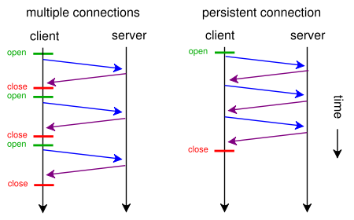

# HTTP와 HTTPS

# HTTP

* HTTP(Hyper Text Transfer Protocol)란  서버/클라이언트 모델을 따라 데이터를 주고 받기 위한 프로토콜이다.

* HTTP는 인터넷에서 하이퍼텍스트를 교환하기 위한 통신 규약으로, *80번 포트*를 사용하고 있다. 따라서 HTTP 서버가 80번 포트에서 요청을 기다리고 있으며, 클라이언트는 80번 포트로 요청을 보내게 된다.

* 현재 가장 널리 사용되는 버전은 HTTP/1.1이며 헤더압축 등의 기능을 추가한 HTTP/2, UDP 위에서 작동하는 HTTP/3도 사용되고 있다.

## HTTP의 특징

 1. 클라이언트 서버 구조
 2. 무상태(Stateless) & 비연결성
 3. HTTP 메시지
 4. 단순함, 확장가능

### 1. 클라이언트 서버 구조
HTTP는 애플리케이션 계층의 프로토콜로, 신뢰 가능한 전송 프로토콜이라면 무엇이든 사용할 수 있으나 TCP 또는 암호화된 연결인 TLS(transport layer secure)를 통해 전송된다.

* *클라이언트 - 서버 프로토콜*
	* 수신자 측(보통 웹 브라우저)에 의해 요청이 초기화되는 프로토콜을 의미한다. 
	
* *클라이언트 -서버 구조의 중요성*
	* 이전에는 클라이언트와 서버로 개념을 분리하지 않았지만 둘을 분리하여 역할을 분리하였다. 모듈화로 통해 각각의 독립적 발전이 가능해진다.
		* 서버 : 비즈니스 로직, 데이터 등
		* 클라이언트 : UI, 사용성 등

* *클라이언트 - 서버 작동원리*
	* HTTP는 클라이언트가 `HTTP 메시지`를 통해 서버에 요청을 보낸다.
	* 서버가 요청에 대한 결과를 만들어 응답이 오면 클라이언트가 응답 결과를 얻어서 동작하게 된다.

클라이언트에 의해 전송되는 HTTP 메시지를 `Request`라고 부르며, 이에 대해 서버가 응답으로 전송하는 HTTP 메시지를 `Response`라고 부른다.

### 2.1. 무상태 프로토콜
HTTP는 상태를 저장하지 않는 무상태(Stateless) 프로토콜을 기본으로 한다.
	장점 : 서버 확장성이 높다.
	단점 : 클라이언트가 매번 추가 데이터를 전송해야 함

* 상태유지(Stateful)
	* *항상 같은 서버가 유지되는 상태*
	* 서버가 클라이언트의 `이전 상태`를 보존하고 있는 상태이다.
	* 중간에 서버가 변경되면 안되는 단점을 갖고 있다.(변경 시 상태 정보를 미리 알려줘야 한다)

* 무상태(Stateless)
	* *서버가 클라이언트의 `이전 상태`를 보존하고 있지 않는 상태*
	* 중간에 다른 서버로 바뀌어도 되므로 확장성이 뛰어나다.
		* 대용량 트래픽의 경우에 stateless를 이용하여 서버를 확장한다.
	> 무상태의 예시
		*ex) 커피를 주문하는 고객과 주문을 받는 동시에 점원이 변경된 상태*
		1. 고객 : 아메리카노 주세요.
		2. 점원A : 아메리카노는 4,500원 입니다. 결제는 어떻게 하시겠어요?
		3. 고객 : 결제는 신용카드로 하겠습니다.
		4. (점원이 중간에 변경)
		5. 점원B : 무슨 제품을 신용카드로 주문하시겠습니까?

	* 기본적으로 HTTP는 무상태이기 때문에 `쿠키`나 `세션`을 이용하여 상태를 유지하는 방식을 사용한다.

### 2.2. 비연결성
* TCP/IP와는 다르게 HTTP에서는 기본적으로 비연결성을 갖는다.
	* 비연결성을 갖는 HTTP는 실제로 요청을 주고 받을 때만 연결을 유지하고 응답을 주고나면 TCP/IP 연결을 끊는다.
	* 이를 통해 최소한의 자원으로 서버 유지를 가능하게 한다.

* 비연결성의 한계 및 극복
	* TCP/IP 연결을 매번 맺어야 함(3-Way handshake)
	* 해당 자원들을 매번 보낼때마다 연결을 다시 맺어야 하는 것은 비효율적이기 때문에 HTTP는 `Keep-alive`와 같은 지속 연결방법을 통해 문제를 해결한다.
	* HTTP/2 및 HTTP/3에서 더 많은 최적화가 이뤄졌다.

### 3. HTTP 메시지
HTTP는 메시지를 통해 통신을 주고 받으며 메시지는 다음과 같은 요소들로 구성된다. 

*HTTP 요청 메시지*

*HTTP 응답 메시지*

자세한 내용 : https://velog.io/@gparkkii/HTTPMessage

### 4. 단순함, 확장가능
* HTTP는 단순하다.
* HTTP메시지도 매우 단순하다.
* 확장 가능한 기술이다.

# HTTPS

* HTTP 프로토콜은 서버 - 클라이언트 간 전송되는 정보가 암호화되지 않는다는 단점이 있다. 이는 중간에 누군가 데이터를 쉽게 도난할 수 있다는 점이다.

* *HTTPS 프로토콜*은 `SSL(보안 소켓 계층)`을 사용함으로써 이 문제를 해결했다.   SSL은 서버와 클라이언트 사이에 안전하게 암호화 된 연결을 만들 수 있게 도와주고 이 정보들이 도난 당하는 것을 막아준다.

* HTTPS의 가장 큰 특징은 `SSL 인증서`이다. SSL 인증서는 사용자가 사이트에 제공하는 정보를 암호화하고 있다. 
	* 이 데이터는 암호화되어 중간에 이 정보를 누군가 훔친다고 하더라도 암호화 되어 있기 때문에 해독할 수 없다.

