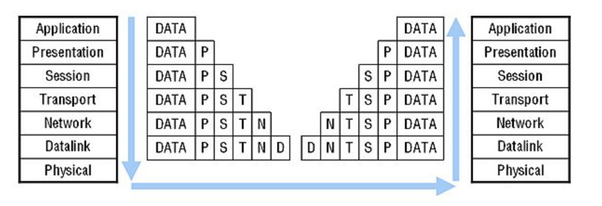
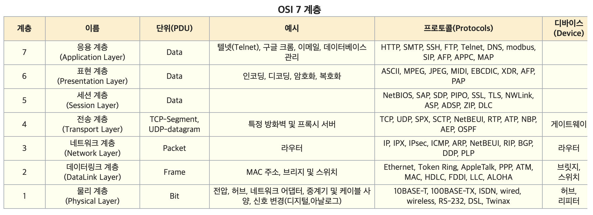

# OSI 7계층

### 개념

- 개방형 시스템의 상호 연결 모델의 표준이다.
- 실제 인터넷에서 사용되는 `TCP/IP`는 `OSI 참조모델`을 기반으로 상업적이고 실무적으로 이용될 수 있게 단순화한 것이다.

### 배경

- 초기의 여러 정보통신업체들의 장비들은 자신의 업체 장비들끼리만 연결이 되어서 호환성이 없었다.
- 따라서 모든 시스템들의 상호연결에 있어서 문제가 없도록 `표준`을 정한것이 OSI 7계층이다.
- 또한 통신이 일어나는 과정을 단계별로 알 수 있고, 특정한 곳에 이상이 생기면 그 계층만 들여다보면 된다.

## 작동 원리

1. `OSI 7계층`은 응용, 표현, 세션, 전송, 네트워크, 데이터링크, 물리계층으로 나뉜다.(7개의 계층)
2. 데이터 **전송** 시 7계층에서 1계층으로 각각의 층마다 인식할 수 있어야 하는 `헤더`를 붙인다(`캡슐화`).
3. 데이터 **수신** 시 1계층에서 7계층으로 헤더를 떼어낸다(`디캡슐화`).
4. 출발지에서 데이터가 전송될 때 헤더가 추가되는데, 2계층에서만 `오류제어`를 위해서 꼬리부분에 추가된다.
5. 물리계층에서 1, 0의 전기신호가 되어서 전송매체 (동축케이블, 광섬유 등)을 통해 전송된다.

### 응용 계층(Application Layer)

- OSI 7계층의 `최상위 계층`이다.
- 사용자가 네트워크 자원에 접근하는 방법을 제공한다. (HTTP, FTP, DNS, SMTP 등)
- 최종적으로 사용자가 볼 수 있는 유일한 계층으로 `인터페이스` 제공한다.
- 텔넷(Telnet), 구글 크롬, 이메일, 데이터베이스 관리 등 이 존재한다.

### 표현 계층(Presentation Layer)

- 응용 계층으로부터 전달받은 데이터를 읽을 수 있는 형식으로 변환한다. (JPEG, ASCII, MPEG 등)
- 즉, `인코딩`과 `디코딩`이 이 계층에서 이루어진다. 
- 또한, 데이터를 `암호화`하거나 `복호화`하는 작업이 이루어진다.

### 세션 계층(Session Layer)

- 두 컴퓨터 간의 대화나 세션을 관리하며, `포트(Port)` 연결이라고도 한다.
- 모든 통신 장치간의 연결을 설정하고 관리 및 종료하고 또한 연결이 `전이중(Full duplex /양방향)`인지 `반이중(Half duplex/단방향)`인지 여부를 확인한다.
- 호스트가 갑자기 중지되지 않고 정상적으로 호스트를 연결하는 데에 책임이 있다.
- 즉, 이 계층에서는 연결 세션에서의 데이터 교환과 에러 발생 시의 복구를 관리한다.

### 전송 계층(Transport Layer)

- 종단간에 **신뢰성** 있는 데이터 전송 서비스를 제공한다.
- 송신자와 수신자간의 신뢰성있고 효율적인 데이터를 전송하기 위해서 `오류검출` 및 복구, `흐름제어`와 중복검사 등을 수행한다.
- `연결형 프로토콜`과 `비연결형 프로토콜` 모두 사용하는데, 대표적으로 `TCP`와 `UDP`가 있다.
- 데이터 단위에서 TCP는 `세그먼트(Segment)`를 사용하고, UDP는 `데이터그램(Datagram)`을 사용한다.

### 네트워크 계층(Network Layer)

- 2홉 이상의 통신(`멀티 홉 통신`)을 담당한다.
- OSI 계층에서 가장 복잡한 계층 중 하나로서 실제 네트워크 간의 데이터 `라우팅`을 담당한다.
	- 라우팅 : 어떤 네트워크 안에서 통신 데이터를 짜여진 알고리즘에 의해서 최대한 빠르게 보낼 수 있는 최적의 경로를 선택하는 과정
- 컴퓨터에게 데이터를 전송할 주소를 가지고 있다.(IP 주소가 네트워크 계층 헤더에 속한다)
- 데이터 단위는 `패킷(Packet)`이다.
- 라우터, L3 스위치가 존재한다.

### 데이터 링크 계층(Data-Link Layer)

- 물리적인 연결을 통해서 **인접한** 두 장치간의 신뢰성 있는 정보전송을 담당하는 계층이다.(`Point-To-Point` 전송, 1홉 통신)
- 점대점 간의 신뢰성있는 정보전달을 위해서 `오류제어`와 `흐름제어(재전송)`가 존재한다.
- `MAC주소`를 통해서 통신한다.
- 데이터 단위는 `프레임(Frame)`이다.
- 브리지, 스위치가 존재한다.

### 물리 계층(Physical Layer)

- OSI 7계층의 `최하위` 계층이다.
- 주로 `기계적`, `전기적`, `기능적인` 특성을 이용해서 데이터를 전송한다.
- 즉, 데이터는 0과 1의 비트열, On과 Off의 전기적인 신호상태로 이루어져 데이터를 전달한다.
- 단지 데이터 전달의 역할을 할 뿐, 알고리즘이나 오류제어 기능이 없다.
- 케이블, 리피터, 허브가 존재한다.

