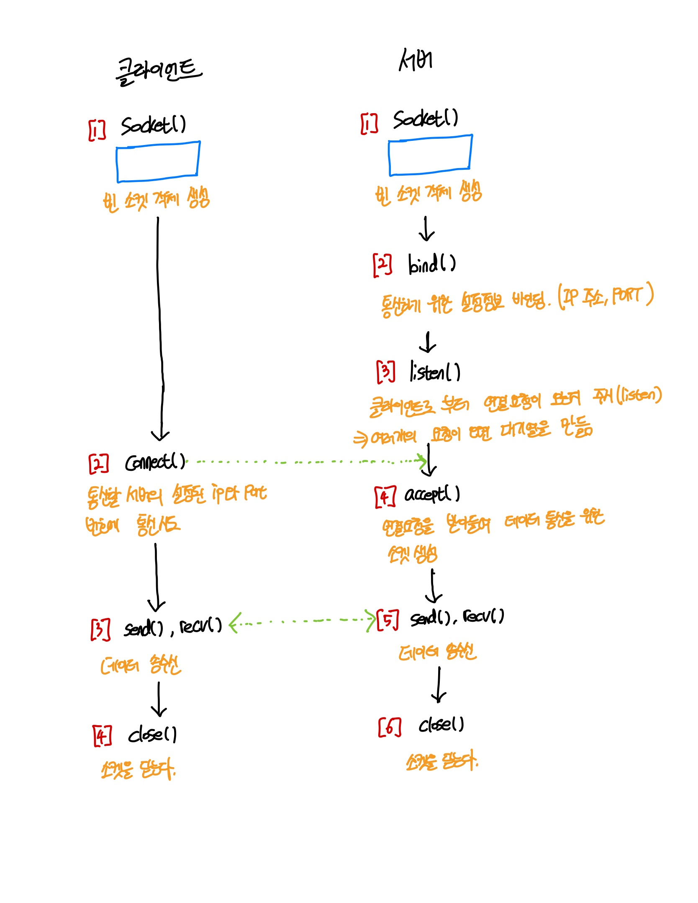

# 소켓(SOCKET)

### 소켓(SOCKET)이란?

`소켓(SOCKET)`은 프로세스가 드넓은 네트워크 세계로 데이터를 내보내거나 혹은 그 세계로부터 데이터를 받기위한 실제적인 창구 역할을 한다. 그러므로 프로세스가 데이터를 보내거나 받기 위해서는 반드시 소켓을 열어서 소켓에 데이터를 써보내거나 소켓으로부터 데이터를 읽어들여야 한다.

소켓은 `프로토콜`, `IP 주소`, `포트 번호`로 정의된다.

> 프로토콜: 원래 외교상의 언어로써 의례나 국가간의 약속을 의미하며, 통신에서는 어떤 시스템이 다른 시스템과 **통신을 원활하게 수용하도록 해주는 통신규약**, 약속

> IP: 전세계 컴퓨터에 부여된 **고유의 식별 주소**

> 포트: 네트워크 상에서 통신하기 위해서 **호스트 내부적으로 프로세스가 할당받아야 하는 고유한 숫자**이다. 한 호스트 내에서 네트워크 통신을 하고있는 프로세스를 **식별**하기 위해 사용되는 값이므로, 같은 호스트 내에서 서로 다른 프로세스가 같은 포트넘버를 가질 수 없다. 즉, `같은 컴퓨터 내에서 프로그램을 식별하는 번호`이다.

즉, 소켓은 떨어져있는 두 호스트를 연결해주는 도구로써 인터페이스의 역할을 하는데 데이터를 주고받을 수 있는 구조체로, 소켓을 통해 데이터 통로가 만들어진다. 이러한 소켓은 역할에 따라서 `서버 소켓`, `클라이언트 소켓`으로 구분된다.

### 소켓(SOCKET) 통신

#### 소켓통신의 흐름

 
 
##### 서버(Server)

- [1] socket() 함수를 이용해서 빈 소켓 객체를 생성한다.
- [2] 클라이언트와 통신하기 위한 설정정보를 소켓과 결합(바인딩)한다.
- [3] 클라이언트로부터 연결요청이 오는지 주시(listen)한다. 여러개의 요청이 오면 대기열을 만든다.
- [4] 클라이언트로부터 연결요청이 오면 요청을 받아들여 데이터 통신을 위한 소켓을 따로 생성한다.
- [5] 클라이언트와 데이터를 주고받는다.
- [6] 모든 작업이 끝나면 소켓을 닫아준다.(자원 낭비방지)

##### 클라이언트(Client)

- [1] socket() 함수를 이용해서 빈 소켓 객체를 생성한다.
- [2] 통신할 서버의 IP와 PORT 번호를 통해서 통신을 시도한다.
- [3] 서버와 데이터를 주고받는다.
- [4] 모든 작업이 끝나면 소켓을 닫아준다.(자원 낭비방지)

데이터를 송수신할 때, `send()`와 `recv()`는 모두 **블럭(Block)방식**으로 동작한다. 즉, 두 API 모두 실행 결과(성공, 실패, 종료)가 결정되기 전까지는 API가 리턴되지 않는다. 특히 `recv()`는 데이터가 수신되거나, 에러가 발생하기 전에는 실행이 종료되지 않기 때문에, 데이터 수신 작업을 생각만큼 단순하게 처리하기가 쉽지않다.

`send()`의 경우에는 데이터를 보내는 주체가 자기 자신이기 때문에, 얼마만큼의 데이터를 보내고, 언제 보낼것인지를 알 수 있지만, 데이터를 수신하는 경우 통신대상이 언제, 어떤 데이터를 보낼것인지를 알 수 없기 때문에 `recv()` API가 한번 실행되면 언제 끝날지 모르는 상태가 되는 것이다.

따라서 데이터 수신을 위한 `recv()`API는 별도의 스레드에서 실행한다. 소켓의 생성과 연결이 완료된 후, 새로운 스레드를 하나 만든 다음 그곳에서 `recv()`를 실행하고 데이터가 수신되길 기다리는 것이다.

### HTTP 통신과 SOCKET 통신

#### HTTP 통신
클라이언트의 요청(Request)이 있을 때만 서버가 응답(Response)하여 정보를 전송하고 곧바로 연결을 종료하는 통신 방식이다.

#### HTTP 통신의 특징
- **클라이언트**가 요청을 보내는 경우에만 **서버**가 응답하는 단방향 통신이다.
- **서버**로부터 응답을 받은 후에는 연결이 바로 종료된다.
- 실시간 연결이 아니고, 필요한 경우에만 **서버**로 요청을 보내는 상황에 유용하다.
- 요청을 보내 **서버**의 응답을 기다리는 애플리케이션 개발에 주로 사용된다.

#### SOCKET 통신
서버와 클라이언트가 특정 PORT를 통해서 실시간으로 양방향 통신을 하는 통신 방식이다.

#### SOCKET 통신의 특징
- **서버**와 **클라이언트**가 계속 연결을 유지하는 `양방향 통신`이다.
- **서버**와 **클라이언트**가 `실시간`으로 데이터를 주고받는 상황이 필요한 경우에 사용한다.
- 실시간 동영상 스트리밍이나 온라인 게임등과 같은 경우에 자주 사용된다.