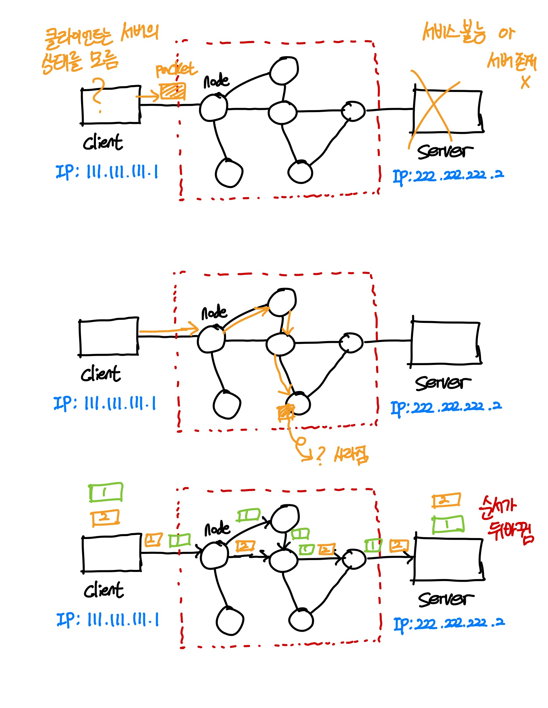

# TCP/IP

`TCP/IP`는 패킷 통신 방식의 인터넷 프로토콜인 IP와 전송 조절 프로토콜이 TCP로 이루어져 있다. IP는 패킷 전달 여부를 보증하지 않고, 패킷을 보낸 순서와 받는 순서가 다를 수 있다. TCP는 IP위에서 동작하는 프로토콜로, 데이터 전달을 보증하고 순서대로 받게 해준다. HTTP, FTP, SMTP등 TCP를 기반으로 하는 수 많은 애플리케이션 프로토콜들이 IP위에서 동작하기 때문에 묶어서 `TCP/IP`로 부르기도 한다.

## IP 프로토콜

-  지정한 `IP주소(IP Address)`에 데이터 전달
-  `패킷(Packet)`이라는 통신 단위로 데이터 전달

#### IP 프로토콜의 한계

- 비연결성
	- 패킷을 받을 대상이 없어도 패킷을 전송한다.
	- 서버가 서비스 불능이어도 패킷을 전송한다.
- 비신뢰성
	- 중간에 패킷이 사라지는 것을 고려하지 않는다.
	- 패킷이 순서대로 도착하는지 고려하지 않는다.

이러한 IP 프로토콜의 한계 때문에 TCP와 같이 사용하는 것이다.

## TCP 프로토콜

신뢰할 수 있는 프로토콜로 TCP의 특징은 다음과 같다.

- 연결 지향 - TCP 3 way hanshake
- 데이터 전달 보증: 데이터를 수신자가 잘 받았는지 송신자에게 알린다.
- 순서를 보장한다.

## TCP/IP

TCP/IP는 하나의 프로토콜이 아닌 TCP와 IP를 합쳐서 부르는 말이다. TCP/IP를 사용한다는 것은 IP 주소체계를 따르고 IP Routing을 이용해서 목적지에 도달하여 TCP의 특성을 활용해서 송신자와 수신자간의 논리적인 연결을 생성하고 신뢰성을 유지한다는 것을 의미한다. 즉, TCP/IP는 송신자가 수신자에게 IP주소를 사용하여 데이터를 전달하는데, 그 데이터가 제대로 갔는지, 너무 빠르지는 않는지, 제대로 받았다고 연락을 하는지에 대한 것을 의미한다.

TCP/IP를 통해서 정보전달을 하는 과정은 다음과 같다.

1. 프로그램을 통해서 'Hello'라는 메시지를 생성한다.
2. Socket 라이브러리를 통해서 전달한다.
3. TCP 정보를 생성(PORT정보, 순서, 검증 등)하고, 메시지 정보도 포함시켜서 전달한다.
4. IP 패킷을 생성(IP주소, TCP 데이터)한다.
5. 인터넷을 통해서 패킷정보를 참조하여 서버로 전송한다.

