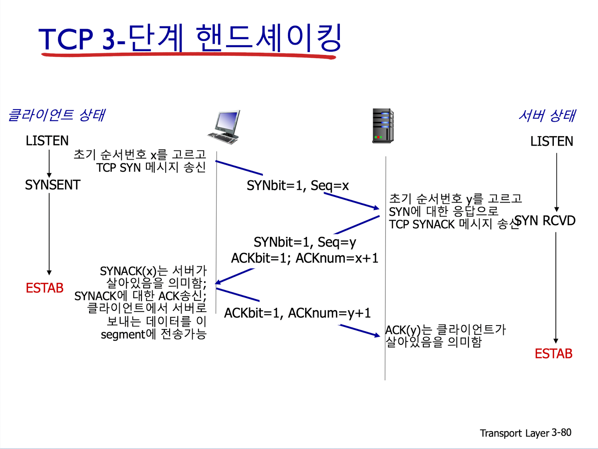
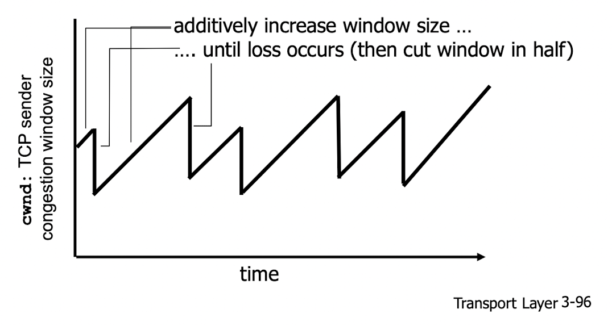

# Transport Layer - UDP/TCP

네트워크 애플리케이션에는 하나 이상의 트랜스포트 계층 프로토콜을 사용할 수 있다.  
트랜스포트 계층 프로토콜은 서로 다른 호스트에서 동작하는 `프로세스`들 사이의 논리적 통신을 제공한다.
(cf. 네트워크 계층 프로토콜은 `호스트`들 사이의 논리적 통신을 제공한다.)  

## 1. 용어정리
### 1) 세그먼트
- 인터넷에서의 `트랜스포트 계층 패킷`을 말한다.
- UDP에 대한 패킷은 종종 `데이터그램`으로 표현되기도 한다.

### 2) IP
- 인터넷 프로토콜의 줄임말로, 인터넷의 네트워크 계층 프로토콜을 말한다.
- IP 서비스 모델은 호스트들 간에 논리적 통신을 제공하는 `best-effort delivery service`이다.
  - 통신하는 호스트들 간 세그먼트를 전달하기 위해서 최대한 노력하지만, 어떤 보장도 하지 않음을 의미한다.
  - 특히 IP는 세그먼트의 전달을 보장하지 않을 뿐 아니라 세그먼트 내부 데이터의 무결성을 보장하지 않는다.
  - 세그먼트 전달의 순서도 보장하지 않는다.
  - 따라서 IP는 비신뢰적 서비스(unreliable service)라고 부른다.

## 2. Transport Layer Protocol - UDP/TCP
### 1) UDP와 TCP의 가장 기본적인 기능
종단 시스템 사이의 IP 전달 서비스를 종단 시스템에서 동작하는 `두 프로세스 간의 전달 서비스로 확장`하는 것

### 1- 트랜스포트 다중화와 역다중화
- `호스트 대 호스트 전달`을 `프로세스 대 프로세스 전달`로 확장하는 과정에서 일어난다.

#### a. 다중화, multiplexing
- 출발지 호스트에서 이루어지는 작업
- 소켓으로부터 데이터를 모으고 헤더정보(역다중화에 쓰임)를 추가하여 세그먼트를 생성한다.
- 생성된 세그먼트들을 네트워크 계층으로 전달하는 작업

#### b. 역다중화, demultiplexing
- 도착지 호스트에서 이루어지는 작업
- 헤더정보를 이용해 수신한 세그먼트를 올바른 소켓으로 전달하는 작업
- 애플리케이션 내 프로세스로 데이터를 전달하는 작업

### 2- UDP의 다중화/역다중화
- 출발지에서 `목적지 IP, 목적지 포트번호를 명시`하여 데이터그램을 만든다.
- 목적지에서는 데이터그램(세그먼트) 내 포트번호를 확인하고 해당 포트번호의 소켓으로 전달한다.

목적지 포트번호가 같은 IP datagram은 `출발지 IP 주소와 출발지 port 번호가 달라도 동일한 소켓으로 전달`된다.

### 3- TCP의 다중화/역다중화
- 출발지에서 `출발지 IP, 출발지 포트번호, 목적지 IP, 목적지 포트번호를 명시`하여 데이터그램을 만든다.
- 목적지에서는 네 개의 값 전부를 이용해 적절한 소켓으로 세그먼트를 전달한다.

서버에서는 `동시에 여러 TCP 소켓을 지원`할 수도 있다. (각 소켓은 각각 고유의 4요소로 식별된다.)  
웹서버는 각 클라이언트 연결에 대해 각자 다른 소켓을 사용한다.

 

## 2. UDP와 TCP

|       |UDP    |TCP  |
|-------|-------|-----|
|데이터전달  |비신뢰적                    |신뢰적 : 흐름제어, 순서번호, 확인응답, 타이머 이용 |
|연결형태    |비연결형                   |연결형 | 
|무결성 검사 |O : 헤더에 오류 검출 필드 포함  |O : 헤더에 오류 검출 필드 포함 |
|전달       |다중화/역다중화              |다중화/역다중화 |
|트래픽 조절 |불가                       |가능 : 혼잡제어 | 

## 1) UDP, User Datagram Protocol
### 특징
- `best-effort` service : 전달보장 X, 순서보장 X, 데이터무결성보장 X
- `connectionless` : 송/수신측 handshaking X, 각 UDP datagram은 독립적으로 다뤄짐.

### UDP 사용 예시
- DNS
- SNMP

### UDP 장점
- (지연을 유발하는) 연결을 설립하지 않는다.
- 단순함: 송/수신측 연결 상태를 유지하지 않는다.
- header 크기가 작다.
- 혼잡 제어 없음: UDP는 원하는 만큼 빨리 보낼 수 있다.

## 2) TCP, Transmission Control Protocol
### 특징
- `point-to-point`(점대점) 통신 : 단일송신측, 단일수신측만이 존재한다.
- `신뢰적`, `순서 유지`
  - segment pipelining
    - Selective repeat
      - 수신 측이 올바르게 수신된 모든 패킷에 대해 개별적으로 ACK
      - 송신 측은 ACK 받지 않은 패킷만 재전송(ACK 받지 못한 패킷에 대해 타이머 사용)
  - cumulative ACKs : 누적 확인응답
  - 단일 재전송 타이머 : time out에 따라 재전송 여부 결정
- `full-duplex`(전이중) data : 한 연결에 양방향으로 데이터를 전송한다. (maximum segment size가 정해져있다.)
- `connection-oriented` : handshaking (제어메시지의 교환)으로 송수신측의 상태를 초기화한 후 데이터를 교환한다.
  - 3 way handshaking 
    - connection request : SYN bit = 1, Seq(초기순서번호) = x
    - response : SYN bit = 1, Seq = y, ACK bit = 1, ACK num = x+1
    - confirm : ACK bit = 1, ACK num = y+1 전송
    - 그림 설명
    
  - 연결 닫기
    - 클라이언트, 서버가 각각 자기 쪽의 연결을 닫는다.
    - FIN bit = 1인 TCP Segment를 보냄
    - FIN을 받으면 ACK로 응답한다.
    - 그림 설명
    
- `flow-control`(흐름제어) : 수신 측의 속도를 감안해 송신할 수 있다.

### TCP 혼잡 제어

- additive increase, multiplicative decrease
- 트래픽을 늘릴 때 조금씩 늘리고 줄일 때는 많이 줄인다.
- additive increase : cwnd를 조금씩 늘린다.
  - cwnd : Congestion WiNdow size
- multiplicative decrease : cwnd를 반으로 줄인다.

### TCP Slow Start
Connection 설립 후 데이터를 처음 보낼 때에는 느리게 보내다가, 점점 빨라진다.
- 예) window size가 100이더라도, 1부터 시작해서 두 배씩 늘려나간다.

 