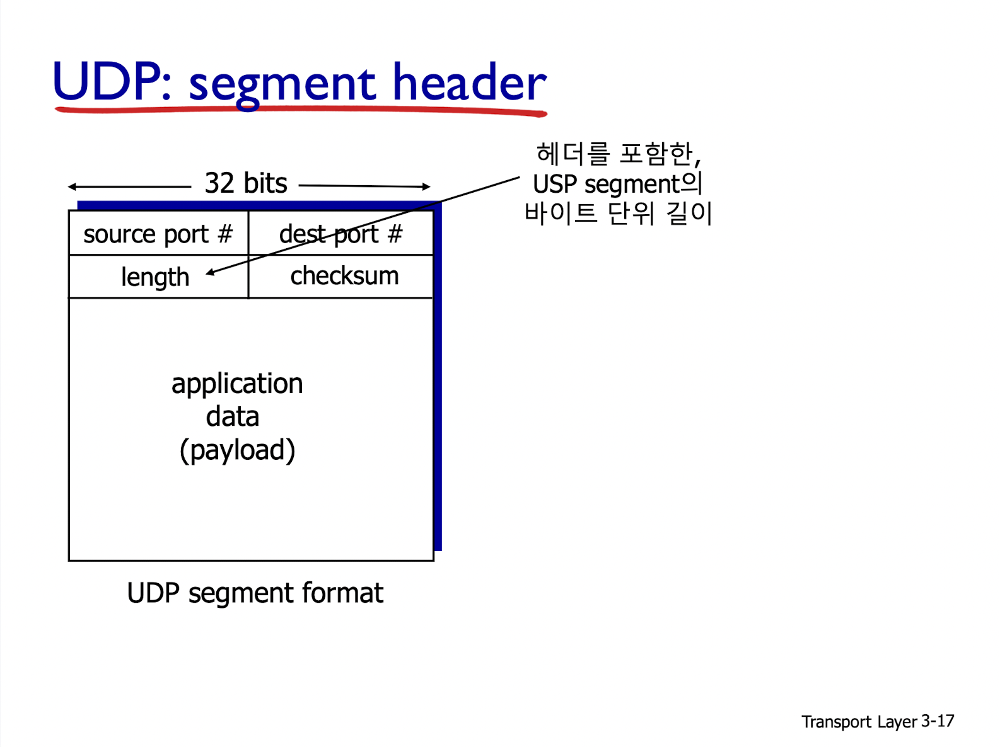
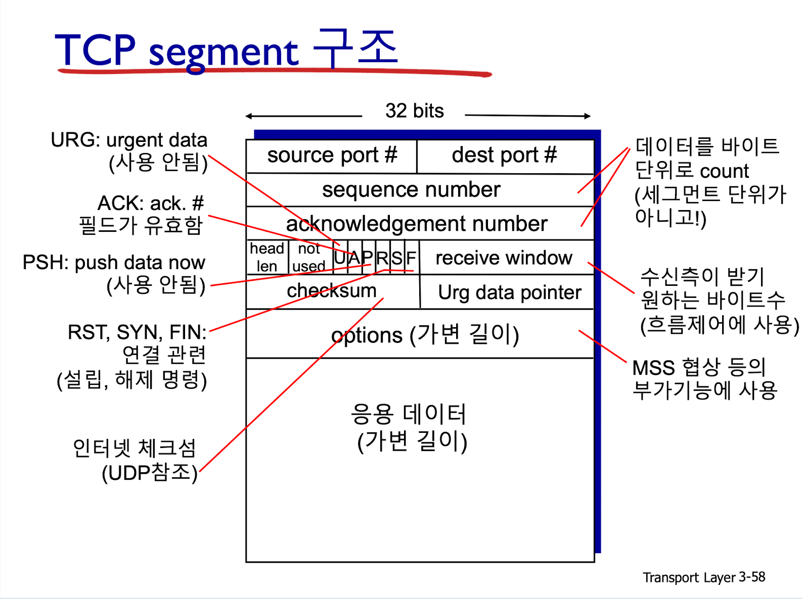

# TCP, UDP Header 분석
TCP, UDP 모두 헤더는 32비트이다.

## UDP Header

1. 출발지 포트번호(16비트)
2. 목적지 포트번호(16비트)
3. 헤더를 포함한 세그먼트의 길이(16비트)
   - 단위(Byte)
4. checksum(16비트)
   - 오류 검출을 위한 비트
   - 송신측 : 헤더를 포함해 세그먼트의 내용을 16비트 정수의 연속으로 취급
     - 세그먼트의 내용을 다 더한 결과(sum)의 1의 보수를 취함
       - `1의 보수`인 이유 : sum에 checksum 값을 더했을 때 모든 자리 수가 1이 되기 때문이다.
     - checksum 필드에 이 값을 넣는다.
   - 수신측 : 전송받은 세그먼트의 checksum을 계산
     - 결과의 모든 비트가 1인가?
       - NO : 오류 검출
       - YES : 오류 미검출(이 경우에도 오류가 있을 수 있다.)

## TCP Header

1. 출발지 포트번호(16비트)
2. 목적지 포트번호(16비트)
3. sequence number(32비트)
   - 데이터를 바이트 단위로 count하기 때문에 필요한 순서번호
   - 세그먼트 내 데이터의 첫 바이트 번호
4. acknowledgement number(32비트)
   - 데이터를 바이트 단위로 count하기 때문에 필요한 확인번호
   - 상대로부터 기대하는 다음 바이트의 번호
   - 누적 확인응답(cumulative ACK)
5. header length(4비트)
   - 헤더를 포함한 세그먼트의 길이 : 단위(Byte)
6. U,Z,P,R,S,F(6비트)
   1. URG : urgent data (사용되지 않음)
   2. ACK : acknowledgement number 필드가 유효한지 체크
   3. PSH : push data now (사용되지 않음)
   4. RST, SYN, FIN : 연결 관련 설립/해제
7. receive window 
   - 수신 측이 받기를 원하는 바이트 수
   - 흐름 제어에 사용된다.
8. checksum
   - 오류 검출을 위한 비트
9. URG data pointer
10. options
    - MSS 협상 등의 부가 기능에 사용된다.

 

출처 : 2020-2 한성대학교 데이터통신 황호영 교수님 강의자료