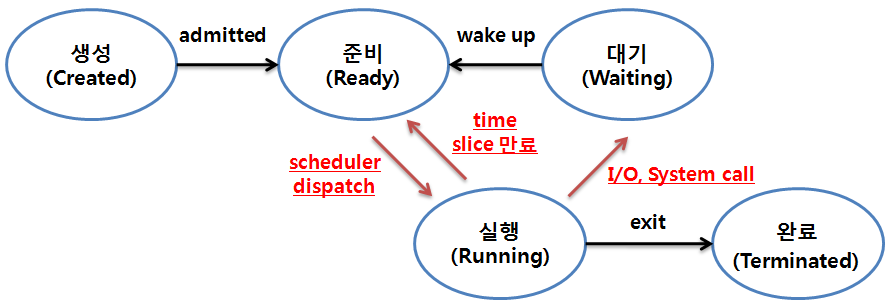

# 문맥 교환(Context Switching)

* 문맥 교환은 **CPU를 차지하던 프로세스가 나가고 새로운 프로세스를 받아들이는 작업**을 말한다.
* 새로운 프로세스를 실행하기 위해 인터럽트가 발생할 때, 진행 중인 프로세스의 레지스터 문맥을 `PCB`에 저장하고 앞으로 실행될 프로세스의 상태 정보를 설정한 다음에 CPU를 할당하여 실행되도록 하는 작업을 `문맥 교환`이라고 합니다.

**즉, 문맥 교환이란**
> 1. CPU 코어를 `다른 프로세스`로 교환
> 2. 현재 프로세스의 상태를 `PCB`에 저장
> 3. 다른 프로세스의 상태를 복원하는 작업(task)를 말한다.

* PCB에 저장되는 내용
	* 프로세스 상태
	* PC 값
	* CPU Register
	* CPU 스케쥴링 정보
	* 메모리 관리 정보
	* 할당된 자원 정보
	* 입출력 상태
	* 등등

## 문맥 교환이 필요한 상황

CPU를 할당받아 실행상태로 전이될 경우거나, 실행중인 CPU 사용 허가시간을 모두 소모하거나, 입출력을 위해 대기해야 하는 경우에 Context Switching이 발생한다. 또한 System call이 걸렸을 때도 발생한다.

1. dispatch
	* Queue 우선 프로세스로 CPU 할당 받아 실행 상태로 전이
2. CPU할당 시간 만료
	* CPU 사용 가능한 할당 시간 초과로 준비 상태로 전이
3. I/O 작업 및 할당
	* I/O 작업이 필요하여 작업 완료 시까지 대기 상태로 전이
4. System Call
	* 또 다른 서비스 호출이 필요한 경우 대기 상태로 전이

*  문맥 교환에서 드는 시간과 메모리의 양을 `OverHead`라고 한다. 문맥 교환 비용(Overhead)은 프로세스가 스레드보다 많이 든다.
* 프로세스는 공유하는 메모리가 없으므로 캐시 메모리 초기화 등 무거운 작업을 해야하는 반면 스레드는 Stack 영역을 제외하면 Code, Data, Heap 메모리 영역을 공유하고 있기 때문에 Stack 영역만 변경하면 되기 때문이다.

 ## 문맥 교환의 오버헤드 해결 방안
1. 문맥 교환이 자주 일어나지 않도록 다중 프로그래밍의 정도를 낮춘다.
2. 스택 중심의 장비에서는 Stack 포인트 레지스터를 변경하여 프로세스 간 문맥 교환을 수행한다.
3. 쓰레드(Thread)를 이용하여 문맥 교환 부하를 최소화한다.
