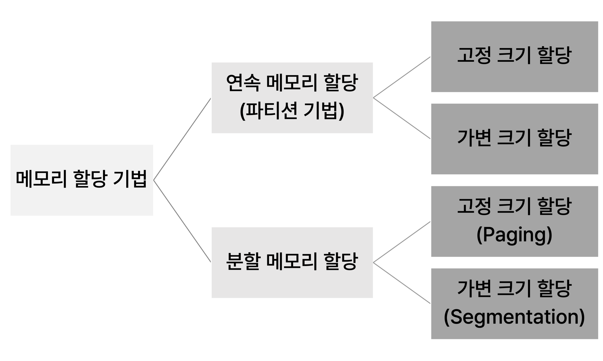
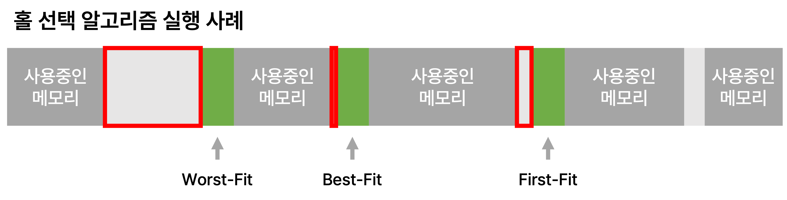
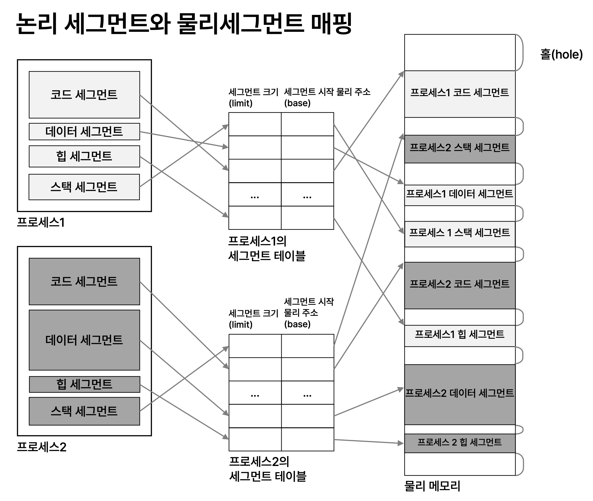
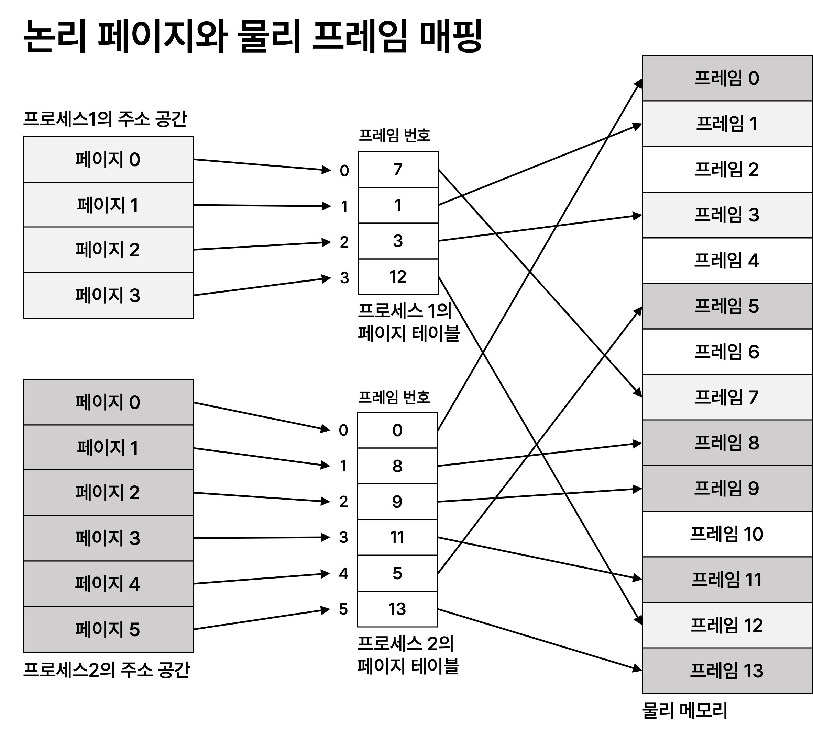
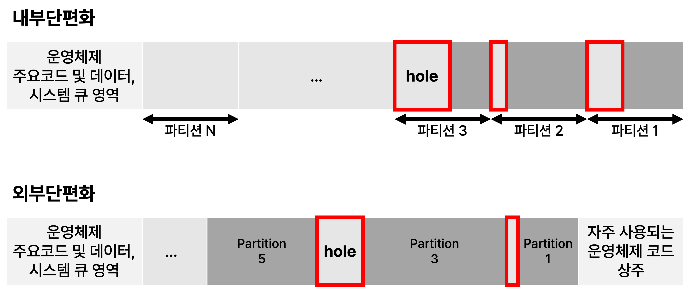

# 단편화, Fragmentation

프로세스에게 할당할 수 없는 조각 메모리들이 생기는 현상으로, 조각 메모리를 hole(홀)이라고 부른다.<br>
메모리 할당 기법에 따라 발생하는 단편화의 종류가 달라지므로 메모리 할당기법과 단편화를 함께 정리해보자.

## 메모리 할당
운영체제가 새 프로세스를 실행시키기거나, 실행 중인 프로세스가 메모리를 필요로 할 때 
물리 메모리를 할당한다. 프로세스의 실행은 할당된 물리 메모리에서 이루어진다.

## 메모리 할당기법
 <br>

## 연속 메모리 할당
- 메모리를 한 개 이상의 파티션으로 분할하고 파티션을 할당하는 기법
- 초기 운영체제에서 사용되었다.
- 파티션의 크기에 따라 고정 크기 할당과 가변 크기 할당 방식으로 나눌 수 있다. 
- 가상 메모리를 지원하지 않는다.

### 구현
#### - 하드웨어 지원
```

∙ CPU 레지스터
  - base 레지스터 : 현재 CPU가 실행중인 프로세스에게 할당된 물리 메모리의 시작 주소 저장
  - limit 레지스터 : 현재 CPU가 실행중인 프로세스에게 할당된 메모리 크기 저장
  - 주소 레지스터 : 현재 액세스하는 메모리의 논리 주소 저장 

∙ MMU : 논리 주소를 물리 주소로 변환하는 장치

```

#### - 운영체제 지원
```

∙ 모든 프로세스에 대해 프로세스별로 할당된 ‘물리메모리의 시작 주소와 크기 정보’ 관리
∙ 비어있는 메모리 영역 관리 
∙ context-switching 시 마다,
  ‘물리 메모리의 시작 주소와 크기 정보’를 CPU 내부의 base 레지스터와 limit 레지스터에 적재

```

### 장점
- 논리 주소를 물리 주소로 바꾸는 과정 단순하다.
- CPU의 메모리 액세스 속도가 빠르다.
- 운영체제가 관리할 정보량이 적어서 부담이 덜하다.

### 단점
- 메모리 할당의 유연성이 떨어진다.
- 작은 홀들을 합치면 충분한 크기의 메모리가 있음에도 연속된 메모리를 할당할 수 없는 경우가 발생한다.
  - 메모리 압축 기법으로 해결할 수 있음.

<br>

### 1. 고정 크기 할당, fixed size partition
- 메모리 전체를 고정 크기의 n개로 분할해 프로세스마다 하나씩 할당한다.
- 수용할 수 있는 프로세스의 수 n이 고정되어 있다.
- 메모리가 부족할 때, 프로세스는 큐에서 대기한다.
- 내부 단편화가 발생한다.

### 2. 가변 크기 할당, variable size partition
- 프로세스마다 가변 크기로 연속된 메모리를 할당한다.
- 수용할 수 있는 프로세스의 수는 가변적이다.
- 메모리가 부족할 때, 프로세스는 큐에서 대기한다.
- 외부 단편화가 발생한다.

### 홀 선택 전략
 

- 운영체제는 할당된 파티션에 관한 정보를 리스트로 유지 및 관리한다.
- 메모리 할당 요청이 발생했을 때 홀을 선택하는 전략이 필요하다.
  - Find-Fit
    - 비어 있는 파티션 중 `맨 앞에 요청 크기보다 큰 파티션`을 선택하는 전략
    - 할당 속도는 빠르지만, 단편화가 발생할 가능성이 있다.
  - Best-Fit
    - 비어 있는 파티션 중 `요청을 수용하는 가장 작은 파티션`을 선택하는 전략
    - 크기 별로 파티션이 정렬되어 있지 않으면 전부 검색해야 한다.
    - 가장 작은 홀이 생성되는 전략이다.
  - Worst-Fit
    - 비어 있는 파티션 중 `요청을 수용하는 가장 큰 파티션` 선택
    - 크기 별로 파티션이 정렬되어 있지 않으면 전부 검색해야 한다.
    - 가장 큰 홀이 생성되는 전략이다.


<br>

## 분할 메모리 할당

### 1. Segmentation

프로세스를 논리 세그먼트로 나누고, 각 논리 세그먼트를 한 덩어리의 물리 메모리에 할당하고 관리하는 메모리 관리 기법

- `Segment`
  - 개발자의 관점에서 보는 프로그램의 논리적 구성 단위
  - 프로그램을 구성하는 일반적인 세그먼트의 종류
    - 코드 세그먼트
    - 데이터 세그먼트
    - 힙 세그먼트
    - 스택 세그먼트
  - 세그먼트의 크기는 가변적이다. 즉 세그먼트의 크기는 모두 다르다.



### 설명
- 프로세스를 논리 세그먼트 크기로 나눈다.
- 각 논리 세그먼트를 물리 세그먼트에 매핑한다.
- 논리 주소를 물리 주소로 변환할 때 `세그먼트 매핑 테이블`을 두고 이용한다.
- `외부 단편화`가 발생한다. (내부 단편화는 발생하지 않는다.)


<br>

### 2. Paging
프로세스의 주소 공간과 물리 메모리를 동일한 크기의 페이지 크기로 분할하고, 
프로세스의 각 페이지를 물리 메모리이 프레임에 분산 할당하고 관리하는 기법

- `Page`
  - 프로세스의 주소 공간을 동일한 크기로 나누고 페이지라고 부른다.
- `Frame`
  - 물리 메모리를 페이지 크기로 나누고 프레임이라고 부른다.
- 논리 주소를 물리 주소로 변환할 때 페이지 테이블을 이용하며, 프로세스마다 하나의 페이지 테이블을 유지한다.
- `페이지테이블`
  - 프로세스의 각 페이지에 해당하는 프레임의 위치를 관리
  - 논리 주소를 물리 주소로 변환할 때 페이지 테이블을 이용하기 때문에 `2번의 조회`가 필요하다.
    - TLB, 페이지 테이블 항목들에 대한 특수 고속 캐시를 사용해 이 문제를 해결할 수 있다.
  - 페이지테이블은 메모리에 존재하는데, 프로그램이 크면 페이지테이블도 커져 `메모리를 차지한다`는 단점이 있다.
    - 역페이지테이블 기법과 2단계 계층적 페이지테이블 방식을 사용해 해결할 수 있다.
- 내부단편화가 발생한다.
  - 프로세스의 마지막 페이지에서만 단편화가 발생한다.




### 설명
- 프로세스 주소공간을 페이지 크기로 나눈다.
- 물리 메모리를 페이지 크기로 나눈다.
- 페이지를 프레임에 매핑한다.
- 논리 주소를 물리 주소로 변환할 때 `프로세스 당 하나의 페이지테이블`을 두고 이용한다.
- `내부 단편화`가 발생한다. (외부 단편화는 발생하지 않는다.)

<br>

## 메모리 관리 기법 정리

|기술 |설명 |장점 |단점 |
|--- |--- |--- |--- |
|고정 분할 |메모리가 고정된 파티션들로 분할된다. <br>프로세스는 균등 사이즈의 파티션 또는 그보다 큰 파티션으로 적재된다. |구현이 간단해 운영체제에 오버헤드가 거의 없다. |`내부단편화`로 인한 비효율적 사용 <br> 최대 활성 프로세스의 수가 고정됨 |
|가변 분할 |파티션들이 동적으로 생성되며, 각 프로세스는 자신의 크기와 일치하는 크기의 파티션에 적재된다. |내부단편화가 없다. |`외부단편화`를 해결하기 위한 메모리 집약이 요구되어 효율이 나빠진다.|
|단순 페이징 |메모리는 균등사이즈의 프레임으로 나뉘고, 각 프로세스는 프레임들과 같은 길이를 가진 균등 페이지로 나뉜다. 프로세스의 모든 페이지가 적재되어야 하며 이 페이지를 저장하는 프레임들이 연속적일 필요는 없다. |외부 단편화가 없다. |적은 양의 `내부단편화`가 생긴다. |
|단순 세그먼테이션 |각 프로세스는 여러 세그먼트들로 나뉜다. 프로세스의 모든 세그먼트가 적재되어야 하며 이 세그먼트를 저장하는 동적 파티션들이 연속적일 필요는 없다. |내부단편화가 없어 메모리 사용 효율이 개선되며, 가변분할에 비해 오버헤드가 적다. |`외부단편화` 발생 |
|가상 메모리 페이징 |단순 페이징과 비교할 때, 프로세스의 페이지 전부를 로드할 필요가 없다. 필요한 페이지가 있으면 후에 불러온다. |외부단편화가 없다. |복잡한 메모리관리의 오버헤드 |
|가상 메모리 세그먼테이션 |단순 세그먼테이션과 비교할 때, 프로세스의 세그먼트 전부를 로드할 필요가 없다. 필요한 세그먼트가 있으면 후에 불러온다. |내부단편화가 없다. |복잡한 메로리관리의 오버헤드 |


## 단편화의 종류
 <br>

### 내부단편화, Internal Fragmentation
- 적재되는 데이터가 파티션보다 작을 때 파티션 내부 공간에 낭비가 발생하는 현상
- 할당된 메모리 내부에 사용할 수 없는 홀이 생긴다.
- 고정 크기 분할, 단순 페이징에서 발생한다.


### 외부단편화, External Fragmentation
- 모든 파티션 영역 이외의 메모리가 점차 사용할 수 없는 조각으로 변하는 현상
- 할당된 메모리들 사이에 사용할 수 없는 홀이 생긴다.
- 가변 크기 분할, 단순 세그먼테이션에서 발생한다.
- 외부단편화 극복 방법으로 `메모리 집약`이 있다.
  - 메모리 집약은 시간이 많이 걸리고, 처리기 시간을 낭비한다.

<br>
<br>
<br>
출처 : 한성대학교 컴퓨터공학부 황기태 교수님 운영체제 강의