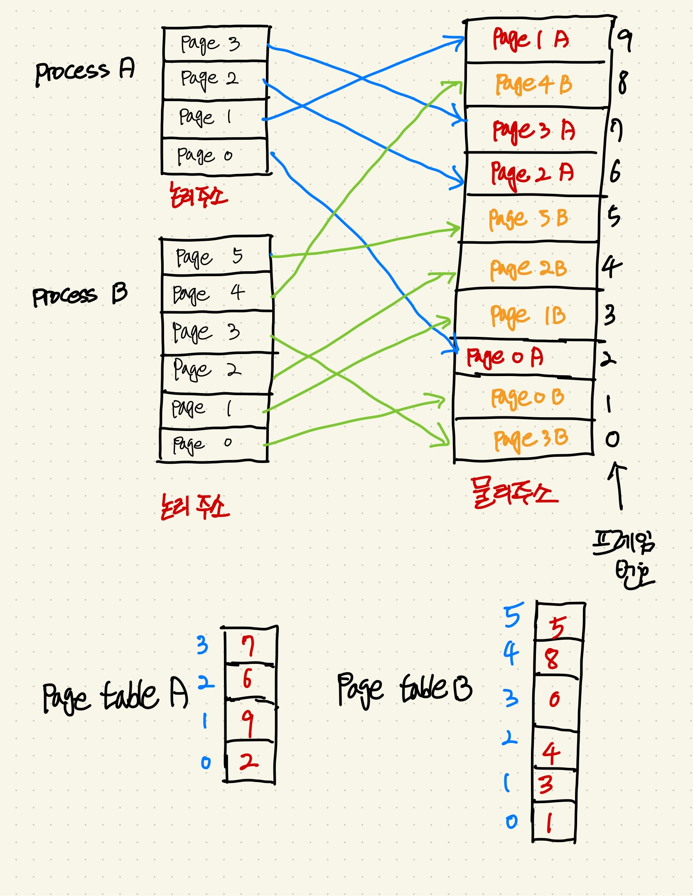
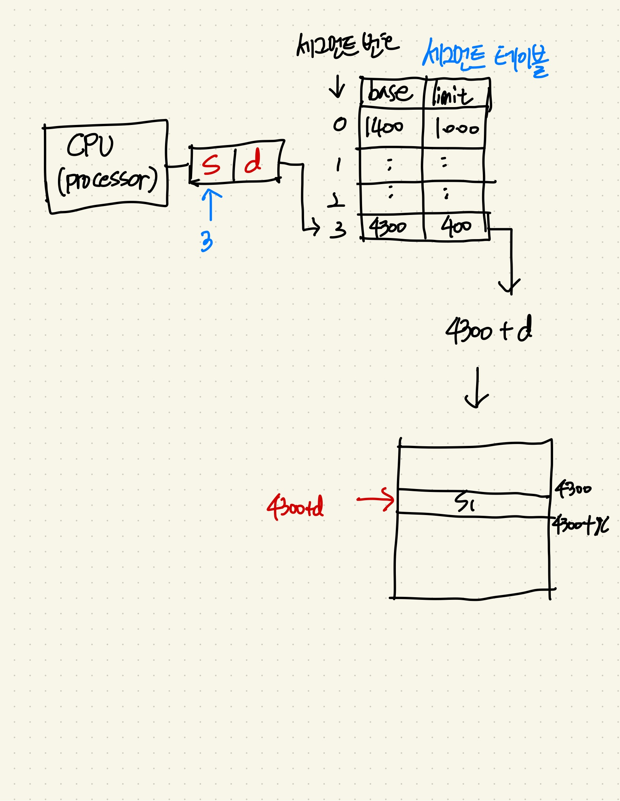

## 메모리 관리 전략

메모리 용량이 증가함에 따라 프로그램의 크기도 점점 증가 -> 메모리는 항상 부족하게 된다.
제한된 물리 메모리의 효율적인 사용과 메모리 참조 방식을 제공하기 위한 전략이다.

### 1. 연속 메모리 할당

프로세스를 메모리에 연속적으로 할당하는 기법이다. 단점은 할당과 제거를 반복하다보면 메모리의 중간중간마다 안쓰는 부분이 생겨나고 이에 따라서 외부 단편화가 발생한다.

#### 연속 메모리 할당에서 외부 단편화를 줄이기 위한 할당 방식

1. 최초 적합(First fit)

- 메모리의 앞쪽부터 프로세스를 할당하는 방식이다. 즉, 메모리를 뒤져서 가장 처음에 들어갈 수 있는 곳에다가 프로세스를 할당하는 방식이다.
- 메모리의 가장 앞쪽에 있는 부분에 바로 할당하기 때문에 속도면에서는 가장 빠른 알고리즘이다.

2. 최적 적합(Best fit)

- 빈 메모리 공간의 크기와 프로세스의 크기 차이가 가장 적은 곳에 프로세스를 할당한다.
- 즉, 할당할 프로세스보다 큰 메모리 공간중에 가장 오차가 적은 메모리 공간에 할당하는 방식이다.

3. 최악 적합(Worst fit)

- 빈 메모리 공간의 크기와 프로세스의 크기 차이가 가장 큰 곳에 프로세스를 할당한다. 즉, 최적 적합의 반대 방식이다.
- 이렇게 할당하면 빈 메모리 공간에 또 다른 프로세스를 할당할 수 있을 것이라는 가정하에 기인한 방식이다.

### 2. 페이징(Paging)

-  프로세스가 메모리 공간에 연속적으로 할당되어야 한다는 제약조건을 없애는 메모리 관리 전략이다.
-  `논리 메모리`는 고정크기의 페이지, `물리 메모리`는 고정크기의 프레임 블록으로 나누어서 관리한다. 페이징 기법에서는 논리 `메모리`의 페이지 크기와 `물리 메모리`의 프레임 크기가 동일하다.
-  즉, 프로세스를 고정크기의 페이지로 나눈다음 그와 동일한 `물리 메모리`의 프레임에 연속적이 아닌 유연하게 할당하는 것이다.

이렇게 `외부 단편화`를 없애는 것을 성공했지만 프로세스는 실행될 때 자신은 연속된 메모리라고 이해한 상태이기 때문에 각각의 페이지가 어떤 프레임 위치에 있는지 알아야 한다. 이 때, 페이징된 논리 메모리 페이지가 어떤 프레임 위치에 있는지 빠르게 인덱싱을 할 수 있게끔 도와주는 것이 `페이지 테이블`이다.

`페이지 테이블`은 각각의 논리 메모리 인덱스 번호가 어떤 프레임 번호에 해당하는지에 대한 정보를 담고있다. 즉, 페이지 테이블은 프레임 번호를 담고있는 배열이고 배열의 인덱스는 프레임 번호를 가리키고 있다고 할 수 있다. 이렇게 `페이지 테이블`을 이용하여 빠르게 찾을 수 있게된다.

페이징 기법을 그림으로 표현하면 다음과 같다.

페이징 기법을 이용하면 외부 단편화를 해결할 수 있지만 내부 단편화가 발생할 수 있다는 단점도 있다.

프로세스를 메모리에 할당하려고 일정한 크기의 6개의 페이지로 나눈다고 치자, 그런데 6개의 페이지로 나누려고 하는데 정확히 6등분이 안될수도 있다는 것이다. 따라서 페이지 내부에 남는 공간이 생기게 되고 내부 단편화가 발생할 수 있는 것이다.

### 3. 세그멘테이션(Segmentation)

- 페이징 기법과 반대로 논리 메모리와 물리 메모리를 같은 크기의 블록이 아닌, 서로 다른 크기의 논리적 단위인 `세그먼트`로 분할하고 메모리를 할당하는 기법이다.
- 실제로 사용자는 자신의 프로그램을 동일한 크기의 페이지 모음으로 인식하기 보다는, 함수는 함수대로, 자료구조는 자료구조대로 각각 단위별로 메모리 상에 존재하는 것으로 인식한다. 이러한 것을 `세그먼트`라고 부른다.

세그멘테이션 기법도 페이징 기법의 페이징 테이블과 유사하게 `세그멘트 테이블`을 통해서 실제 물리 메모리를 찾는다.

프로세스가 메모리에 할당되어 실제 물리 메모리를 찾는 방식은 다음과 같다.

1. CPU로 부터 발생한 논리 주소를 `세그먼트 번호(s)`와 `오프셋(d)`로 나눈다.
2. `세그먼트 번호(s)`로 세그먼트 테이블 내의 값을 찾는다. 이 때, 세그먼트 테이블에는 `시작 물리주소(base)`와 `한계값(limit)`이 수록되어있다. `시작 물리주소`는 실제 물리메모리의 시작 주소이고, `한계값`은 세그먼트 크기의 최대 올수있는 값을 의미한다. 예를들면 한계값보다 세그먼트 크기인 오프셋(d)가 더 크다면 위치할 수 없는 것이다.
3. **찾은 시작 물리주소 + 오프셋** 으로 실제 물리 메모리의 주소를 찾는다.

세그멘테이션 기법을 그림으로 표현하면 다음과 같다.

세그멘테이션 기법을 이용하면 세그먼트 단위가 가변적이기 떄문에 페이징 기법의 문제점 이었던 `내부 단편화`를 해결할 수 있지만, `외부 단편화`가 발생할 수 있다.

세그먼트 단위가 가변적이기 떄문에 계속적으로 큰 크기의 세그먼트가 들어온다면 작은 공간이 계속적으로 비어있는 현상이 발생하기 때문에 `내부 단편화`가 발생할 수 있는 것이다.

