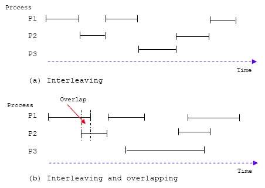

# 상호배제

상호배제가 필요한 이유(등장배경)를 시작으로 상호배제를 보장하기 위한 접근방법에 대해 알아보자.

<br/>

### 시스템 프로세스 수행 모드, 인터리빙과 오버래핑
* 단일처리기 멀티프로그래밍 시스템에서 프로세스들은 **인터리빙(interleaving)**된다.
  * 인터리빙은 실제로 병렬처리되는 것은 아니다.
  * 프로세스 간 문맥 교환(context switching)을 위한 비용이 발생한다.
  * 시스템의 처리 효율과 구조적인 프로그래밍에 큰 장점을 제공한다.
* 멀티프로세서 시스템에서 프로세스들은 **인터리빙 뿐 아니라 오버래핑(overlapping)**된다.



<br/>

### 프로세스 간 메모리 공유
* 장점 : 공간 절약의 효율성과 프로세스들의 긴밀한 상호작용
* 단점 : 서로 다른 프로세스가 공유 자원에 접근할 경우 문제가 발생한다.


* 단일처리기 시스템
  * 프로세스 수행 중 어떤 위치에서라도 인터럽트 발생 가능
  * 인터럽트 발생 시 명령 수행을 중지시키기 때문에 문제 발생

```
(단일처리기 시스템)
- 두 개의 프로세스 P1, P2가 번갈아가며 echo 함수를 호출한다.

void echo() {
    a = getchar(); // 인터럽트 발생, context switching...
    b = a;
    putchar(b);
}
```

* 멀티프로세서 시스템
  * 인터럽트의 비동기적 발생
  * 프로세스가 동시에 수행되면서 같은 전역 변수를 접근하려고 하기 때문에 문제 발생

```
(멀티프로세서 시스템)
- 두 개의 프로세스 P1, P2는 각각 서로 다른 처리기에서 동시에 수행되고 있다.

Process P1              Process P2

*                       *
a = getchar();          *
*                       a = getchar();
b = a;                  b = a;
putchar(b);             *
*                       putchar(b);
*                       *
```

따라서 공유 자원에 대한 접근을 제어해야 한다.

<br/>


### 용어정의
상호배제에 대해 알아보기 전 용어를 먼저 정의하자.
* 임계자원(critical resource) : 두 개 이상의 프로세스가 동시에 사용할 수 없는 자원
* 임계영역(critical section) : 임계자원을 접근하는 프로그램 코드의 일부분

## 상호배제
* 한 시점에 단 하나의 프로세스만이 임계영역에 들어갈 수 있음을 의미한다.
* 상호배제의 보장은 교착상태와 기아라는 제어문제를 발생시킬 수 있다.

### 상호배제를 보장하는 방법
1. 소프트웨어적 접근방법
   * 모든 책임을 병행 수행하려는 프로세스가 담당하는 방법
   * 수행 부하가 크고, 잘 설계되지 않으면 오동작의 가능성이 높음
   * [Dekker 알고리즘](./dekker_algorithm.md)
   * [Peterson 알고리즘](./peterson_algorithm.md)


2. 특별한 용도로 설계된 **기계어** 이용
   * 부하가 적다는 장점이 있음 
   * 같은 메모리 위치에 대한 읽기와 쓰기를 하나의 명령어 사이클로 처리하는 기계어 제안
   * word에 저장된 값이 testval이면 newval로 변경한 후 oldval을 리턴하고,
   * word에 저장된 값이 testval과 다르면 아무것도 하지 않고 oldval을 리턴한다.
   ```
   int compare_and_swap(int *word, int testval, int newval) {
     int oldval;
     oldval = *word;
     if (oldval == testval)
       *word = newval;
     return oldval;
   }
   ```
   * 이 함수를 이용한 상호 배제 프로그램
   ```
   const int n = //프로세스 개수
   int bolt;
   void P(int i) {
     while (true) {
       while (compare_and_swap(bolt, 0, 1) == 1)
         // 대기
       /* 임게영역 */
       bolt = 0;
       ...
     }
   }
   ```
   * bolt 값이 0이면 임계 영역을 실행할 수 있다는 의미이므로 1로 변경 후 0을 리턴하고,
   * bolt 값이 1이었다면 임계 영역을 실행할 수 없다는 의미이므로 아무것도 하지 않고 1을 리턴한다.

   > 기계 명령어 접근 방법의 단점
   * busy waiting 방식이다.
   * starvation, 기아가 발생할 수 있다.
     * 프로세스가 임계영역에서 빠져나왔을 때 대기중인 프로세스가 여러 개라고 가정하자.
     * 그 중 하나만이 임계영역에 진입할 수 있다.
     * 이 때 프로세스가 기다린 시간이나 특성을 고려하지 않는다.
     * 따라서 무한정 기다리는 프로세스가 생길 수 있어 기아가 발생한다.
   * deadlock, 교착상태가 발생할 수 있다.
     * 단일 처리기 시스템에서, 
     * P1이 임계영역에 들어간다.
     * P1보다 더 높은 우선순위의 P2가 생성되고, 운영체제가 P2를 스케줄 한다.
     * P2가 P1과 같은 자원을 쓰려고 한다.
     * P2는 상호 배제에 의해 자원을 사용하지 못하고 busy waiting을 수행한다.
     * 우선순위가 높은 P2가 계속 실행중이므로 P1은 다시 스케줄되지 못해 교착상태가 발생한다.


<br/>
3. 운영체제나 프로그래밍 언어 수준에서 상호 배제 보장을 제공
   * 세마포 등의 방법
