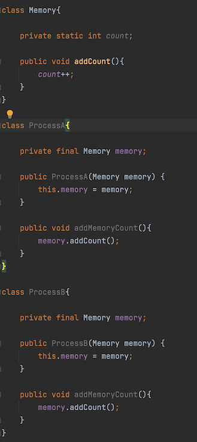
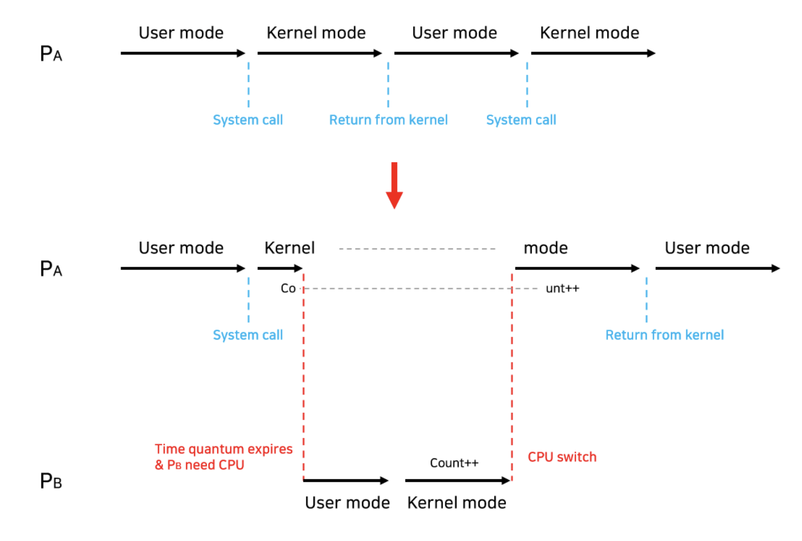

## 프로세스 동기화(Process Synchronization)

### 프로세스 동기화란?

하나의 자원을 한 순간에 하나의 프로세스만이 이용하도록 제어하는 것이다.

> 프로세스가 서로 메시지를 주고받거나 프로세스 내부에서 쓰레드끼리 자원을 공유하면서 `동기화`에 대한 문제가 항상 발생할 수 있다. 

### 경쟁 상태(Race Condition)

`경쟁 상태(Race Condition)`는 여러 프로세스들이 동시에 데이터에 접근하는 상황에서, 어떤 순서로 데이터에 접근하느냐에 따라 결과 값이 달라질 수 있는 상황을 말한다. 공유 데이터의 동시 접근은 데이터의 불일치 문제를 발생시킬 수 있다. 따라서, `Race Condition`을 막고 일관성을 유지하기 위해서는 협력 프로세스간의 실행 순서를 정해주는 메커니즘인 `동기화`가 필요하다.

**예시**

메모리 프로퍼티인 count가 static으로 공유하고 있기 때문에 각각의 프로세스에서 동시에 접근하면 데이터의 불일치가 나타날 수 있다.

일반적으로 다음 세 가지 경우에서 Race Condition이 발생할 수 있다.

#### 1. 커널 모드로 수행 중 인터럽트가 발생하는 경우

`(kernel mode start)------->(kernel count++)------>(Interrupt count--)---------->(kernel mode end)`

의도된 동작은 `count++`과 `count--`가 모두 반영되어 count가 초기값을 유지하는 것이지만, 만약 `Load`를 한 후에 `인터럽트`가 발생하는 경우 `인터럽트`의 결과는 반영되지 않고 `count++`만 반영된다. 이는 <U>커널 모드의 수행이 끝나기 전에는 인터럽트를 받지않는 방식(disable/enable)</U>으로 문제를 해결할 수 있다.

- 유저 모드: 유저(사용자)가 접근할 수 있는 영역을 제한적으로 두고, 프로그램의 자원에 함부로 침범하지 못하는 모드이다. 즉, 코드를 작성하고, 프로세스를 실행하는 등의 행동들을 말한다.
- 커널 모드: 모든 자원(드라이버, 메모리, CPU 등)에 접근, 명령을 할 수 있는 모드이다. 컴퓨터 내부에서 할 수 있는 모든 일들을 할 수 있는 모드이다.

#### 2. 프로세스가 시스템 콜을 호출해서 커널 모드로 수행 중인데 Context switch가 발생하는 경우

두 프로세스의 주소 공간에서는 데이터를 공유하지 않지만, `시스템 콜`을 수행하는 동안에는 둘 다 커널 주소 공간의 데이터를 접근한다. 따라서 커널 주소 공간에서 작업을 수행하는 도중에 CPU를 빼앗으면 `경쟁상태(race condition)`이 발생한다.

이는 <U>커널 모드를 수행중일 때 CPU가 `선점`되지 못하도록 하고, 커널 모드에서 유저 모드로 돌아갈 때 `선점` 되도록</U> 함으로써 해결할 수 있다.

#### 3. 멀티 프로세서에서 공유 메모리 내의 커널 데이터에 접근하는 경우

어떤 CPU가 마지막으로 Count를 저장했는지에 따라서 결과값이 달라진다. 즉, Count라는 공유 변수를 수정하면 문제가 발생하게 된다는 것이다. 싱글 프로세서인 경우 1번과 같이 `인터럽트(disable/enable)` 방식으로 해결할 수 있지만, `멀티 프로세서`인 경우 인터럽트 제어로는 해결할 수 없다. 한 번에 한 CPU만 커널에 들어갈 수 있도록 하는 방법이 있으나 이는 비효율적이다. 만약 두 프로세서가 공유 메모리에 있는 서로 다른 데이터에 접근하여 `Race Condition`의 가능성이 없음에도 불구하고 한 번에 한 CPU만 커널에 들어갈 수 있기 때문이다. 따라서, 커널 내부에 있는 각 공유 데이터에 접근할 때마다 그 데이터에 대해서만`lock/unlock`을 하는 방식으로 해결할 수 있다.

### 임계 영역(Critical  Section)

`임계 영역(Critical Section)`은 코드 상에서 `Race Condition`이 발생할 수 있는 특정 부분을 의미한다. 즉, 공유 데이터에 접근하는 코드 영역을 말한다.

`임계 영역`으로 인해 발생하는 문제점을 해결하기 위해서는 다음 조건들을 만족해야 한다.

1. 상호 배제(Mutual Exclusion)
	- 하나의 프로세스가 이미 `임계 영역`에서 작업 중이면 다른 모든 프로세스들을 `임계 영역`에 진입하면 안된다.
2. 진행(Progress)
	- `임계 영역`에서 작업중인 프로세스가 없고, `임계 영역`에 진입하고자 하는 프로세스가 존재한다면 진입 가능해야 한다.
3. 한정 대기(Bounded Waiting)
	- 프로세스가 `임계 영역`에 들어가기 위해 요청한 후부터 그 요청이 허용될 때까지 다른 프로세스들이 임계 영역에 들어가는 횟수에 한계가 있어야 한다. 즉, `임계 영역`에 진입하여는 프로세스가 무한정 대기해서는 안된다.

## 프로세스 동기화 해결책

### Mutex Lock

- 동시에 공유 자원에 접근하는 것을 막기위해 `임계 영역(Critical Section)`에 진입하는 프로세스는 `Lock`을 획득하고 `임계 영역`을 빠져나올 때, `Lock`을 방출함으로써 동시에 접근이 되지 않도록 하는 기법이다.

### Semaphores

- 소프트웨어 상에서 `임계 영역 문제`를 해결하기 위한 동기화 도구

종류

- 카운팅 세마포: 가용한 개수를 가진 자원에 대한 접근 제어용으로 사용되며, 세마포는 그 가용한 자원의 개수로 초기화된다. 자원을 사용하면 세마포가 감소, 방출하면 세마포가 증가한다.
- 이진 세마포: MUTEX라고도 불리며, 상호배제의 `(Mutual Exclusion)`의 머릿글자를 따서 만들어졌다. 이름 그대로 0과 1사이의 값만 가능하며, 다중 프로세스들 사이의 Critical Section 문제를 해결하기 위해 사용된다.