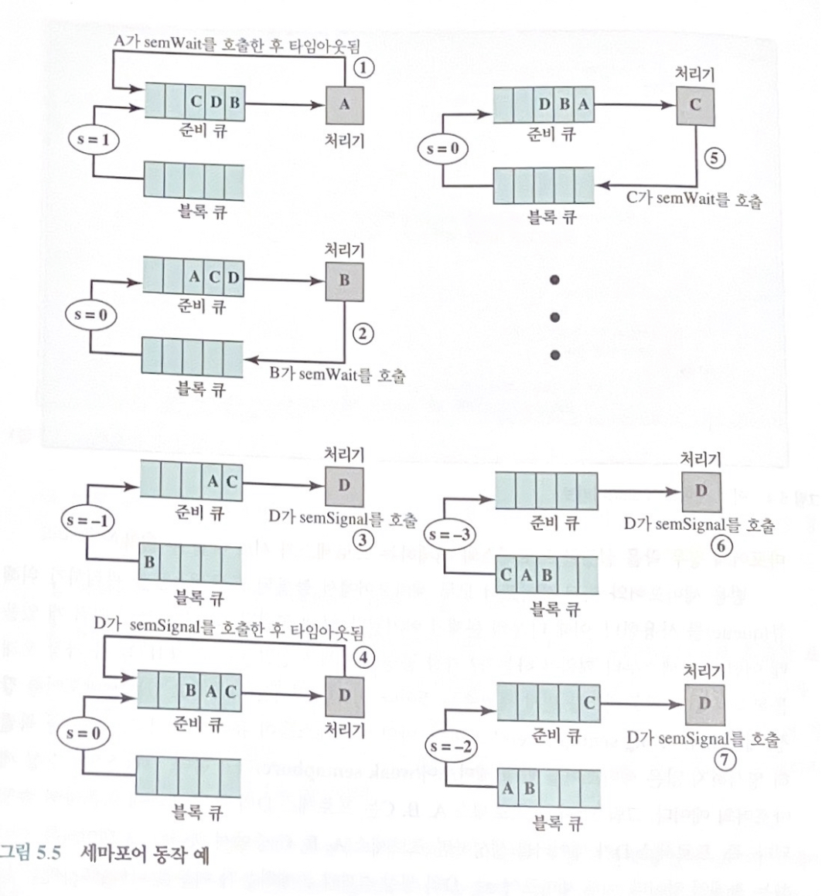

# Semaphore, 세마포어
세마포는 운영체제와 프로그래밍 언어 수준에서 병행성을 위해 제공하는 기법 중 하나이다.

## 배경
병행 프로세스들의 문제를 다룬 최초의 주요한 발전은 1965년에 발표된 Dijkstra의 논문이다.  
다익스트라 기법의 기본적 원리는 다음과 같다.
* 두 개 이상의 프로세스들은 간단한 형태의 시그널을 이용해 협동할 수 있다.
* 한 프로세스가 특정 시그널을 수신할 때까지ㅏ 정해진 위치에서 중지하도록 강제한다.
* 시그널을 위해 세마포어라고 불리는 특수 변수들을 사용한다.

## 정의 및 지원하는 연산
프로세스 간에 시그널을 주고받기 위해 사용되는 정수 값이다. 
세마포어는 다음의 세 가지 원자적 연산을 지원한다.
1. **initialize, 초기화** : 음이 아닌 값으로 초기화된다.
2. **decrease(semWait) 연산** : 세마포어의 값을 감소시킨다.
   * 만약 세마포어의 값이 음수가 되면, semWait를 호출한 프로세스는 블록된다.
   * 세마포어가 음수가 아니라면 프로세스는 계속 수행될 수 있다.
3. **increase(semSignal) 연산** : 세마포어의 값을 증가시킨다.
   * 만약 세마포어의 값이 양수가 아니면, semWait 연산에 의해 블록된 프로세스들을 깨운다.

위 세 가지 연산 외에 다른 방법으로는 세마포어 변수를 체크하거나 변경할 수 없다.

## 세마포어의 구분
세마포어는 유지할 수 있는 값의 범위에 따라 두 가지로 구분된다.

### 1. 범용 세마포어, General Semaphore / Counting Semaphore
* 범용 세마포어는 정수를 그 값으로 갖는다.

> 동작
1. 세마포어가 0 또는 양수 값으로 초기화된다.
2. 값이 양수라면, semWait을 호출한 후 대기 없이 수행될 수 있는 프로세스의 개수를 의미한다.
3. 값이 0이라면, 이제부터 semWait을 호출하는 프로세스가 블록되고 세마포어가 음수가 된다.
4. 값이 음수라면, 이 때 세마포어의 절대값은 블록 상태인 프로세스의 개수를 의미한다.
5. semSignal이 호출되면 세마포어의 값이 증가한다.
6. 만일 semSignal이 호출될 때 블록된 프로세스가 있으면 하나씩 깨어난다.

### 2. 이진 세마포어, Binary Semaphore
* 오직 0 또는 1의 값만 가질 수 있다.

> 동작
1. 세마포어는 0이나 1로 초기화된다.
2. 값이 0이면 semWaitB를 호출한 프로세스는 블록된다.
3. 이진 세마포어의 값이 1이면, 값을 0으로 변경시키고 semWaitB를 호출한 프로세스는 계속 수행된다.
4. semSignalB 연산이 호출될 경우 블록 상태인 프로세스가 존재하는지 확인한다.
5. 만약 블록 상태인 프로세스가 존재하면 그 프로세스를 깨우고, 
6. 블록 상태인 프로세스가 없으면 세마포어 값을 1로 설정한다.

> 관련개념
* **뮤텍스**, Mutual Exclusion Lock
  * 객체를 얻거나 반납할 때 사용하는 프로그래밍 플래그
  * 사용하려는 데이터가 공유될 수 없거나 연산이 동시에 수행될 수 없으면 mutex가 0으로 설정된다.
  * 이 때 접근하는 프로세스들은 블록된다.
  * 데이터에 대한 접근이나 연산이 완료되면 mutex의 락이 해제되며 값이 1로 설정된다.  
  

* **뮤텍스와 이진 세마포어의 차이점**
  * 락을 설정한 프로세스와 락을 해제하는 프로세스가 같은가?
  * 뮤텍스 : 락을 설정한 프로세스만이 락을 해제할 수 있다.
  * 이진 세마포어 : 락을 설정한 프로세스와 락을 해제하는 프로세스가 다를 수 있다.

## 세마포어의 분류
### 생각해보기
세마포어 연산으로 블록 상태가 된 프로세스들은 어떻게 관리될까?

### 정답
**큐**(**queue**)를 사용한다.  
큐에 연결된 프로세스들이 여러 개일 때 어떤 프로세스부터 깨어나는지에 따라 세마포어가 분류된다.

### 분류

1. Strong Semaphore, **강성 세마포어**
   * 선입선출로 블록 상태의 프로세스들을 관리한다.
   * 기아 문제가 발생하지 않는다.

2. Weak Semaphore, **약성 세마포어**
   * 프로세스들이 큐에서 제거되는 순서를 특별히 명시하지 않는다.
   * 기아 문제가 발생할 수 있다.

## 세마포어 동작과정

## 세마포어에 관한 흥미로운 점 3개
1. 프로세스가 세마포어 값을 감소시키기 전까지는 해당 프로세스가 블록될지 아닐지 알 수 없다.
2. 프로세스가 세마포어를 증가시켜 블록 상태이던 프로세스를 하나 깨우면, 이 두 프로세스 모두 수행 가능한 상태가 된다. 단일처리기 시스템에서 이 두 프로세스 중 어느 프로세스가 먼저 수행될지 알 수 없다.
3. 세마포어에 시그널을 보낼 때 다른 프로세스가 대기 중인지 여부를 알 필요가 없으므로, 블록 상태인 프로세스는 0 또는 1개일 수 있다.