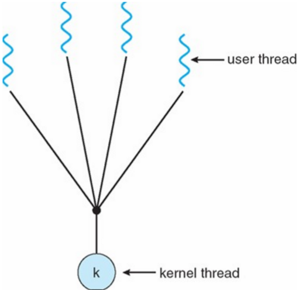
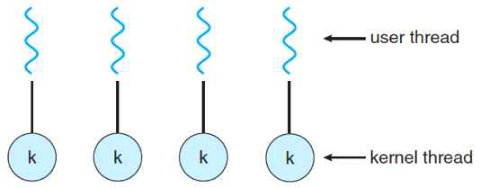
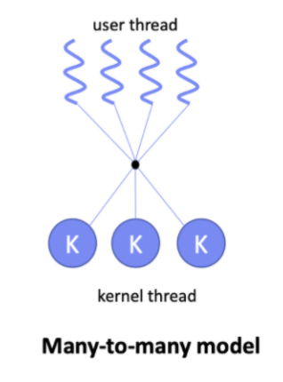

#  사용자 레벨 스레드와 커널 레벨 스레드
* 프로세스는 커널 프로세스와 사용자 프로세스로 나뉘며 스레드에도 `커널 스레드`와 `사용자 스레드`가 있다.
	* 사용자 스레드 : 라이브러리에 의해 구현된 일반적인 스레드이다.(java에서 스레드 함수를 쓰는 경우)

```java  
class thread1 extends Thread {
public void run () {
// .. 병렬처리 할 코드 구현
	}
}
```		


* 커널 스레드 : 커널이 직접 생성하고 관리하는 스레드이다.
---
##  사용자 스레드
* 사용자 스레드(user-level thread)는 운영체제가 멀티 스레드를 지원하지 않을 때 사용 하는 방법으로 초기의 스레드 시스템에 사용.
* 사용자 레벨에서 스레드를 구현하기 때문에 관련 `라이브러리`를 사용하여 구현하며 라이브러리는 커널 스레드에서 사용되는 스케줄링이나 동기화 같은 기능을 대신 구현한다.
* 때문에 커널 입장에선 이 스레드는 **하나의 프로세스**처럼 보인다.


* 사진과 같이 사용자 스레드는 커널 입장에서는 일반 프로세스지만 커널이 하는 일을 라이브러리가 대신 처리하여 `여러 개의 스레드`를 작동한다. 하나의 커널 스레드와 여러 개의 사용자 스레드가 존재하기 때문에 `1 to N`모델이라고 부른다.

* 프로세스 1개(사용자 스레드 N개) 당 커널 스레드 1개가 할당된다.
* 프로세스 내에 스레드 라이브러리가 있어서 커널의 도움 없이 스레드의 `스케줄링`을 할 수 있다.
* 스레드 정보(TCB, Thread Control Block)는 프로세스 내에서, 프로세스 정보(PCB)는 커널에서 관리한다.

### 사용자 스레드 장점
* **스케줄링과 동기화를 위해 System Call(커널 호출)을 하지 않기 때문에 오버헤드가 적다. 문맥 교환이 필요 없기 때문에 속도가 빠르다.** 커널에서 문맥 교환을 하는 이유는 시간을 나누어 서로 다른 프로세스를 처리하기 위해서인데, 사용자 스레드는 같은 프로세스에서 이뤄지기 때문에 해당 과정이 생략된다.
	* 컨텍스트 스위칭 : CPU에서 인터럽트 발생으로 현재 작업중인 프로세스가 `블록`되고 다른 프로세스로 변경할 때, CPU 내 레지스터 다음에 실행할 정보들로 교체를 하고 캐시를 비운다.
* 커널은 사용자 스레드 존재조차 모르기 때문에 모드간의 전환이 없어 **성능 이득**이 발생한다. 

### 사용자 스레드 단점
* 시스템 전반에 걸친 **스케줄링 우선순위를 지원하지 않는다** (위에서 말한 라이브러리를 통해서만 스케줄링함)
* 하나의 스레드가 `System Call(커널 호출)`하면 해당 프로세스 내 **모든 스레드가 중단됨**(해당 프로세스의 사용자 스레드**들**을 하나의 프로세스로 보기 때문)
* 한 프로세스의 타임 슬라이스를 여러 스레드가 공유하기 때문에 **여러 개의 CPU를 사용할 수 없다.** CPU를 여러 개 갖추고 멀티스레드를 지원하는 커널의 경우 여러 CPU에 나누어 작업이 가능하지만, 커널 입장에서 사용자 스레드는 하나의 프로세스로 인식하므로 작업을 나눌 수 없다.

---

## 커널 스레드
* 커널 스레드(kernal-level thread)는 커널이 멀티스레드를 지원하는 방식으로, 하나의 스레드가 하나의 커널 스레드와 연결되기 때문에 1 to 1 모델이라고 부른다.
* 커널 스레드는 독립적으로 스케줄링이 되므로 특정 스레드가 `대기 상태`에 들어가도 다른 스레드는 작업을 계속 할 수 있다.
* 커널이 전체 TCB와 PCB를 관리한다.



* 커널 스레드의 장단점은 사용자 스레드의 장단점과 반대라고 생각하면 된다.

### 커널 스레드 장점
* 커널이 각 스레드를 **개별적으로 관리**할 수 있다.
* 커널 스레드는 커널 레벨에서 모든 작업을 지원하기 때문에 `멀티 CPU`를 사용할 수 있다.
* 동작중인 하나의 스레드가 `System Call(커널 호출)`해도 다른 스레드는 계속 실행될 수 있다.

### 커널 스레드 단점
* 스케쥴링과 동기화를 위해 System Call(커널 호출)을 하는데 오래 걸림
* 사용자 모드와 커널 모드 간 전환이 빈번하게 발생하여 성능이 저하된다.

---

## 참고. 멀티레벨 스레드
* 멀티레벨 스레드(multi-level thread) 또는 하이브리드 스레드(hybrid-thread)는 **사용자 스레드와 커널 스레드를 혼합한 방식**으로 M to N 모델이라고 부른다.
* 멀티레벨 스레드에서는 커널 스레드의 개수가 사용자 스레드보다 같거나 작다.
	* 커널 스레드 개수 <= 사용자 스레드 개수
* 사용자 스레드와 커널 스레드의 장단점을 모두 갖고 있다.
	* 하나의 커널 스레드가 대기 상태에 들어가면 다른 커널 스레드가 대신 작업을 하여 사용자 스레드보다 유연하게 작업을 처리할 수 있다.
	* 하지만, 커널 스레드를 같이 사용하기 때문에 여전히 문맥 교환 시 오버헤드가 발생하여 사용자 스레드만큼 빠르지 않다.
	

