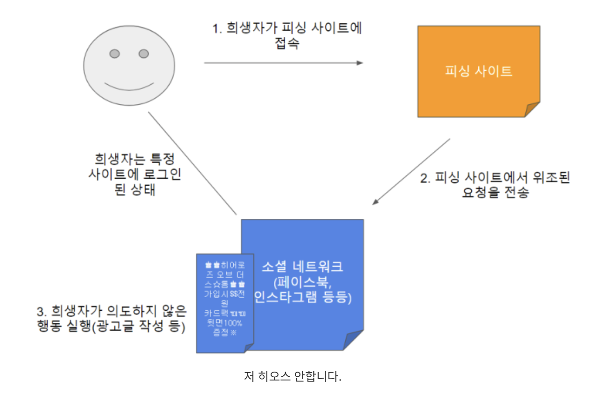
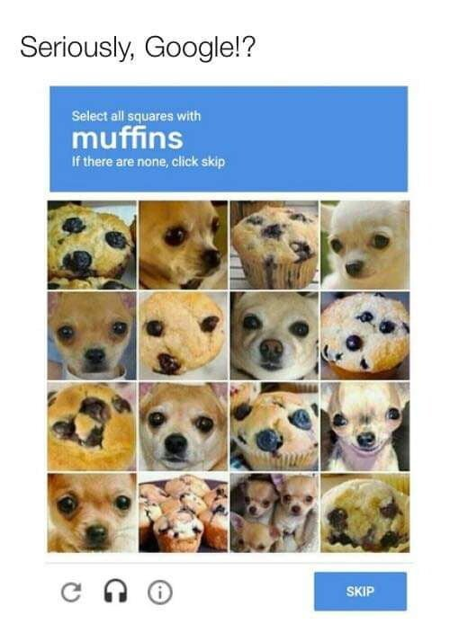

# CSRF(Cross Site Request Forgery)

CSRF란 **사이트간 요청 위조**의 줄임말로 웹 취약점 중에 하나이다. **공격자가 희생자의 권한을 도용하여 특정 웹 사이트의 기능을 실행**하게 할 수 있으며 이는 희생자의 의도와는 무관하게 이루어진다.

CSRF의 취약점을 이용하면 공격자가 희생자의 계정으로 네이버 카페나 인스타그램, 페이스북 등 다수의 방문자가 있는 사이트에 광고성 혹은 유해한 게시글을 업로드하는 것도 가능해진다. 

### CSRF의 조건

CSRF를 통해 공격을 하기 위해서는 아래의 조건이 만족되어야 한다.

- 희생자가 **공격자가 만든 피싱 사이트에 접속**해야 한다.
- 희생자가 위조 요청을 보낼 사이트에 **로그인** 되어 있어야 한다.
- 단, 굳이 피싱 사이트에 접속하지 않아도 **XSS에 성공한 사이트에서도 CSRF 공격을 실행할 수 있다.**

이와 같은 조건을 만족해야하는 이유는 CSRF가 서버에 직접적으로 공격을 가하는 취약점이 아니기 때문이다. 언뜻 보기에는 '저 조건을 다 만족할 일이 있을까?' 싶지만 자주 방문하는 사이트는 대부분 `자동 로그인` 기능을 사용한다는 것을 생각하면 주의가 필요하다. 물론 네이버나 페이스북 같은 사이트는 대응책이 구비되어 있겠지만, 보안이 허술해보이는 소규모 커뮤니티 사이트나 쇼핑몰 등에서는 자동 로그인 기능이 있어도 사용하지 않는것이 좋다.

그림으로 CSRF가 이루어지는 과정을 살펴보자.



1. 희생자가 위조 요청을 보낼 사이트에 로그인 되어있는 상태로 피싱 사이트에 접속한다. 즉, 공격자는 피싱 사이트 접속 유도를 위해서 **피싱 메일, 팝업 광고**를 띄우는 등의 행동을 한다.
2. 희생자가 피싱 사이트에 접속을 하면 피싱 사이트에서 희생자로 가장하여 요청을 위조해 전송한다.
3. 위조 요청을 받은 사이트는 해당 요청에 대한 응답을 하게되고 이로 인해서 희생자가 의도하지 않은 행동이 실행된다.

코드로 예시를 들면

```html

```

이렇게 유저를 강제로 로그아웃 시키는 것도 가능하다.

공격자가 피싱 사이트에 이런 코드를 삽입해 두었다면 피싱 사이트에 접속하는 순간 피해자는 자기 의지와는 관계없이 로그인 해 두었던 사이트에서 로그아웃 되어버린다.

실제로 2008년 옥션에서 발생했던 관리자 계정 탈취사건도 있다. 관리자가 admin 권한으로 로그인한 상태에서 피싱 메일을 열람하였고, 피싱 메일안에 숨겨진 CSRF 코드를 실행되어 관리자 권한을 탈취하게 된 것이다.

### CSRF 대응 방법

CSRF에 대응하는 방법은 크게 3가지가 존재한다.

#### 1. CAPCHA 사용



인터넷을 사용하는 사람이면 한번쯤은 꼭 경험해봤을 CAPCHA이다. 이미지를 보여주고 그 이미지에 해당하는 문자/숫자/그림이 아니라면 요청을 거부하기 때문에 CSRF 공격을 효과적으로 방어할 수 있는 방법이다. 

#### 2. Referrer 검증법

요청이 들어올 때, **Request의 Header에 담겨있는 referrer 값**을 확인하여 같은 도메인에서 보낸 요청인지 검증하여 차단하는 방법이다. 거의 대부분의 경우에는 이 referrer 검증법으로 공격을 방어할 수 있다. 

하지만 동일 사이트에서 XSS 취약점이 발견된다면 이를 통해서 CSRF 공격을 실행할 수 있다는 점을 유의해야 하며, 이는 페이지 단위까지 쪼개서 도메인 검증을 하는 것으로 페이지 간의 CSRF 공격을 방지할 수 있다.

#### 3. CSRF Token 사용

사용자의 **세션에 임의의 값을 저장**하여 모든 요청마다 그 값을 포함시켜서 전송한다. 그리고 요청이 들어올 때마다 백엔드 세션에 저장된 값과 요청으로 전송된 값이 일치하는지 검증하여 방어하는 방법이다. 이 방법은 Referrer 방법과 같이 XSS를 통한 CSRF 공격에 취약하다는 특징이 있다.
