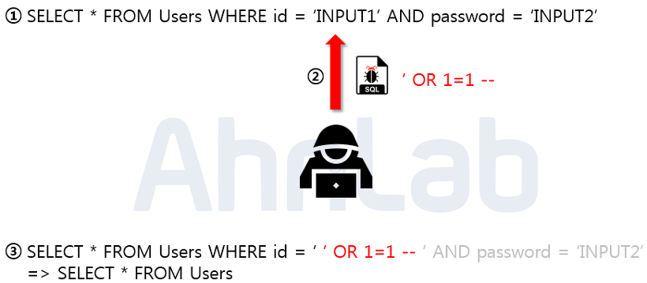
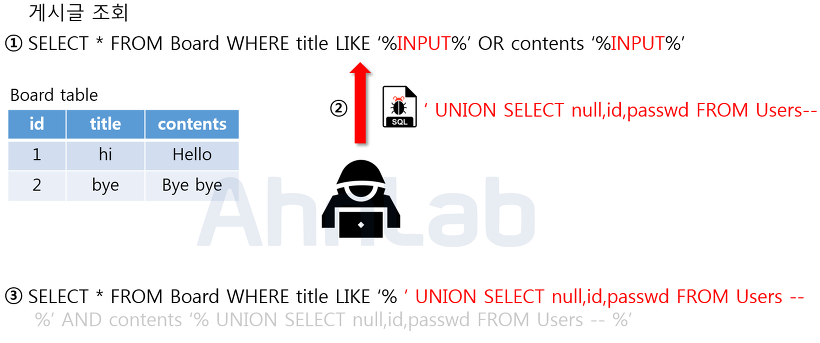
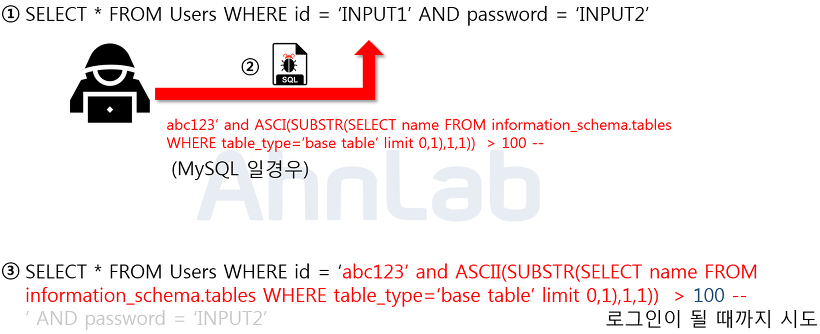

# SQL Injection

`SQL Injection` 이란 악의적인 사용자가 보안상의 취약점을 이용하여, **임의의 SQL 문을 주입하고 실행되게 하여 데이터베이스가 비정상적인 동작을 하도록 조작하는 행위**이다. Injection 공격은 OWASP Top10 중의 첫 번째에 속해 있으며, 공격이 비교적 쉬운 편이고 공격에 성공할 경우에는 **큰 피해를 입힐 수 있는 공격**이다.

## 공격 종류 및 방법

### Error based SQL Injection(논리적 에러를 이용한 SQL Injection)

가장 많이 쓰이는 SQL Injection 방법이고, 가장 대중적인 공격 기법이다.

위 사진에서 보이는 쿼리문은 일반적으로 로그인 시 많이 사용되는 SQL 구문이다. 해당 구문에서 입력값에 대한 검증이 없음을 확인하고, 악의적인 사용자가 임의의 SQL 구문을 주입하였다. 주입된 내용은 'OR 1=1 -- 으로 WHERE 절에 있는 싱글쿼터를 닫아주기 위한 싱글쿼터와 OR 1=1 이라는 구문을 이용하여 WHERE 절을 모두 참으로 만들고, --을 넣어줌으로써 뒤의 구문을 모두 주석처리 해주었다.

매우 간단한 구문이지만 결론적으로 Users 테이블에 있는 모든 정보를 조회하게 함으로써 가장 먼저 만들어진 계정으로 로그인에 성공하게 된다. 보통은 관리자 계정이 맨 처음 만들어지기 때문에 관리자 계정으로 로그인을 할 수 있게 된다. 관리자 계정을 탈취한 악의적인 사용자는 관리자의 권한을 이용하여 또 다른 2차 피해를 발생시킬 수 있게 된다.

### Union Based SQL Injection(Union 명령을 이용한 SQL Injection)

SQL에서 Union 키워드는 두 개의 쿼리문에 대한 결과를 통합하여 하나의 테이블로 보여주게 하는 키워드이다. 정상적인 쿼리문에서 Union 키워드를 사용하여 인젝션에 성공하면, 원하는 쿼리문을 실행할 수 있게 된다. Union Injection을 성공하기 위해서는 두 가지 조건이 있다. 하나는 Union 하는 두 테이블의 컬럼 수가 같아야 하고, 데이터의 형이 같아야 한다.

위의 사진에서 보이는 쿼리문은 Board 라는 테이블에서 게시글을 검색하는 쿼리문이다. 입력값을 title과 contents 컬럼의 데이터랑 비교한 뒤 비슷한 글자가 있는 게시글을 출력한다. 여기서 입력값으로 Union 키워드와 함께 컬럼 수를 맞춰서 SELECT 구문을 넣어주게 되면, 두 쿼리문이 합쳐져서 하나의 테이블로 보여지게 된다. 현재 인젝션한 구문은 사용자의 id와 password를 요청하는 쿼리문이다. 인젝션이 성공하게 되면, 사용자의 개인정보가 게시글과 함께 화면에 보여지게 된다.

물론 패스워드를 평문으로 DB에 저장하지는 않겠지만, 인젝션이 가능하다는 점에서 이미 그 이상의 보안 위험에 노출되어 있다. 이 공격도 역시 입력값에 대한 검증이 없기 때문에 발생하게 된 예시이다.

### Bilnd SQL Injection

1. Boolean based SQL

Blind SQL Injection은 데이터베이스로 부터 특정한 값이나 데이터를 전달받지 않고, 단순히 **참과 거짓의 정보**만 알 수 있을 때 사용한다. 로그인 폼에 SQL Injection이 가능하다고 가정했을 때, 서버가 응답하는 로그인 성공과 로그인 실패 메시지를 이용하여, DB의 테이블 정보 등을 추출해낼 수 있다.

위의 그림을 Blind Injection을 이용하여 DB의 테이블 명을 알아내는 방법이다. Injection이 가능한 로그인 폼을 통하여 악의적인 사용자는 임의로 가입한 abc123 이라는 아이디와 함께 abc123’ and ASCII(SUBSTR(SELECT name From information_schema.tables WHERE table_type=’base table’ limit 0,1)1,1)) > 100 -- 이라는 구문을 주입한다.

해당 구문은 MySQL에서 테이블 명을 조회하는 구문으로 limit 키워드를 통해서 하나의 테이블만 조회하고, SUBSTR 함수로 첫 글자만, 그리고 마지막으로 ASCII 를 통해서 아스키 값으로 변환해준다. 만약에 조회되는 테이블 명이 Users 라면 'U' 자가 ascii 값으로 조회가 될 것이고, 뒤의 100이라는 숫자 값과 비교를 하게된다. 거짓이면 로그인 실패가 될 것이고, 참이 될 때까지 뒤의 100이라는 숫자를 변경해가면서 비교를 한다.

[이외의 다른 종류의 SQL Injection](https://noirstar.tistory.com/264)

## 대응 방안

### 입력 값에 대한 검증

SQL Injection에서 사용되는 기법과 키워드는 엄청나게 많다. 사용자의 입력 값에 대한 검증이 필요한데, 서버 단에서 **화이트리스트 기반으로 검증해야 한다.** 그 이유는 블랙리스트 기반으로 검증하게 되면 수많은 차단리스트를 등록해야 하고, 하나라도 빠지면 공격에 성공하게 되기 때문이다. 공백으로 치환하는 방법도 많이 쓰이는데, 이 방법도 취약한 방법이다. 예를들어 공격자가 SE**SELECT**LECT 라고 입력 시 중간의 SELECT가 공백으로 치환이 되면, SELECT 라는 키워드가 완성되게 된다. 공백 대신에 **공격 키워드와는 의미없는 단어로 치환되어야 한다.**

### Prepared Statement 구문의 사용

Prepared Statement 구문을 사용하게 되면, 사용자의 입력 값이 DB의 파라미터로 들어가기 전에 DBMS가 **미리 컴파일 하여 실행하지 않고 대기**한다. 그 후에 사용자의 입력 값을 문자열로 인식하게 하여 공격 쿼리가 들어간다고 하더라도, 사용자의 입력은 이미 의미없는 단순 문자열이기 때문에 전체 쿼리문도 공격자의 의도대로 동작하지 않는다.

### Error Message 노출 금지

공격자가 SQL Injection을 수행하기 위해서는 DB의 정보(테이블명, 컬럼명 등)가 필요하다. DB 에러 발생 시 따로 처리를 해주지 않았다면, **에러가 발생한 쿼리문과 함께 에러에 관한 내용을 반환**해준다. 여기서 테이블명 및 컬럼명 그리고 쿼리문이 노출이 될 수 있기 때문에, DB에 대한 오류발생 시 **사용자에게 보여줄 수 있는 페이지를 제작 혹은 메시지박스를 띄우도록 해야 한다.**

### 웹 방화벽 사용

웹 공격 방어에 특화되어있는 **웹 방화벽을 사용**하는 것도 하나의 방법이다. 웹 방화벽은 소프트웨어 형, 하드웨어 형, 프록시 형 이렇게 세가지 종류로 나눌 수 있는데, 소프트웨어 형은 서버 내에 직접 설치하는 방법이고, 하드웨어 형은 네트워크 상에서 서버 앞단에 직접 하드웨어 장비로 구성하는 것이며, 마지막으로 프록시 형은 DNS 서버 주소를 웹 방화벽으로 바꾸고 서버로 가는 트래픽이 웹 방화벽을 먼저 거치도록 하는 방법이다.

